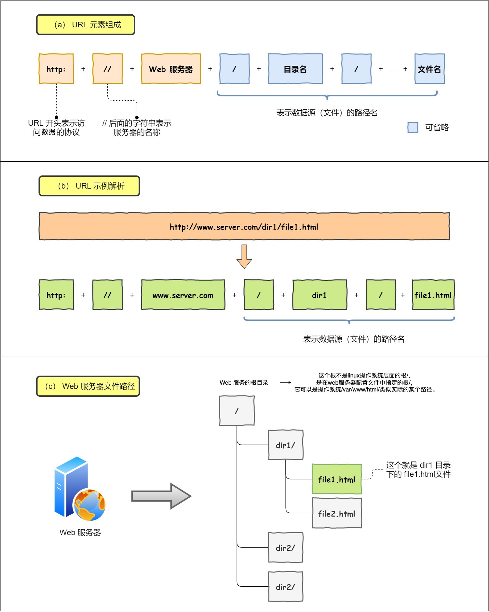
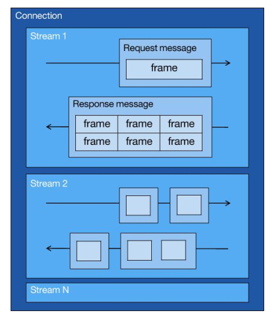
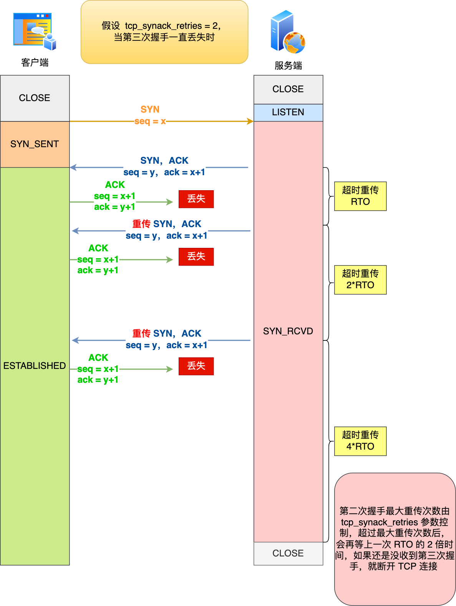
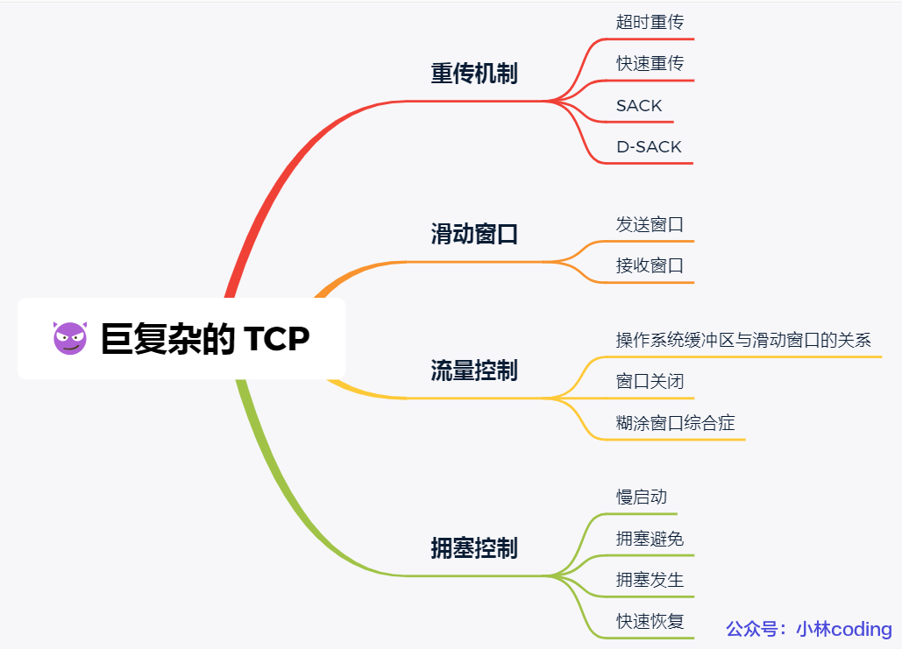
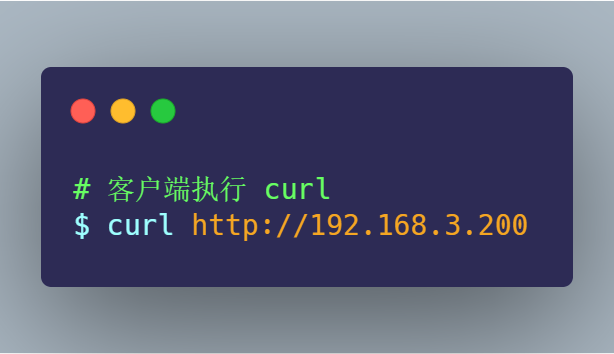
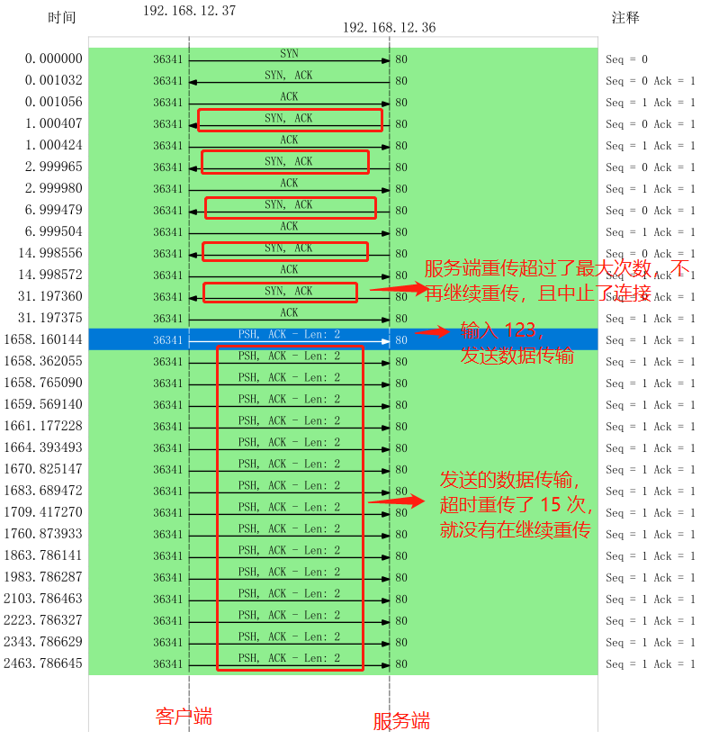
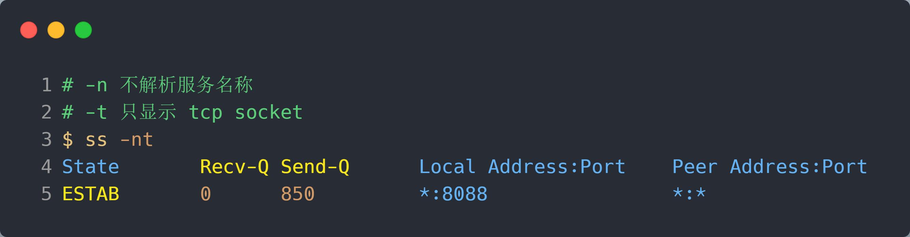
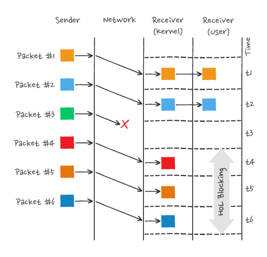
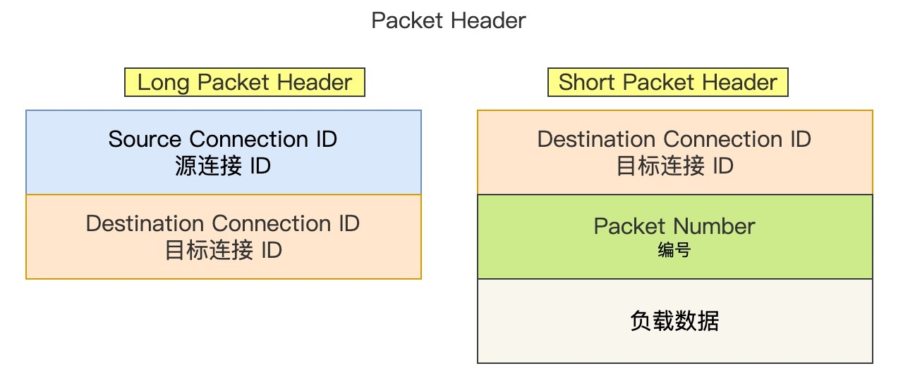

# 计算机网络


# 图解网络

# -----------------


简单介绍下《图解网络》，整个内容共有 **`20W` 字 + `500` 张图**，每一篇都自己手绘了很多图，目的也很简单，想通过「说人话+图解」的方式，击破大家对于「八股文」的恐惧

# 一、简介

## 1.1 适合什么群体？

《图解网络》写的网络知识主要是**面向程序员**的，因为小林本身也是个程序员，所以涉及到的知识主要是关于程序员日常工作或者面试的网络知识。

非常适合有一点网络基础，但是又不怎么扎实，或者知识点串不起来的同学，说白**这本图解网络就是为了拯救半桶水的同学而出来的**。

因为小林写的图解网络就四个字，**通俗易懂**！

相信你在看这本图解网络的时候，你心里的感受会是：

- 「卧槽，原来是这样，大学老师教知识原来是这么理解」
- 「卧槽，我的网络知识串起来了」
- 「卧槽，我感觉面试稳了」
- 「卧槽，相见恨晚」

当然，也适合面试突击网络知识时拿来看。图解网络里的内容基本是面试常见的协议，比如 HTTP、HTTPS、TCP、UDP、IP 等等，也有很多面试常问的问题，比如：

- TCP 为什么三次握手？四次挥手？
- TCP 为什么要有 TIME_WAIT 状态？
- TCP 为什么是可靠传输协议，而 UDP 不是？
- 键入网址到网页显示，期间发生了什么？
- HTTPS 握手过程是怎样的？
- ….

不敢说 100 % 涵盖了面试的网络问题，但是至少 90% 是有的，而且内容的深度应对大厂也是绰绰有余，有非常多的读者跑来感激小林的图解网络，帮助他们拿到了国内很多一线大厂的 offer。


## 1.2 要怎么阅读？

很诚恳的告诉你，《图解网络》不是教科书，而是我写的**图解网络文章的整合**，所以肯定是没有教科书那么细致和全面，当然也就不会有很多废话，都是**直击重点，不绕弯，而且有的知识点书上看不到。**

阅读的顺序可以不用从头读到尾，你可以根据你想要了解的知识点，通过本站的搜索功能，去看哪个章节的内容就好，可以随意阅读任何章节。


《图解网络》目录结构如下（别看篇章不多，每一章都是很长很长的文章哦 😆）：

- 网络基础篇
  - [TCP/IP 网络模型有哪几层？](https://xiaolincoding.com/network/1_base/tcp_ip_model.html)
  - [键入网址到网页显示，期间发生了什么？](https://xiaolincoding.com/network/1_base/what_happen_url.html)
  - [Linux 系统是如何收发网络包的？](https://xiaolincoding.com/network/1_base/how_os_deal_network_package.html)
- HTTP 篇
  - [HTTP 常见面试题](https://xiaolincoding.com/network/2_http/http_interview.html)
  - [HTTP/1.1如何优化？](https://xiaolincoding.com/network/2_http/http_optimize.html)
  - [HTTPS RSA 握手解析](https://xiaolincoding.com/network/2_http/https_rsa.html)
  - [HTTPS ECDHE 握手解析](https://xiaolincoding.com/network/2_http/https_ecdhe.html)
  - [HTTPS 如何优化？](https://xiaolincoding.com/network/2_http/https_optimize.html)
  - [HTTP/2 牛逼在哪？](https://xiaolincoding.com/network/2_http/http2.html)
  - [HTTP/3 强势来袭](https://xiaolincoding.com/network/2_http/http3.html)
  - [既然有 HTTP 协议，为什么还要有 RPC？](https://xiaolincoding.com/network/2_http/http_rpc.html)
  - [既然有 HTTP 协议，为什么还要有 WebSocket？](https://xiaolincoding.com/network/2_http/http_websocket)
- TCP 篇
  - [TCP 三次握手与四次挥手面试题](https://xiaolincoding.com/network/3_tcp/tcp_interview.html)
  - [TCP 重传、滑动窗口、流量控制、拥塞控制](https://xiaolincoding.com/network/3_tcp/tcp_feature.html)
  - [TCP 实战抓包分析](https://xiaolincoding.com/network/3_tcp/tcp_tcpdump.html)
  - [TCP 半连接队列和全连接队列](https://xiaolincoding.com/network/3_tcp/tcp_queue.html)
  - [如何优化 TCP?](https://xiaolincoding.com/network/3_tcp/tcp_optimize.html)
  - [如何理解是 TCP 面向字节流协议？](https://xiaolincoding.com/network/3_tcp/tcp_stream.html)
  - [为什么 TCP 每次建立连接时，初始化序列号都要不一样呢？](https://xiaolincoding.com/network/3_tcp/isn_deff.html)
  - [SYN 报文什么时候情况下会被丢弃？](https://xiaolincoding.com/network/3_tcp/syn_drop.html)
  - [四次挥手中收到乱序的 FIN 包会如何处理？](https://xiaolincoding.com/network/3_tcp/out_of_order_fin.html)
  - [在 TIME_WAIT 状态的 TCP 连接，收到 SYN 后会发生什么？](https://xiaolincoding.com/network/3_tcp/time_wait_recv_syn.html)
  - [TCP 连接，一端断电和进程崩溃有什么区别？](https://xiaolincoding.com/network/3_tcp/tcp_down_and_crash.html)
  - [拔掉网线后， 原本的 TCP 连接还存在吗？](https://xiaolincoding.com/network/3_tcp/tcp_unplug_the_network_cable.html)
  - [tcp_tw_reuse 为什么默认是关闭的？](https://xiaolincoding.com/network/3_tcp/tcp_tw_reuse_close.html)
  - [HTTPS 中 TLS 和 TCP 能同时握手吗？](https://xiaolincoding.com/network/3_tcp/tcp_tls.html)
  - [TCP Keepalive 和 HTTP Keep-Alive 是一个东西吗？](https://xiaolincoding.com/network/3_tcp/tcp_http_keepalive.html)
  - [TCP 有什么缺陷？](https://xiaolincoding.com/network/3_tcp/tcp_problem.html)
  - [如何基于 UDP 协议实现可靠传输？](https://xiaolincoding.com/network/3_tcp/quic.html)
  - [TCP 和 UDP 可以使用同一个端口吗？](https://xiaolincoding.com/network/3_tcp/port.html)
  - [服务端没有 listen，客户端发起连接建立，会发生什么？](https://xiaolincoding.com/network/3_tcp/tcp_no_listen.html)
  - [没有 accpet，可以建立 TCP 连接吗？](https://xiaolincoding.com/network/3_tcp/tcp_no_accpet.html)
  - [用了 TCP 协议，数据一定不会丢吗？](https://xiaolincoding.com/network/3_tcp/tcp_drop.html)
  - [TCP 四次挥手，可以变成三次吗？](https://xiaolincoding.com/network/3_tcp/tcp_three_fin.html)
  - [TCP 序列号和确认号是如何变化的？](https://xiaolincoding.com/network/3_tcp/tcp_seq_ack.html)
- IP 篇
  - [IP 基础知识全家桶](https://xiaolincoding.com/network/4_ip/ip_base.html)
  - [ping 的工作原理](https://xiaolincoding.com/network/4_ip/ping.html)
  - [断网了，还能 ping 通 127.0.0.1 吗？](https://xiaolincoding.com/network/4_ip/ping_lo.html)
- 学习心得
  - [计算机网络怎么学？](https://xiaolincoding.com/network/5_learn/learn_network.html)
  - [画图经验分享](https://xiaolincoding.com/network/5_learn/draw.html)


# 二、网络基础篇

## 2.1 TCP/IP 网络模型有哪几层？

问大家，为什么要有 TCP/IP 网络模型？

对于同一台设备上的进程间通信，有很多种方式，比如有管道、消息队列、共享内存、信号等方式，而对于不同设备上的进程间通信，就需要网络通信，而设备是多样性的，所以要兼容多种多样的设备，就**协商**出了一套**通用的网络协议**。

这个网络协议是**分层**的，每一层都有各自的作用和职责，接下来就根据**「 TCP/IP 网络模型」**分别对每一层进行介绍。


- **应用层**

最上层的，也是我们能直接接触到的就是**应用层**（*Application Layer*），我们**电脑或手机使用的应用软件都是在应用层实现**。那么，当两个不同设备的应用需要通信的时候，应用就把应用数据传给下一层，也就是传输层。

所以，应用层只需要专注于为用户提供应用功能，比如 HTTP、FTP、Telnet、DNS、SMTP等。

应用层是不用去关心数据是如何传输的，就类似于，我们寄快递的时候，只需要把包裹交给快递员，由他负责运输快递，我们不需要关心快递是如何被运输的。

而且**应用层**是工作在操作系统中的**用户态**，**传输层及以下则工作在内核态。**


- **传输层**

应用层的数据包会传给传输层，**传输层**（*Transport Layer*）是为应用层提供网络支持的。


在传输层会有两个**传输协议**，分别是 TCP 和 UDP。

**TCP** 的全称叫**传输控制协议**（*Transmission Control Protocol*），大部分应用使用的正是 TCP 传输层协议，比如 HTTP 应用层协议。TCP 相比 UDP 多了很多特性，比如流量控制、超时重传、拥塞控制等，这些都是为了保证数据包能可靠地传输给对方。


**UDP** 相对来说就很简单，简单到**只负责发送数据包，不保证数据包是否能抵达对方**，但它实时性相对更好，传输效率也高。当然，UDP 也可以实现可靠传输，把 TCP 的特性在应用层上实现就可以，不过要实现一个商用的**可靠 UDP 传输协议**，也不是一件简单的事情。


应用需要传输的数据可能会非常大，如果直接传输就不好控制，因此当传输层的数据包大小超过 **MSS（TCP 最大报文段长度）** ，就要将数据包**分块**，这样即使中途有一个分块丢失或损坏了，只需要重新发送这一个分块，而不用重新发送整个数据包。在 TCP 协议中，我们把每个分块称为一个 **TCP 段**（*TCP Segment*）。


当设备作为接收方时，传输层则要负责把数据包传给应用，但是一台设备上可能会**有很多应用在接收或者传输数据**，因此需要用一个编号将**应用区分**开来，这个编号就是**端口**。

比如 80 端口通常是 Web 服务器用的，22 端口通常是远程登录服务器用的。而对于浏览器（客户端）中的每个标签栏都是一个独立的进程，操作系统会为这些进程分配临时的端口号。

由于传输层的报文中会携带端口号，因此接收方可以识别出该报文是发送给哪个应用。


- **网络层**

传输层可能大家刚接触的时候，会认为它负责将数据从一个设备传输到另一个设备，事实上它并不负责。

实际场景中的网络环节是错综复杂的，中间有各种各样的线路和分叉路口，如果一个设备的数据要传输给另一个设备，就需要在各种各样的路径和节点进行选择，而**传输层**的设计理念是**简单、高效、专注**，如果传输层还负责这一块功能就有点违背设计原则了。

也就是说，我们不希望传输层协议处理太多的事情，只需要服务好应用即可，让其作为应用间数据传输的媒介，帮助实现应用到应用的通信，而实际的传输功能就交给下一层，也就是**网络层**（*Internet Layer*）。


网络层最常使用的是 IP 协议（*Internet Protocol*），IP 协议会将传输层的报文作为数据部分，再加上 IP 包头组装成 IP 报文，如果 IP 报文大小超过 MTU（以太网中一般为 1500 字节）就会**再次进行分片**，得到一个即将发送到网络的 IP 报文。


网络层负责将数据从一个设备传输到另一个设备，世界上那么多设备，又该如何找到对方呢？因此，**网络层**需要有**区分设备的编号**。

我们一般用 IP 地址给设备进行编号，对于 IPv4 协议， IP 地址共 32 位，分成了四段（比如，192.168.100.1），每段是 8 位。只有一个单纯的 IP 地址虽然做到了区分设备，但是寻址起来就特别麻烦，全世界那么多台设备，难道一个一个去匹配？这显然不科学。

因此，需要将 IP 地址分成两种意义：

- 一个是**网络号**，负责标识该 IP 地址是属于哪个「子网」的；
- 一个是**主机号**，负责标识同一「子网」下的不同主机；

怎么分的呢？这需要配合**子网掩码**才能算出 IP 地址 的网络号和主机号。

举个例子，比如 10.100.122.0/24，后面的`/24`表示就是 `255.255.255.0` 子网掩码，255.255.255.0 二进制是「11111111-11111111-11111111-00000000」，大家数数一共多少个1？不用数了，是 24 个1，为了简化子网掩码的表示，用/24代替255.255.255.0。

知道了子网掩码，该怎么计算出网络地址和主机地址呢？

将 10.100.122.2 和 255.255.255.0 进行**按位与运算**，就可以得到网络号，如下图：


将 255.255.255.0 取反后与IP地址进行进行**按位与运算**，就可以得到主机号。

大家可以去搜索下子网掩码计算器，自己改变下「掩码位」的数值，就能体会到子网掩码的作用了。


那么在寻址的过程中，先匹配到相同的网络号（表示要找到同一个子网），才会去找对应的主机。

除了寻址能力， IP 协议还有另一个重要的能力就是**路由**。实际场景中，两台设备并不是用一条网线连接起来的，而是通过很多网关、路由器、交换机等众多网络设备连接起来的，那么就会形成很多条网络的路径，因此当数据包到达一个网络节点，就需要通过路由算法决定下一步走哪条路径。

路由器寻址工作中，就是要找到目标地址的子网，找到后进而把数据包转发给对应的网络内。


所以，**IP 协议的寻址作用是告诉我们去往下一个目的地该朝哪个方向走，路由则是根据「下一个目的地」选择路径。寻址更像在导航，路由更像在操作方向盘**。


- **网络接口层**

生成了 IP 头部之后，接下来要交给**网络接口层**（*Link Layer*）在 IP 头部的前面加上 MAC 头部，并封装成数据帧（Data frame）发送到网络上。


IP 头部中的接收方 IP 地址表示网络包的目的地，通过这个地址我们就可以判断要将包发到哪里，但在以太网的世界中，这个思路是行不通的。

什么是以太网呢？电脑上的以太网接口，Wi-Fi接口，以太网交换机、路由器上的千兆，万兆以太网口，还有网线，它们都是以太网的组成部分。以太网就是一种在「局域网」内，把附近的设备连接起来，使它们之间可以进行通讯的技术。

以太网在判断网络包目的地时和 IP 的方式不同，因此必须采用相匹配的方式才能在以太网中将包发往目的地，而 MAC 头部就是干这个用的，所以，在以太网进行通讯要用到 MAC 地址。

MAC 头部是以太网使用的头部，它包含了接收方和发送方的 MAC 地址等信息，我们可以通过 ARP 协议获取对方的 MAC 地址。

所以说，网络接口层主要为网络层提供「链路级别」传输的服务，负责在以太网、WiFi 这样的底层网络上发送原始数据包，工作在网卡这个层次，使用 MAC 地址来标识网络上的设备。


- **总结**

综上所述，TCP/IP 网络通常是由上到下分成 4 层，分别是**应用层，传输层，网络层和网络接口层**。


再给大家贴一下每一层的封装格式：


网络接口层的传输单位是帧（frame），IP 层的传输单位是包（packet），TCP 层的传输单位是段（segment），HTTP 的传输单位则是消息或报文（message）。但这些名词并没有什么本质的区分，可以统称为数据包。


## 2.2 ==键入网址到网页显示，期间发生了什么？==

> 想必不少小伙伴面试过程中，会遇到「**当键入网址后，到网页显示，其间发生了什么**」的面试题。

还别说，这问题真挺常问的，前几天坐在我旁边的主管电话面试应聘者的时候，也问了这个问题。

接下来以下图较简单的网络拓扑模型作为例子，探究探究其间发生了什么？


#### - 孤单小弟 —— HTTP

> 浏览器做的第一步工作是**解析 URL**

首先**浏览器**做的第一步工作就是要对 `URL` 进行**解析**，从而生成发送给 `Web` 服务器的请求信息。

让我们看看一条长长的 URL 里的各个元素的代表什么，见下图：



> 所以图中的**长长的 URL** 实际上是**请求服务器里的文件资源**。


> 要是上图中的蓝色部分 URL 元素都省略了，那应该是请求哪个文件呢？

当**没有路径名时**，就代表访问根目录下事先设置的**默认文件**，也就是 `/index.html` 或者 `/default.html` 这些文件，这样就不会发生混乱了。


> #### 生产 HTTP 请求信息

对 `URL` 进行解析之后，浏览器确定了 Web 服务器和文件名，接下来就是**根据这些信息来生成 HTTP 请求消息了。**


> 一个孤单 HTTP 数据包表示：“我这么一个小小的数据包，没亲没友，直接发到浩瀚的网络，谁会知道我呢？谁能载我一程呢？谁能保护我呢？我的目的地在哪呢？”。充满各种疑问的它，没有停滞不前，依然踏上了征途！


#### - **真实地址查询 —— DNS**

通过浏览器解析 URL 并生成 HTTP 消息后，需要**委托操作系统**将消息发送给 `Web` 服务器。

但在发送之前，还有一项工作需要完成，那就是 **查询服务器域名对应的 IP 地址** ，因为委托操作系统发送消息时，必须提供通信对象的 IP 地址。

比如我们打电话的时候，必须要知道对方的电话号码，但由于电话号码难以记忆，所以通常我们会将对方电话号 + 姓名保存在通讯录里。

所以，有一种**服务器**就专门保存了 **`Web` 服务器域名与 `IP` 的对应关系**，它就是 **`DNS` 服务器。**


> ##### 域名的层级关系

DNS 中的域名都是用**句点**来分隔的，比如 `www.server.com`，这里的句点代表了不同层次之间的**界限**。

在域名中，**越靠右**的位置表示其层级**越高**。

毕竟域名是外国人发明，所以思维和中国人相反，比如说一个城市地点的时候，外国喜欢从小到大的方式顺序说起（如 XX 街道 XX 区 XX 市 XX 省），而中国则喜欢从大到小的顺序（如 XX 省 XX 市 XX 区 XX 街道）。

实际上域名最后还有一个点，比如 `www.server.com.`，这个最后的一个点代表**根域名**。

也就是，`.` 根域是在最顶层，它的下一层就是 `.com` 顶级域，再下面是 `server.com`。

所以域名的层级关系类似一个树状结构：

- 根 DNS 服务器（.）
- 顶级域 DNS 服务器（.com）
- 权威 DNS 服务器（server.com）


**根域的 DNS 服务器信息保存在互联网中所有的 DNS 服务器中。**

这样一来，任何 DNS 服务器就都可以找到并访问根域 DNS 服务器了。

因此，客户端只要能够找到**任意一台 DNS 服务器**，就可以通过它找到根域 DNS 服务器，然后再一路顺藤摸瓜找到位于下层的某台目标 DNS 服务器。

> #### 域名解析的工作流程

1. 客户端首先会发出一个 DNS 请求，问 www.server.com 的 **IP 是啥**，并发给本地 DNS 服务器（也就是客户端的 TCP/IP 设置中填写的 DNS 服务器地址）。
2. 本地域名服务器收到客户端的请求后，如果缓存里的表格能找到 www.server.com，则它直接返回 IP 地址。如果没有，本地 DNS 会去问它的根域名服务器：“老大， 能告诉我 www.server.com 的 IP 地址吗？” 根域名服务器是最高层次的，它不直接用于域名解析，但能**指明一条道路**。
3. 根 DNS 收到来自本地 DNS 的请求后，发现后置是 .com，说：“www.server.com 这个域名归 .com 区域管理”，我给你 .com 顶级域名服务器地址给你，你去问问它吧。”
4. 本地 DNS 收到顶级域名服务器的地址后，发起请求问“老二， 你能告诉我 www.server.com 的 IP 地址吗？”
5. 顶级域名服务器说：“我给你负责 www.server.com 区域的权威 DNS 服务器的地址，你去问它应该能问到”。
6. 本地 DNS 于是转向问权威 DNS 服务器：“老三，www.server.com对应的IP是啥呀？” server.com 的权威 DNS 服务器，它是域名解析结果的原出处。为啥叫权威呢？就是我的域名我做主。
7. 权威 DNS 服务器查询后将对应的 IP 地址 X.X.X.X 告诉本地 DNS。
8. 本地 DNS 再将 IP 地址返回客户端，客户端和目标建立连接。

至此，我们完成了 DNS 的解析过程。现在总结一下，整个过程我画成了一个图。


DNS 域名解析的过程蛮有意思的，整个过程就和我们日常生活中找人问路的过程类似，**只指路不带路**。

> 那是不是每次解析域名都要经过那么多的步骤呢？

当然不是了，还有**缓存**这个东西的嘛。

浏览器会先看**自身有没有对这个域名的缓存**，如果有，就直接返回，如果没有，就去问操作系统，操作系统也会去看自己的**缓存**，如果有，就直接返回，如果没有，再去 hosts 文件看，也没有，才会去问「本地 DNS 服务器」。

> 数据包表示：“DNS 老大哥厉害呀，找到了目的地了！我还是很迷茫呀，我要发出去，接下来我需要谁的帮助呢?”


#### - **指南好帮手 —— 协议栈**

通过 DNS 获取到 IP 后，就可以把 HTTP 的传输工作交给操作系统中的 **协议栈**。

协议栈的内部分为**几个部分**，分别承担不同的工作。上下关系是有一定的规则的，上面的部分会向下面的部分委托工作，下面的部分收到委托的工作并执行。


> 应用程序（浏览器）通过**调用 Socket 库**，来**`委托协议栈`工作**。协议栈的上半部分有两块，分别是负责收发数据的 TCP 和 UDP 协议，这两个传输协议会接受应用层的委托执行收发数据的操作。

协议栈的下面一般是用 IP 协议控制网络包收发操作，在互联网上传数据时，数据会被切分成一块块的网络包，而将网络包发送给对方的操作就是由 IP 负责的。

此外 IP 中还包括 `ICMP` 协议和 `ARP` 协议。

- `ICMP` 用于告知网络包传送过程中产生的错误以及各种控制信息。
- `ARP` 用于根据 IP 地址**查询**相应的以太网 MAC 地址。

IP 下面的网卡驱动程序负责控制网卡硬件，而最下面的网卡则负责完成实际的收发操作，也就是对网线中的信号执行发送和接收操作。

> 数据包看了这份指南表示：“原来我需要那么多大佬的协助啊，那我先去找找 TCP 大佬！”


#### - 可靠传输 —— TCP

HTTP 是基于 TCP 协议传输的，所以在这我们先了解下 TCP 协议。

> #### TCP 包头格式

我们先看看 TCP 报文头部的格式：


首先，**源端口号**和**目标端口**号是不可少的，如果没有这两个端口号，数据就不知道应该发给哪个应用。

接下来有包的**序**号，这个是为了**解决包乱序**的问题。

还有应该有的是**确认号**，目的是**确认发出去对方是否有收到**。如果没有收到就应该重新发送，直到送达，这个是为了**解决丢包**的问题。


接下来还有一些**状态位**。例如 `SYN` 是发起一个连接，`ACK` 是回复，`RST` 是重新连接，`FIN` 是结束连接等。TCP 是面向连接的，因而**双方要维护连接的状态**，这些带状态位的包的发送，会引起双方的**状态变更**。


还有一个重要的就是**窗口大小**。TCP 要做**流量控制**，通信双方各声明一个窗口（缓存大小），标识自己当前能够的处理能力，别发送的太快，撑死我，也别发的太慢，饿死我。

除了做流量控制以外，TCP还会做**拥塞控制**，对于真正的通路堵车不堵车，它无能为力，唯一能做的就是控制自己，也即**控制发送的速度**。不能改变世界，就改变自己嘛。

> TCP 传输数据之前，要先**三次握手建立连接**

在 **`HTTP 传输数据之前`，首先需要 `TCP 建立连接`**，TCP 连接的建立，通常称为**三次握手**。

这个所谓的「连接」，只是双方计算机里维护一个状态机，在连接建立的过程中，双方的状态变化时序图就像这样。


- 一开始，客户端和服务端都处于 `CLOSED` 状态。先是**服务端主动监听某个端口**，处于 `LISTEN` 状态。
- 然后**客户端主动发起连接** `SYN`，之后处于 `SYN-SENT` 状态。
- 服务端收到发起的连接，返回 `SYN`，并且 `ACK` 客户端的 `SYN`，之后处于 `SYN-RCVD` 状态。
- 客户端收到服务端发送的 `SYN` 和 `ACK` 之后，**发送**对 `SYN` 确认的 `ACK`，之后处于 `ESTABLISHED` 状态，**因为它一发一收成功了。**
- 服务端收到 `ACK` 的 `ACK` 之后，处于 `ESTABLISHED` 状态，因为**它也一发一收了。**

所以三次握手目的是**保证双方都有发送和接收的能力**。

> 如何查看 TCP 的连接状态？

TCP 的连接状态查看，在 Linux 可以通过 `netstat -napt` 命令查看。


> TCP 分割数据

如果 **HTTP 请求消息比较长**，超过了 `MSS` 的长度，这时 TCP 就需要**把 HTTP 的数据拆解成一块块的数据发送**，而不是一次性发送所有数据。


- `MTU`：一个网络包的最大长度，以太网中一般为 `1500` 字节。
- `MSS`：除去 IP 和 TCP 头部之后，一个网络包所能容纳的 TCP 数据的最大长度。

数据会被以 `MSS` 的长度为单位进行拆分，拆分出来的每一块数据都会被放进单独的网络包中。也就是在每个被拆分的数据加上 TCP 头信息，然后交给 IP 模块来发送数据。


> TCP 报文生成

TCP 协议里面会有两个端口，一个是**浏览器监听的端口（通常是随机生成的）**，一个是 **Web 服务器监听的端口** **（HTTP 默认端口号是 `80`， HTTPS 默认端口号是 `443`）。**

在双方建立了连接后，**TCP 报文中的数据**部分就是**存放 HTTP 头部 + 数据**，组装好 TCP 报文之后，就需交给下面的网络层处理。

至此，网络包的报文如下图。


> 此时，遇上了 TCP 的 数据包激动表示：“太好了，碰到了可靠传输的 TCP 传输，它给我加上 TCP 头部，我不再孤单了，安全感十足啊！有大佬可以保护我的可靠送达！但我应该往哪走呢？”


#### - **远程定位 —— IP**

TCP 模块在执行连接、收发、断开等各阶段操作时，都需要委托 IP 模块将数据封装成**网络包**发送给通信对象。

> #### IP 包头格式

我们先看看 IP 报文头部的格式：


在 IP 协议里面需要有**源地址 IP** 和 **目标地址 IP**：

- 源地址IP，即是客户端输出的 IP 地址；
- 目标地址，即通过 DNS 域名解析得到的 Web 服务器 IP。

因为 HTTP 是经过 TCP 传输的，所以在 IP 包头的**协议号**，要填写为 `06`（十六进制），表示协议为 TCP。

> 假设客户端有多个网卡，就会有多个 IP 地址，那 IP 头部的源地址应该选择哪个 IP 呢？

当存在多个网卡时，在填写源地址 IP 时，就需要判断到底应该填写哪个地址。这个判断相当于在多块网卡中判断应该使用哪个一块网卡来发送包。

这个时候就需要根据**路由表**规则，来判断**哪一个网卡作为源地址 IP。**

在 Linux 操作系统，我们可以使用 `route -n` 命令查看当前系统的路由表。


举个例子，根据上面的路由表，我们假设 Web 服务器的目标地址是 `192.168.10.200`。


1. 首先先和第一条目的子网掩码（`Genmask`）进行 **与运算**，得到结果为 `192.168.10.0`，但是第一个条目的 `Destination` 是 `192.168.3.0`，两者不一致所以匹配失败。
2. 再与第二条目的子网掩码进行 **与运算**，得到的结果为 `192.168.10.0`，与第二条目的 `Destination 192.168.10.0` 匹配成功，所以将使用 `eth1` 网卡的 IP 地址作为 IP 包头的源地址。

那么假设 Web 服务器的目标地址是 `10.100.20.100`，那么依然依照上面的路由表规则判断，判断后的结果是和第三条目匹配。

第三条目比较特殊，它目标地址和子网掩码都是 `0.0.0.0`，这表示**默认网关**，如果其他所有条目都无法匹配，就会自动匹配这一行。并且后续就把包发给路由器，`Gateway` 即是路由器的 IP 地址。

> IP 报文生成

至此，网络包的报文如下图。


> 此时，加上了 IP 头部的数据包表示 ：“有 IP 大佬给我指路了，感谢 IP 层给我加上了 IP 包头，让我有了远程定位的能力！不会害怕在浩瀚的互联网迷茫了！可是目的地好远啊，我下一站应该去哪呢？”


#### - **两点传输 —— MAC**

生成了 IP 头部之后，接下来网络包还需要在 IP 头部的前面加上 **MAC 头部**。

> #### MAC 包头格式

**MAC 头部**是**以太网使用的头部**，它包含了接收方和发送方的 **MAC 地址**等信息。


在 MAC 包头里需要**发送方 MAC 地址**和**接收方目标 MAC 地址**，用于**两点之间的传输**。

一般在 TCP/IP 通信里，MAC 包头的**协议类型**只使用：

- `0800` ： IP 协议
- `0806` ： ARP 协议

> MAC 发送方和接收方如何确认?

**发送方**的 MAC 地址获取就比较简单了，**MAC 地址**是**在网卡生产时写入到 ROM 里的**，只要将这个值读取出来写入到 MAC 头部就可以了。

**接收方**的 MAC 地址就有点复杂了，只要告诉以太网对方的 MAC 的地址，以太网就会帮我们把包发送过去，那么很显然这里应该填写对方的 MAC 地址。

所以先得搞清楚应该把包发给谁，这个只要查一下**路由表**就知道了。在路由表中找到相匹配的条目，然后把包发给 `Gateway` 列中的 IP 地址就可以了。

> 既然知道要发给谁，按如何获取对方的 MAC 地址呢？

不知道对方 MAC 地址？不知道就喊呗。

此时就需要 `ARP` 协议帮我们**找到路由器的 MAC 地址。**


ARP 协议会在以太网中以**广播**的形式，对以太网所有的设备喊出：“这个 IP 地址是谁的？请把你的 MAC 地址告诉我”。

然后就会有人回答：“这个 IP 地址是我的，我的 MAC 地址是 XXXX”。

如果对方和自己处于同一个子网中，那么通过上面的操作就可以得到对方的 MAC 地址。然后，我们将这个 MAC 地址写入 MAC 头部，MAC 头部就完成了。

> 好像每次都要广播获取，这不是很麻烦吗？

放心，在后续操作系统会把本次查询结果放到一块叫做 **ARP 缓存**的内存空间留着以后用，不过缓存的时间就几分钟。

也就是说，在发包时：

- 先查询 ARP 缓存，如果其中已经保存了对方的 MAC 地址，就不需要发送 ARP 查询，直接使用 ARP 缓存中的地址。
- 而当 ARP 缓存中不存在对方 MAC 地址时，则发送 ARP 广播查询。

> 查看 ARP 缓存内容

在 Linux 系统中，我们可以使用 `arp -a` 命令来查看 ARP 缓存的内容。


> **MAC 报文生成**

至此，网络包的报文如下图。


> 此时，加上了 MAC 头部的数据包万分感谢，说道 ：“感谢 MAC 大佬，我知道我下一步要去哪了！我现在有很多头部兄弟，相信我可以到达最终的目的地！”。 带着众多头部兄弟的数据包，终于准备要出门了。


#### - **出口 —— 网卡**

网络包只是存放在内存中的一串二进制数字信息，没有办法直接发送给对方。因此，我们需要将**数字信息转换为电信号**，才能在网线上传输，也就是说，这才是真正的数据发送过程。

负责执行这一操作的是**网卡**，要**控制网卡**还需要靠**网卡驱动程序**。

网卡驱动获取网络包之后，会将其**复制**到**网卡内的缓存区中**，接着会在其**开头加上 报头 和 起始帧分界符，在末尾加上用于检测错误的 帧校验序列**。


- 起始帧分界符是一个用来**表示包起始位置的标记**
- 末尾的 `FCS`（帧校验序列）用来**检查包传输过程是否有损坏**

最后**网卡**会将包转为**电信号**，通过网线发送出去。

> 唉，真是不容易，发一个包，真是历经千辛万苦。致此，一个带有许多头部的数据终于踏上寻找目的地的征途了！


- #### **送别者 —— 交换机**

下面来看一下包是如何通过交换机的。交换机的设计是将网络包**原样**转发到目的地。交换机工作在 **MAC 层**，也称为**二层网络设备**。

> 交换机的包接收操作

首先，电信号到达网线接口，交换机里的模块进行接收，接下来交换机里的模块将电信号转换为数字信号。

然后通过包末尾的 `FCS` 校验错误，如果没问题则放到缓冲区。这部分操作基本和计算机的网卡相同，但交换机的工作方式和网卡不同。

计算机的网卡本身具有 MAC 地址，并通过核对收到的包的接收方 MAC 地址判断是不是发给自己的，如果不是发给自己的则丢弃；相对地，交换机的端口不核对接收方 MAC 地址，而是直接接收所有的包并存放到缓冲区中。因此，和网卡不同，**交换机的端口不具有 MAC 地址**。

将包存入缓冲区后，接下来需要查询一下这个包的接收方 MAC 地址是否已经在 MAC 地址表中有记录了。

交换机的 MAC 地址表主要包含两个信息：

- 一个是设备的 MAC 地址，
- 另一个是该设备连接在交换机的哪个端口上。


举个例子，如果收到的包的接收方 MAC 地址为 `00-02-B3-1C-9C-F9`，则与图中表中的第 3 行匹配，根据端口列的信息，可知这个地址位于 `3` 号端口上，然后就可以通过交换电路将包发送到相应的端口了。

所以，**交换机根据 MAC 地址表查找 MAC 地址，然后将信号发送到相应的端口**。

> 当 MAC 地址表找不到指定的 MAC 地址会怎么样？

地址表中找不到指定的 MAC 地址。这可能是因为具有该地址的设备还没有向交换机发送过包，或者这个设备一段时间没有工作导致地址被从地址表中删除了。

这种情况下，交换机无法判断应该把包转发到哪个端口，只能将包转发到除了源端口之外的所有端口上，无论该设备连接在哪个端口上都能收到这个包。

这样做不会产生什么问题，因为以太网的设计本来就是将包发送到整个网络的，然后**只有相应的接收者才接收包，而其他设备则会忽略这个包**。

有人会说：“这样做会发送多余的包，会不会造成网络拥塞呢？”

其实完全不用过于担心，因为发送了包之后目标设备会作出响应，只要返回了响应包，交换机就可以将它的地址写入 MAC 地址表，下次也就不需要把包发到所有端口了。

局域网中每秒可以传输上千个包，多出一两个包并无大碍。

此外，如果接收方 MAC 地址是一个**广播地址**，那么交换机会将包发送到除源端口之外的所有端口。

以下两个属于广播地址：

- MAC 地址中的 `FF:FF:FF:FF:FF:FF`
- IP 地址中的 `255.255.255.255`

> 数据包通过交换机转发抵达了路由器，准备要离开土生土长的子网了。此时，数据包和交换机离别时说道：“感谢交换机兄弟，帮我转发到出境的大门，我要出远门啦！”


#### - **出境大门 —— 路由器**

> **路由器与交换机的区别**

网络包经过交换机之后，现在到达了**路由器**，并在此被转发到下一个路由器或目标设备。

这一步转发的工作原理和交换机类似，也是通过查表判断包转发的目标。

不过在具体的操作过程上，路由器和交换机是有区别的。

- 因为**路由器**是基于 **IP** 设计的，俗称**三层**网络设备，路由器的各个端口都具有 MAC 地址和 IP 地址；
- 而**交换机**是基于**以太网**设计的，俗称**二层**网络设备，交换机的端口不具有 MAC 地址。

> 路由器基本原理

路由器的端口具有 MAC 地址，因此它就能够成为以太网的发送方和接收方；同时还具有 IP 地址，从这个意义上来说，它和计算机的网卡是一样的。

当转发包时，首先路由器端口会接收发给自己的以太网包，然后**路由表**查询转发目标，再由相应的端口作为发送方将以太网包发送出去。

> 路由器的包接收操作

首先，电信号到达网线接口部分，路由器中的模块会**将电信号转成数字信号**，然后通过包末尾的 `FCS` 进行错误校验。

如果没问题则检查 MAC 头部中的**接收方 MAC 地址**，看看是不是发给自己的包，如果是就放到接收缓冲区中，否则就丢弃这个包。

总的来说，路由器的端口都具有 MAC 地址，只接收与自身地址匹配的包，遇到不匹配的包则直接丢弃。

> 查询路由表确定输出端口

完成包接收操作之后，路由器就会**去掉**包开头的 MAC 头部。

**MAC 头部的作用就是将包送达路由器**，其中的接收方 MAC 地址就是路由器端口的 MAC 地址。因此，当**包到达路由器之后**，MAC 头部的任务就完成了，于是 MAC 头部就会**被丢弃**。

接下来，路由器会根据 MAC 头部后方的 `IP` 头部中的内容进行**包的转发操作**。

转发操作分为几个阶段，首先是查询**路由表**判断转发目标。


具体的工作流程根据上图，举个例子。

假设地址为 `10.10.1.101` 的计算机要向地址为 `192.168.1.100` 的服务器发送一个包，这个包先到达图中的**路由器**。

判断转发目标的第一步，就是根据包的接收方 IP 地址查询路由表中的目标地址栏，以找到相匹配的记录。

路由匹配和前面讲的一样，每个条目的子网掩码和 `192.168.1.100` IP 做 **& 与运算**后，得到的结果与对应条目的目标地址进行匹配，如果匹配就会作为候选转发目标，如果不匹配就继续与下个条目进行路由匹配。

如第二条目的子网掩码 `255.255.255.0` 与 `192.168.1.100` IP 做 **& 与运算**后，得到结果是 `192.168.1.0` ，这与第二条目的目标地址 `192.168.1.0` 匹配，该第二条目记录就会被作为转发目标。

实在找不到匹配路由时，就会选择**默认路由**，路由表中子网掩码为 `0.0.0.0` 的记录表示「默认路由」。

> 路由器的发送操作

接下来就会进入包的**发送操作**。

首先，我们需要根据**路由表的网关列**判断对方的地址。

- 如果网关是一个 IP 地址，则这个IP 地址就是我们要转发到的目标地址，**还未抵达终点**，还需继续需要路由器转发。
- 如果网关为空，则 IP 头部中的接收方 IP 地址就是要转发到的目标地址，也是就终于找到 IP 包头里的目标地址了，说明**已抵达终点**。

知道对方的 IP 地址之后，接下来需要通过 `ARP` 协议根据 IP 地址查询 MAC 地址，并将查询的结果作为接收方 MAC 地址。

路由器也有 ARP 缓存，因此首先会在 ARP 缓存中查询，如果找不到则发送 ARP 查询请求。

接下来是发送方 MAC 地址字段，这里填写输出端口的 MAC 地址。还有一个以太类型字段，填写 `0800` （十六进制）表示 IP 协议。

网络包完成后，接下来会将其转换成电信号并通过端口发送出去。这一步的工作过程和计算机也是相同的。

发送出去的网络包会通过**交换机**到达下一个路由器。由于接收方 MAC 地址就是下一个路由器的地址，所以交换机会根据这一地址将包传输到下一个路由器。

接下来，下一个路由器会将包转发给再下一个路由器，经过层层转发之后，网络包就到达了最终的目的地。

不知你发现了没有，在网络包传输的过程中，**源 IP 和目标 IP 始终是不会变的，一直变化的是 MAC 地址**，因为需要 MAC 地址在以太网内进行**两个设备**之间的包传输。

> 数据包通过多个路由器道友的帮助，在网络世界途经了很多路程，最终抵达了目的地的城门！城门值守的路由器，发现了这个小兄弟数据包原来是找城内的人，于是它就将数据包送进了城内，再经由城内的交换机帮助下，最终转发到了目的地了。数据包感慨万千的说道：“多谢这一路上，各路大侠的相助！”


#### - 互相扒皮 —— 服务器 与 客户端

数据包抵达了**服务器**，服务器肯定高兴呀，正所谓有朋自远方来，不亦乐乎？

服务器高兴的不得了，于是开始**扒数据包的皮**！就好像你收到快递，能不兴奋吗？


数据包抵达服务器后，服务器会先扒开数据包的 MAC 头部，查看是否和服务器自己的 **MAC 地址符合**，符合就将包收起来。

接着继续扒开数据包的 IP 头，发现 IP 地址符合，根据 IP 头中协议项，知道自己上层是 TCP 协议。

于是，扒开 TCP 的头，里面有序列号，需要看一看这个序列包是不是我想要的，如果是就放入缓存中然后返回一个 ACK，如果不是就丢弃。TCP头部里面还有**端口号**， HTTP 的服务器正在监听这个端口号。

于是，服务器自然就知道是 **HTTP 进程想要这个包**，于是就将包发给 HTTP 进程。


服务器的 HTTP 进程看到，原来这个请求是要访问一个页面，于是就**把这个网页封装在 HTTP 响应报文**里。


HTTP 响应报文也需要穿上 TCP、IP、MAC 头部，不过这次是源地址是服务器 IP 地址，目的地址是客户端 IP 地址。

穿好头部衣服后，从网卡出去，交由交换机转发到出城的路由器，路由器就把响应数据包发到了下一个路由器，就这样跳啊跳。

最后跳到了客户端的城门把守的路由器，路由器扒开 IP 头部发现是要找城内的人，于是又把包发给了城内的交换机，再由交换机转发到客户端。

客户端收到了服务器的响应数据包后，同样也非常的高兴，客户能拆快递了！

于是，客户端开始扒皮，把收到的数据包的皮扒剩 HTTP 响应报文后，交给浏览器去渲染页面，一份特别的数据包快递，就这样显示出来了！

最后，客户端要离开了，向服务器发起了 TCP 四次挥手，至此双方的连接就断开了。


#### - 一个数据包臭不要脸的感受

> 下面内容的 「我」，代表「臭美的数据包角色」。注：（括号的内容）代表我的吐槽，三连呸！

我一开始我虽然孤单、不知所措，但没有停滞不前。我依然满怀信心和勇气开始了征途。（**你当然有勇气，你是应用层数据，后面有底层兄弟当靠山，我呸！**）

我很庆幸遇到了各路神通广大的大佬，有可靠传输的 TCP、有远程定位功能的 IP、有指明下一站位置的 MAC 等（**你当然会遇到，因为都被计算机安排好的，我呸！**）。

这些大佬都给我前面加上了头部，使得我能在交换机和路由器的转发下，抵达到了目的地！（**哎，你也不容易，不吐槽了，放过你！**）

这一路上的经历，让我认识到了网络世界中各路大侠协作的重要性，是他们维护了网络世界的秩序，感谢他们！（**我呸，你应该感谢众多计算机科学家！**）


## 2.3 Linux 系统是如何收发网络包的？

这次，就围绕一个问题来说。

**Linux 系统是如何收发网络包的？**


- ### 网络模型

为了使得多种设备能通过网络相互通信，和为了解决各种不同设备在网络互联中的兼容性问题，国际标准化组织制定了开放式系统互联通信参考模型（*Open System Interconnection Reference Model*），也就是 OSI 网络模型，该模型主要有 7 层，分别是应用层、表示层、会话层、传输层、网络层、数据链路层以及物理层。

> 每一层负责的职能都不同，如下：
>
> - 应用层，负责给应用程序提供统一的接口；
> - 表示层，负责把数据转换成兼容另一个系统能识别的格式；
> - 会话层，负责建立、管理和终止表示层实体之间的通信会话；
> - 传输层，负责端到端的数据传输；
> - 网络层，负责数据的路由、转发、分片；
> - 数据链路层，负责数据的封帧和差错检测，以及 MAC 寻址；
> - 物理层，负责在物理网络中传输数据帧；

由于 OSI 模型实在太复杂，提出的也只是概念理论上的分层，**并没有提供具体的实现方案**。

事实上，我们比较常见，也比较实用的是四层模型，即 TCP/IP 网络模型，Linux 系统正是按照这套网络模型来实现网络协议栈的。

TCP/IP 网络模型共有 4 层，分别是应用层、传输层、网络层和网络接口层，每一层负责的职能如下：

- 应用层，负责向用户提供一组应用程序，比如 HTTP、DNS、FTP 等;
- 传输层，负责端到端的通信，比如 TCP、UDP 等；
- 网络层，负责网络包的封装、分片、路由、转发，比如 IP、ICMP 等；
- 网络接口层，负责网络包在物理网络中的传输，比如网络包的封帧、 MAC 寻址、差错检测，以及通过网卡传输网络帧等；

TCP/IP 网络模型相比 OSI 网络模型简化了不少，也更加易记，它们之间的关系如下图：


不过，我们常说的七层和四层负载均衡，是用 OSI 网络模型来描述的，七层对应的是应用层，四层对应的是传输层。


- ### Linux 网络协议栈

我们可以把自己的身体比作应用层中的数据，打底衣服比作传输层中的 TCP 头，外套比作网络层中 IP 头，帽子和鞋子分别比作网络接口层的帧头和帧尾。

在冬天这个季节，当我们要从家里出去玩的时候，自然要先穿个打底衣服，再套上保暖外套，最后穿上帽子和鞋子才出门，这个过程就好像我们把 TCP 协议通信的网络包发出去的时候，会把应用层的数据**按照网络协议栈** **层层封装和处理。**

你从下面这张图可以看到，应用层数据在每一层的封装格式。


其中：

- 传输层，给应用数据前面增加了 TCP 头；
- 网络层，给 TCP 数据包前面增加了 IP 头；
- 网络接口层，给 IP 数据包前后分别增加了帧头和帧尾；


> 这些新增的头部和尾部，都有各自的作用，也都是按照特定的协议格式填充，这每一层都增加了各自的协议头，那自然网络包的大小就增大了，但**物理链路**并不能**传输任意大小**的数据包，所以在以太网中，规定了**最大传输单元（MTU）**是 `1500` 字节，也就是规定了单次传输的最大 IP 包大小。

当网络包超过 MTU 的大小，就会**在网络层分片**，以确保分片后的 IP 包不会超过 MTU 大小，如果 MTU 越小，需要的分包就越多，那么网络吞吐能力就越差，相反的，如果 MTU 越大，需要的分包就越少，那么网络吞吐能力就越好。


知道了 TCP/IP 网络模型，以及网络包的封装原理后，那么 **Linux 网络协议栈**的样子，你想必猜到了大概，它其实就类似于 TCP/IP 的四层结构：


从上图的的网络协议栈，你可以看到：

- > 应用程序需要通过**系统调用**，来跟 **Socket 层**进行数据交互；

- **Socket 层**的下面就是**传输层、网络层和网络接口层**；

- 最下面的一层，则是网卡驱动程序和硬件网卡设备；


- ### Linux 接收网络包的流程

网卡是计算机里的一个硬件，专门负责接收和发送网络包，当网卡接收到一个网络包后，会通过 DMA 技术，将网络包写入到指定的内存地址，也就是写入到 Ring Buffer ，这个是一个环形缓冲区，接着就会告诉操作系统这个网络包已经到达。

> 那应该怎么告诉操作系统这个网络包已经到达了呢？

最简单的一种方式就是触发中断，也就是每当网卡收到一个网络包，就触发一个中断告诉操作系统。

但是，这存在一个问题，在高性能网络场景下，网络包的数量会非常多，那么就会触发非常多的中断，要知道当 CPU 收到了中断，就会停下手里的事情，而去处理这些网络包，处理完毕后，才会回去继续其他事情，那么频繁地触发中断，则会导致 CPU 一直没完没了的处理中断，而导致其他任务可能无法继续前进，从而影响系统的整体效率。

所以为了解决频繁中断带来的性能开销，Linux 内核在 2.6 版本中引入了 **NAPI 机制**，它是混合「中断和轮询」的方式来接收网络包，它的核心概念就是**不采用中断的方式读取数据**，而是首先采用中断唤醒数据接收的服务程序，然后 `poll` 的方法来轮询数据。

因此，当有网络包到达时，会通过 DMA 技术，将网络包写入到指定的内存地址，接着网卡向 CPU 发起硬件中断，当 CPU 收到硬件中断请求后，根据中断表，调用已经注册的中断处理函数。

硬件中断处理函数会做如下的事情：

- 需要先「暂时屏蔽中断」，表示已经知道内存中有数据了，告诉网卡下次再收到数据包直接写内存就可以了，不要再通知 CPU 了，这样可以提高效率，避免 CPU 不停的被中断。
- 接着，发起「软中断」，然后恢复刚才屏蔽的中断。

至此，硬件中断处理函数的工作就已经完成。

硬件中断处理函数做的事情很少，主要耗时的工作都交给软中断处理函数了。

> 软中断的处理

内核中的 ksoftirqd 线程专门负责软中断的处理，当 ksoftirqd 内核线程收到软中断后，就会来轮询处理数据。

ksoftirqd 线程会从 Ring Buffer 中获取一个数据帧，用 sk_buff 表示，从而可以作为一个网络包交给网络协议栈进行逐层处理。

> 网络协议栈

首先，会先进入到网络接口层，在这一层会检查报文的合法性，如果不合法则丢弃，合法则会找出该网络包的上层协议的类型，比如是 IPv4，还是 IPv6，接着再去掉帧头和帧尾，然后交给网络层。

到了网络层，则取出 IP 包，判断网络包下一步的走向，比如是交给上层处理还是转发出去。当确认这个网络包要发送给本机后，就会从 IP 头里看看上一层协议的类型是 TCP 还是 UDP，接着去掉 IP 头，然后交给传输层。

传输层取出 TCP 头或 UDP 头，根据四元组「源 IP、源端口、目的 IP、目的端口」 作为标识，找出对应的 Socket，并把数据放到 Socket 的接收缓冲区。

最后，应用层程序调用 Socket 接口，将内核的 Socket 接收缓冲区的数据「拷贝」到应用层的缓冲区，然后唤醒用户进程。

至此，一个网络包的接收过程就已经结束了，你也可以从下图左边部分看到网络包接收的流程，右边部分刚好反过来，它是网络包发送的流程。


- ### Linux 发送网络包的流程

如上图的右半部分，发送网络包的流程正好和接收流程相反。

首先，应用程序会调用 Socket 发送数据包的接口，由于这个是系统调用，所以会从用户态陷入到内核态中的 Socket 层，内核会申请一个内核态的 sk_buff 内存，**将用户待发送的数据拷贝到 sk_buff 内存，并将其加入到发送缓冲区**。

接下来，网络协议栈从 Socket 发送缓冲区中取出 sk_buff，并按照 TCP/IP 协议栈从上到下逐层处理。

如果使用的是 TCP 传输协议发送数据，那么**先拷贝一个新的 sk_buff 副本** ，这是因为 sk_buff 后续在调用网络层，最后到达网卡发送完成的时候，这个 sk_buff 会被释放掉。而 TCP 协议是支持丢失重传的，在收到对方的 ACK 之前，这个 sk_buff 不能被删除。所以内核的做法就是每次调用网卡发送的时候，实际上传递出去的是 sk_buff 的一个拷贝，等收到 ACK 再真正删除。

接着，对 sk_buff 填充 TCP 头。这里提一下，sk_buff 可以表示各个层的数据包，在应用层数据包叫 data，在 TCP 层我们称为 segment，在 IP 层我们叫 packet，在数据链路层称为 frame。

你可能会好奇，为什么全部数据包只用一个结构体来描述呢？协议栈采用的是分层结构，上层向下层传递数据时需要增加包头，下层向上层数据时又需要去掉包头，如果每一层都用一个结构体，那在层之间传递数据的时候，就要发生多次拷贝，这将大大降低 CPU 效率。

于是，为了在层级之间传递数据时，不发生拷贝，只用 sk_buff 一个结构体来描述所有的网络包，那它是如何做到的呢？是通过调整 sk_buff 中 `data` 的指针，比如：

- 当接收报文时，从网卡驱动开始，通过协议栈层层往上传送数据报，通过增加 skb->data 的值，来逐步剥离协议首部。
- 当要发送报文时，创建 sk_buff 结构体，数据缓存区的头部预留足够的空间，用来填充各层首部，在经过各下层协议时，通过减少 skb->data 的值来增加协议首部。

你可以从下面这张图看到，当发送报文时，data 指针的移动过程。


至此，传输层的工作也就都完成了。

然后交给网络层，在网络层里会做这些工作：选取路由（确认下一跳的 IP）、填充 IP 头、netfilter 过滤、对超过 MTU 大小的数据包进行分片。处理完这些工作后会交给网络接口层处理。

网络接口层会通过 ARP 协议获得下一跳的 MAC 地址，然后对 sk_buff 填充帧头和帧尾，接着将 sk_buff 放到网卡的发送队列中。

这一些工作准备好后，会触发「软中断」告诉网卡驱动程序，这里有新的网络包需要发送，驱动程序会从发送队列中读取 sk_buff，将这个 sk_buff 挂到 RingBuffer 中，接着将 sk_buff 数据映射到网卡可访问的内存 DMA 区域，最后触发真实的发送。

当数据发送完成以后，其实工作并没有结束，因为内存还没有清理。当发送完成的时候，网卡设备会触发一个硬中断来释放内存，主要是释放 sk_buff 内存和清理 RingBuffer 内存。

最后，当收到这个 TCP 报文的 ACK 应答时，传输层就会释放原始的 sk_buff 。

> 发送网络数据的时候，涉及几次内存拷贝操作？

第一次，调用发送数据的系统调用的时候，内核会申请一个内核态的 sk_buff 内存，将用户待发送的数据拷贝到 sk_buff 内存，并将其加入到发送缓冲区。

第二次，在使用 TCP 传输协议的情况下，从传输层进入网络层的时候，每一个 sk_buff 都会被克隆一个新的副本出来。副本 sk_buff 会被送往网络层，等它发送完的时候就会释放掉，然后原始的 sk_buff 还保留在传输层，目的是为了实现 TCP 的可靠传输，等收到这个数据包的 ACK 时，才会释放原始的 sk_buff 。

第三次，当 IP 层发现 sk_buff 大于 MTU 时才需要进行。会再申请额外的 sk_buff，并将原来的 sk_buff 拷贝为多个小的 sk_buff。


- ### 总结

电脑与电脑之间通常都是通过网卡、交换机、路由器等网络设备连接到一起，那由于网络设备的异构性，国际标准化组织定义了一个七层的 OSI 网络模型，但是这个模型由于比较复杂，实际应用中并没有采用，而是采用了更为简化的 TCP/IP 模型，Linux 网络协议栈就是按照了该模型来实现的。

TCP/IP 模型主要分为应用层、传输层、网络层、网络接口层四层，每一层负责的职责都不同，这也是 Linux 网络协议栈主要构成部分。

当应用程序通过 **Socket 接口**发送数据包，数据包会被网络协议栈从上到下进行逐层处理后，才会被送到网卡队列中，随后由网卡将网络包发送出去。

而在接收网络包时，同样也要先经过网络协议栈从下到上的逐层处理，最后才会被送到应用程序。


# ----------------

# 三、 HTTP篇

##  3.1 HTTP 常见面试题

在面试过程中，HTTP 被提问的概率还是比较高的。

小林我搜集了 6 大类 HTTP 面试常问的题目，同时这 6 大类题跟 **HTTP 的发展和演变**关联性是比较大的，通过**问答 + 图解**的形式**由浅入深**的方式帮助大家进一步的学习和理解 HTTP。

> 1. HTTP 基本概念
> 2. Get 与 Post
> 3. HTTP 特性
> 4. HTTP 缓存技术
> 5. HTTPS 与 HTTP
> 6. HTTP/1.1、HTTP/2、HTTP/3 演变


### 3.1.1 HTTP 基本概念

#### - HTTP 是什么？

HTTP 是超文本传输协议，也就是 HyperText **T**ransfer **P**rotocol。

> 能否详细解释「超文本传输协议」？

HTTP 的名字「超文本协议传输」，它可以拆成三个部分：

- 超文本
- 传输
- 协议


*1. 「协议」*

在生活中，我们也能随处可见「协议」，例如：

- 刚毕业时会签一个「三方协议」；
- 找房子时会签一个「租房协议」；


生活中的协议，本质上与计算机中的协议是相同的，协议的特点:

> - 「**协**」字，代表的意思是必须有**两个以上的参与者**。例如三方协议里的参与者有三个：你、公司、学校三个；租房协议里的参与者有两个：你和房东。
> - 「**议**」字，代表的意思是对参与者的一种**行为约定和规范**。例如三方协议里规定试用期期限、毁约金等；租房协议里规定租期期限、每月租金金额、违约如何处理等。

针对 HTTP **协议**，我们可以这么理解。

HTTP 是一个用在计算机世界里的**协议**。它使用计算机能够理解的语言确立了一种**计算机之间交流通信的规范**（**两个以上的参与者**），以及相关的各种控制和错误处理方式（**行为约定和规范**）。


*2. 「传输」*

所谓的「传输」，很好理解，就是把一堆东西从 A 点搬到 B 点，或者从 B 点 搬到 A 点。

别轻视了这个简单的动作，它至少包含两项重要的信息。

HTTP 协议是一个**双向协议**。

我们在上网冲浪时，**浏览器是请求方 A**，**百度网站就是应答方 B**。双方约定用 HTTP 协议来通信，于是浏览器把请求数据发送给网站，网站再把一些数据返回给浏览器，最后由浏览器渲染在屏幕，就可以看到图片、视频了。


数据虽然是在 A 和 B 之间传输，但允许中间有**中转或接力**。


就好像第一排的同学想传递纸条给最后一排的同学，那么传递的过程中就需要经过好多个同学（中间人），这样的传输方式就从「A < --- > B」，变成了「A <-> N <-> M <-> B」。

而在 HTTP 里，需要中间人遵从 HTTP 协议，只要不打扰基本的数据传输，就可以添加任意额外的东西。

针对**传输**，我们可以进一步理解了 HTTP。

HTTP 是一个在计算机世界里专门用来在**两点之间传输数据**的约定和规范。


*3. 「超文本」*

HTTP 传输的内容是**「超文本」**。

我们先来理解「文本」，在互联网早期的时候只是简单的字符文字，但现在**「文本」的涵义已经可以扩展为图片、视频、压缩包等**，在 HTTP 眼里这些都算作「文本」。

再来理解「超文本」，它就是**超越了普通文本的文本**，它是**文字、图片、视频等的混合体**，最关键有**超链接**，能从一个超文本**跳转**到另外一个超文本。

**HTML 就是最常见的超文本了**，它本身只是纯文字文件，但内部用很多标签定义了图片、视频等的链接，再经过**浏览器的解释**，呈现给我们的就是一个文字、有画面的网页了。

OK，经过了对 HTTP 里这三个名词的详细解释，就可以给出比「超文本传输协议」这七个字更准确更有技术含量的答案：

**HTTP 是一个在计算机世界里专门在「两点」之间「传输」文字、图片、音频、视频等「超文本」数据的「约定和规范」。**

> 那「HTTP 是用于从互联网服务器传输超文本到本地浏览器的协议」，这种说法正确吗？

这种说法是**不正确**的。因为也可以是「服务器< -- >服务器」，所以采用**两点之间**的描述会更准确。

#### - HTTP 常见的状态码有哪些？


`1xx` 类状态码属于**提示信息**，是协议处理中的一种中间状态，实际用到的比较少。

`2xx` 类状态码表示服务器**成功**处理了客户端的请求，也是我们最愿意看到的状态。

- 「**200 OK**」是最常见的成功状态码，表示一切正常。如果是非 `HEAD` 请求，服务器返回的响应头都会有 body 数据。
- 「**204 No Content**」也是常见的成功状态码，与 200 OK 基本相同，但响应头没有 body 数据。
- 「**206 Partial Content**」是应用于 HTTP 分块下载或断点续传，表示响应返回的 body 数据并不是资源的全部，而是其中的一部分，也是服务器处理成功的状态。

`3xx` 类状态码表示**客户端请求的资源发生了变动**，需要客户端用新的 URL 重新发送请求获取资源，也就是**重定向**。

- 「**301 Moved Permanently**」表示**永久重定向**，说明请求的资源已经不存在了，需改用新的 URL 再次访问。
- 「**302 Found**」表示**临时重定向**，说明请求的资源还在，但暂时需要用另一个 URL 来访问。

301 和 302 都会在响应头里使用字段 `Location`，指明后续要跳转的 URL，浏览器会自动重定向新的 URL。

- 「**304 Not Modified**」不具有跳转的含义，表示资源未修改，重定向已存在的缓冲文件，也称缓存重定向，也就是告诉客户端可以继续使用缓存资源，用于缓存控制。


`4xx` 类状态码表示客户端发送的**报文有误**，服务器无法处理，也就是**错误码**的含义。

- 「**400 Bad Request**」表示**客户端请求的报文有错误**，但只是个笼统的错误。
- 「**403 Forbidden**」表示**服务器禁止访问资源，**并不是客户端的请求出错。
- 「**404 Not Found**」表示**请求的资源在服务器上不存在或未找到**，所以无法提供给客户端。

`5xx` 类状态码表示客户端请求报文正确，但是**服务器处理时内部发生了错误**，属于服务器端的错误码。

- 「**500 Internal Server Error**」与 400 类型，是个笼统通用的错误码，服务器发生了什么错误，我们并不知道。
- 「**501 Not Implemented**」表示客户端请求的功能还不支持，类似“即将开业，敬请期待”的意思。
- 「**502 Bad Gateway**」通常是服务器作为网关或代理时返回的错误码，表示服务器自身工作正常，访问后端服务器发生了错误。
- 「**503 Service Unavailable**」表示服务器当前很忙，暂时无法响应客户端，类似“网络服务正忙，请稍后重试”的意思。
- 

#### - HTTP 常见字段有哪些？

*Host* 字段

客户端发送请求时，用来指定服务器的域名。


```text
Host: www.A.com
```

有了 `Host` 字段，就可以将请求发往「同一台」服务器上的不同网站。

*Content-Length 字段*

服务器在返回数据时，会有 `Content-Length` 字段，表明**本次回应的数据长度**。


```text
Content-Length: 1000
```

如上面则是告诉浏览器，本次服务器回应的数据长度是 1000 个字节，后面的字节就属于下一个回应了。

大家应该都知道 HTTP 是基于 TCP 传输协议进行通信的，而使用了 TCP 传输协议，就会存在一个“粘包”的问题，**HTTP 协议通过设置回车符、换行符作为 HTTP header 的边界，通过 Content-Length 字段作为 HTTP body 的边界，这两个方式都是为了解决“粘包”的问题**。

具体什么是 TCP 粘包，可以看这篇文章：[如何理解是 TCP 面向字节流协议？(opens new window)](https://xiaolincoding.com/network/3_tcp/tcp_stream.html)


*Connection 字段*

`Connection` 字段最常用于客户端要求服务器使用**「HTTP 长连接」**机制，以便其他请求复用。


HTTP 长连接的特点是，只要任意一端没有明确提出断开连接，则保持 TCP 连接状态。


HTTP/1.1 版本的默认连接都是长连接，但为了兼容老版本的 HTTP，需要指定 `Connection` 首部字段的值为 `Keep-Alive`。

```text
Connection: Keep-Alive
```

开启了 HTTP Keep-Alive 机制后， 连接就不会中断，而是保持连接。当客户端发送另一个请求时，它会使用同一个连接，一直持续到客户端或服务器端提出断开连接。

> PS：大家不要把 HTTP Keep-Alive 和 TCP Keepalive 搞混了，这两个虽然长的像，但是不是一个东西，具体可以看我这篇文章：[TCP Keepalive 和 HTTP Keep-Alive 是一个东西吗？(opens new window)](https://xiaolincoding.com/network/3_tcp/tcp_http_keepalive.html)


*Content-Type 字段*

`Content-Type` 字段用于服务器回应时，告诉客户端，本次数据是什么格式。


```text
Content-Type: text/html; Charset=utf-8
```

上面的类型表明，发送的是网页，而且编码是UTF-8。

客户端请求的时候，可以使用 `Accept` 字段声明自己可以接受哪些数据格式。

```text
Accept: */*
```

上面代码中，客户端声明自己可以接受任何格式的数据。

*Content-Encoding 字段*

`Content-Encoding` 字段说明数据的压缩方法。表示服务器返回的数据使用了什么压缩格式


```text
Content-Encoding: gzip
```

上面表示服务器返回的数据采用了 gzip 方式压缩，告知客户端需要用此方式解压。

客户端在请求时，用 `Accept-Encoding` 字段说明自己可以接受哪些压缩方法。

```text
Accept-Encoding: gzip, deflate
```


### 3.1.2 GET 与 POST

#### - GET 和 POST 有什么区别？

根据 RFC 规范，**GET 的语义是从服务器获取指定的资源**，这个资源可以是静态的文本、页面、图片视频等。GET 请求的参数位置一般是写在 URL 中，URL 规定只能支持 ASCII，所以 GET 请求的参数只允许 ASCII 字符 ，而且浏览器会对 URL 的长度有限制（HTTP协议本身对 URL长度并没有做任何规定）。

比如，你打开我的文章，浏览器就会发送 **GET 请求**给服务器，服务器就会返回文章的所有文字及资源。


根据 RFC 规范，**POST 的语义是根据请求负荷（报文body） 对指定的资源做出处理 **，具体的处理方式视资源类型而不同。POST 请求携带数据的位置一般是写在**报文 body 中**，body 中的数据可以是**任意格式的数据**，只要客户端与服务端协商好即可，而且浏览器不会对 body 大小做限制。

比如，你在我文章底部，敲入了留言后点击「提交」（**暗示你们留言**），浏览器就会执行一次 POST 请求，把你的留言文字放进了报文 body 里，然后拼接好 POST 请求头，通过 TCP 协议发送给服务器。


#### - GET 和 POST 方法都是安全和幂等的吗？

先说明下安全和幂等的概念：

- 在 HTTP 协议里，所谓的「安全」是指请求方法不会「破坏」服务器上的资源。
- 所谓的「幂等」，意思是多次执行相同的操作，结果都是「相同」的。

如果从 RFC 规范定义的语义来看：

- **GET 方法就是安全且幂等的**，因为它是「只读」操作，无论操作多少次，服务器上的数据都是安全的，且每次的结果都是相同的。所以，**可以对 GET 请求的数据做缓存，这个缓存可以做到浏览器本身上（彻底避免浏览器发请求），也可以做到代理上（如nginx），而且在浏览器中 GET 请求可以保存为书签**。
- **POST** 因为是「新增或提交数据」的操作，会修改服务器上的资源，所以是**不安全**的，且多次提交数据就会创建多个资源，所以**不是幂等**的。所以，**浏览器一般不会缓存 POST 请求，也不能把 POST 请求保存为书签**。


做个简要的小结。

GET 的语义是请求获取指定的资源。GET 方法是安全、幂等、可被缓存的。

POST 的语义是根据请求负荷（报文主体）对指定的资源做出处理，具体的处理方式视资源类型而不同。POST 不安全，不幂等，（大部分实现）不可缓存。

注意， 上面是从 RFC 规范定义的语义来分析的。

但是实际过程中，开发者不一定会按照 RFC 规范定义的语义来实现 GET 和 POST 方法。比如：

- 可以用 GET 方法实现新增或删除数据的请求，这样实现的 GET 方法自然就不是安全和幂等。
- 可以用 POST 方法实现查询数据的请求，这样实现的 POST 方法自然就是安全和幂等。

曾经有个笑话，有人写了个博客，删除博客用的是 GET 请求，他觉得没人访问就连鉴权都没做。然后 Google 服务器爬虫爬了一遍，他所有博文就没了。。。

如果「安全」放入概念是指信息是否会被泄漏的话，虽然 POST 用 body 传输数据，而 GET 用 URL 传输，这样数据会在浏览器地址拦容易看到，但是并不能说 GET 不如 POST 安全的。

因为 HTTP 传输的内容都是明文的，虽然在浏览器地址拦看不到 POST 提交的 body 数据，但是只要抓个包就都能看到了。

所以，要避免传输过程中数据被窃取，就要使用 HTTPS 协议，这样所有 HTTP 的数据都会被加密传输。

> GET 请求可以带 body 吗？

RFC 规范并没有规定 GET 请求不能带 body 的。理论上，任何请求都可以带 body 的。只是因为 RFC 规范定义的 GET 请求是获取资源，所以根据这个语义不需要用到 body。

另外，URL 中的查询参数也不是 GET 所独有的，POST 请求的 URL 中也可以有参数的。


### 3.1.3 HTTP 缓存技术

#### - HTTP 缓存有哪些实现方式？

对于一些**具有重复性的 HTTP 请求**，比如每次请求得到的**数据都一样的**，我们可以把这对「请求-响应」的数据都**缓存在本地**，那么下次就直接读取本地的数据，不必在通过网络获取服务器的响应了，这样的话 HTTP/1.1 的性能肯定肉眼可见的提升。

所以，避免发送 HTTP 请求的方法就是通过**缓存技术**，HTTP 设计者早在之前就考虑到了这点，因此 HTTP 协议的头部有不少是针对缓存的字段。

HTTP 缓存有两种实现方式，分别是**强制缓存和协商缓存**。


#### - 什么是强制缓存？

强缓存指的是只要**浏览器判断缓存没有过期**，则直接使用浏览器的本地缓存，决定是否使用缓存的主动性在于浏览器这边。

如下图中，返回的是 200 状态码，但在 size 项中标识的是 from disk cache，就是使用了强制缓存。


强缓存是利用下面这两个 HTTP 响应头部（Response Header）字段实现的，它们都用来表示资源在客户端缓存的有效期：

- `Cache-Control`， 是一个相对时间；
- `Expires`，是一个绝对时间；

如果 HTTP 响应头部同时有 Cache-Control 和 Expires 字段的话，**Cache-Control 的优先级高于 Expires** 。

Cache-control 选项更多一些，设置更加精细，所以建议使用 Cache-Control 来实现强缓存。具体的实现流程如下：

- 当浏览器第一次请求访问服务器资源时，服务器会在返回这个资源的同时，在 Response 头部加上 Cache-Control，Cache-Control 中设置了过期时间大小；
- 浏览器再次请求访问服务器中的该资源时，会先**通过请求资源的时间与 Cache-Control 中设置的过期时间大小，来计算出该资源是否过期**，如果没有，则使用该缓存，否则重新请求服务器；
- 服务器再次收到请求后，会再次更新 Response 头部的 Cache-Control。

#### - 什么是协商缓存？

当我们在浏览器使用开发者工具的时候，你可能会看到过某些请求的响应码是 `304`，这个是告诉浏览器可以使用本地缓存的资源，通常这种**通过服务端告知客户端是否可以使用缓存**的方式被称为**协商缓存**。


上图就是一个**协商缓存**的过程，所以**协商缓存就是与服务端协商之后，通过协商结果来判断是否使用本地缓存**。

协商缓存可以基于两种头部来实现。

第一种：请求头部中的 `If-Modified-Since` 字段与响应头部中的 `Last-Modified` 字段实现，这两个字段的意思是：

- 响应头部中的 `Last-Modified`：标示这个响应资源的最后修改时间；
- 请求头部中的 `If-Modified-Since`：当资源过期了，发现响应头中具有 Last-Modified 声明，则再次发起请求的时候带上 Last-Modified 的时间，服务器收到请求后发现有 If-Modified-Since 则与被请求资源的最后修改时间进行对比（Last-Modified），如果最后修改时间较新（大），说明资源又被改过，则返回最新资源，HTTP 200 OK；如果最后修改时间较旧（小），说明资源无新修改，响应 HTTP 304 走缓存。

第二种：请求头部中的 `If-None-Match` 字段与响应头部中的 `ETag` 字段，这两个字段的意思是：

- 响应头部中 `Etag`：唯一标识响应资源；
- 请求头部中的 `If-None-Match`：当资源过期时，浏览器发现响应头里有 Etag，则再次向服务器发起请求时，会将请求头 If-None-Match 值设置为 Etag 的值。服务器收到请求后进行比对，如果资源没有变化返回 304，如果资源变化了返回 200。

第一种实现方式是基于时间实现的，第二种实现方式是基于一个唯一标识实现的，相对来说后者可以更加准确地判断文件内容是否被修改，避免由于时间篡改导致的不可靠问题。

如果在第一次请求资源的时候，服务端返回的 HTTP 响应头部同时有 Etag 和 Last-Modified 字段，那么客户端再下一次请求的时候，如果带上了 ETag 和 Last-Modified 字段信息给服务端，**这时 Etag 的优先级更高**，也就是服务端先会判断 Etag 是否变化了，如果 Etag 有变化就不用在判断 Last-Modified 了，如果 Etag 没有变化，然后再看 Last-Modified。

**为什么 ETag 的优先级更高？**这是因为 ETag 主要能解决 Last-Modified 几个比较难以解决的问题：

1. 在没有修改文件内容情况下文件的最后修改时间可能也会改变，这会导致客户端认为这文件被改动了，从而重新请求；
2. 可能有些文件是在秒级以内修改的，`If-Modified-Since` 能检查到的粒度是秒级的，使用 Etag就能够保证这种需求下客户端在 1 秒内能刷新多次；
3. 有些服务器不能精确获取文件的最后修改时间。

注意，**协商缓存这两个字段都需要配合强制缓存中 Cache-Control 字段来使用，只有在未能命中强制缓存的时候，才能发起带有协商缓存字段的请求**。

下图是强制缓存和协商缓存的工作流程：


当使用 ETag 字段实现的协商缓存的过程：

- 当浏览器第一次请求访问服务器资源时，服务器会在返回这个资源的同时，在 Response 头部加上 ETag 唯一标识，这个唯一标识的值是根据当前请求的资源生成的；

- 当浏览器再次请求访问服务器中的该资源时，首先会先检查强制缓存是否过期：

  - 如果没有过期，则直接使用本地缓存；
  - 如果缓存过期了，会在 Request 头部加上 If-None-Match 字段，该字段的值就是 ETag 唯一标识；

- 服务器再次收到请求后，

  会根据请求中的 If-None-Match 值与当前请求的资源生成的唯一标识进行比较

  ：

  - **如果值相等，则返回 304 Not Modified，不会返回资源**；
  - 如果不相等，则返回 200 状态码和返回资源，并在 Response 头部加上新的 ETag 唯一标识；

- 如果浏览器收到 304 的请求响应状态码，则会从本地缓存中加载资源，否则更新资源。


### 3.1.4 ==HTTP 特性==

到目前为止，HTTP 常见到版本有 HTTP/1.1，HTTP/2.0，HTTP/3.0，不同版本的 HTTP 特性是不一样的。

这里先用 HTTP/1.1 版本给大家介绍，其他版本的后续也会介绍。

#### - HTTP/1.1 的优点有哪些？

HTTP 最突出的优点是「简单、灵活和易于扩展、应用广泛和跨平台」。

*1. 简单*

HTTP 基本的报文格式就是 `header + body`，头部信息也是 `key-value` 简单文本的形式，**易于理解**，降低了学习和使用的门槛。

*2. 灵活和易于扩展*

HTTP 协议里的各类请求方法、URI/URL、状态码、头字段等每个组成要求都没有被固定死，都允许开发人员**自定义和扩充**。


同时 HTTP 由于是工作在应用层（ `OSI` 第七层），则它**下层可以随意变化**，比如：

- HTTPS 就是在 HTTP 与 TCP 层之间增加了 SSL/TLS 安全传输层；
- **HTTP/1.1 和 HTTP/2.0 传输协议**使用的是 **TCP 协议**，而到了 **HTTP/3.0 传输协议改用了 UDP 协议**。

*3. 应用广泛和跨平台*

互联网发展至今，HTTP 的应用范围非常的广泛，从台式机的浏览器到手机上的各种 APP，从看新闻、刷贴吧到购物、理财、吃鸡，HTTP 的应用遍地开花，同时天然具有**跨平台**的优越性。


#### - HTTP/1.1 的缺点有哪些？

HTTP 协议里有优缺点一体的**双刃剑**，分别是「无状态、明文传输」，同时还有一大缺点「不安全」。

*1. 无状态双刃剑*

无状态的**好处**，因为服务器不会去记忆 HTTP 的状态，所以不需要额外的资源来记录状态信息，这能减轻服务器的负担，能够把更多的 CPU 和内存用来对外提供服务。

无状态的**坏处**，既然服务器**没有记忆能力**，它在完成有**关联性的操作时会非常麻烦**。

例如登录->添加购物车->下单->结算->支付，这系列操作都要知道用户的身份才行。但服务器不知道这些请求是有关联的，每次都要问一遍身份信息。

**这样每操作一次，都要验证信息**，这样的购物体验还能愉快吗？别问，问就是**酸爽**！

对于无状态的问题，解法方案有很多种，其中比较简单的方式用 **Cookie** 技术。

`Cookie` 通过在请求和响应报文中写入 Cookie 信息来控制客户端的状态。

相当于，**在客户端第一次请求后，服务器会下发一个装有客户信息的「小贴纸」，后续客户端请求服务器的时候，带上「小贴纸」，服务器就能认得了了**，


*2. 明文传输双刃剑*

明文意味着在传输过程中的信息，是可方便阅读的，比如 Wireshark 抓包都可以直接肉眼查看，为我们调试工作带了极大的便利性。

但是这正是这样，HTTP 的所有信息都暴露在了光天化日下，相当于**信息裸奔**。在传输的漫长的过程中，信息的内容都毫无隐私可言，很容易就能被窃取，如果里面有你的账号密码信息，那**你号没了**。


*3. 不安全*

HTTP 比较严重的缺点就是不安全：

- 通信使用明文（不加密），内容可能会被窃听。比如，**账号信息容易泄漏，那你号没了。**
- 不验证通信方的身份，因此有可能遭遇伪装。比如，**访问假的淘宝、拼多多，那你钱没了。**
- 无法证明报文的完整性，所以有可能已遭篡改。比如，**网页上植入垃圾广告，视觉污染，眼没了。**

HTTP 的安全问题，可以用 **HTTPS 的方式**解决，也就是通过引入 SSL/TLS 层，使得在安全上达到了极致。


#### - HTTP/1.1 的性能如何？

HTTP 协议是基于 **TCP/IP**，并且使用了「**请求 - 应答**」的通信模式，所以性能的关键就在这**两点**里。

*1. 长连接*

早期 HTTP/1.0 性能上的一个很大的问题，那就是**每发起一个请求，都要新建一次 TCP 连接**（三次握手），而且是串行请求，做了无谓的 TCP 连接建立和断开，增加了通信开销。

为了解决上述 TCP 连接问题，HTTP/1.1 提出了**长连接**的通信方式，也叫持久连接。这种方式的好处在于减少了 TCP 连接的重复建立和断开所造成的额外开销，减轻了服务器端的负载。


持久连接的特点是，只要任意一端没有明确提出断开连接，则保持 TCP 连接状态。


当然，如果某个 HTTP 长连接**超过一定时间没有任何数据交互**，服务端就会主动断开这个连接。

*2. 管道网络传输*

HTTP/1.1 采用了长连接的方式，这使得**管道（pipeline）网络传输**成为了可能。

即可在同一个 TCP 连接里面，客户端可以**发起多个请求**，只要**第一个请求发出去了，不必等其回来**，就可以发第二个请求出去，可以**减少整体的响应时间。**

举例来说，客户端需要请求两个资源。以前的做法是，在同一个 TCP 连接里面，先发送 A 请求，然后等待服务器做出回应，收到后再发出 B 请求。那么，管道机制则是允许浏览器同时发出 A 请求和 B 请求，如下图：


但是**服务器必须按照接收请求的顺序发送对这些管道化请求的响应**。

如果服务端在处理 A 请求时耗时比较长，那么后续的请求的处理都会被阻塞住，这称为「队头堵塞」。

所以，**HTTP/1.1 管道解决了请求的队头阻塞，但是没有解决响应的队头阻塞**。

> TIP
>
> **注意!!!**
>
> 实际上 HTTP/1.1 管道化技术不是默认开启，**而且浏览器基本都没有支持**，所以**后面所有文章讨论 HTTP/1.1 都是建立在没有使用管道化的前提**。大家知道有这个功能，但是没有被使用就行了。

*3. 队头阻塞*

「请求 - 应答」的模式会造成 HTTP 的性能问题。为什么呢？

因为当顺序发送的请求序列中的一个请求因为某种原因被阻塞时，在后面排队的所有请求也一同被阻塞了，会招致客户端一直请求不到数据，这也就是「**队头阻塞**」，好比上班的路上塞车。


总之 HTTP/1.1 的性能一般般，后续的 HTTP/2 和 HTTP/3 就是在**优化 HTTP 的性能。**

### 3.1.5 HTTP 与 HTTPS

#### - HTTP 与 HTTPS 有哪些区别？

- HTTP 是超文本传输协议，信息是明文传输，存在安全风险的问题。HTTPS 则解决 HTTP 不安全的缺陷，在 TCP 和 HTTP 网络层之间加入了 **SSL/TLS** 安全协议，使得报文能够加密传输。

- HTTP 连接建立相对简单， TCP 三次握手之后便可进行 HTTP 的报文传输。而 HTTPS **在 TCP 三次握手之后**，还需进行 **SSL/TLS 的握手过程**，才可进入加密报文传输。

- > 两者的默认端口不一样，HTTP 默认端口号是 80，HTTPS 默认端口号是 443。

- HTTPS 协议需要向 CA（证书权威机构）申请数字证书，来保证服务器的身份是可信的。

#### - HTTPS 解决了 HTTP 的哪些问题？

HTTP 由于是明文传输，所以安全上存在以下三个风险：

- **窃听风险**，比如通信链路上可以获取通信内容，用户号容易没。
- **篡改风险**，比如强制植入垃圾广告，视觉污染，用户眼容易瞎。
- **冒充风险**，比如冒充淘宝网站，用户钱容易没。


HTTP**S** 在 HTTP 与 TCP 层之间加入了 `SSL/TLS` 协议，可以很好的解决了上述的风险：

- **信息加密**：交互信息无法被窃取，但你的号会因为「自身忘记」账号而没。
- **校验机制**：无法篡改通信内容，篡改了就不能正常显示，但百度「竞价排名」依然可以搜索垃圾广告。
- **身份证书**：证明淘宝是真的淘宝网，但你的钱还是会因为「剁手」而没。

可见，只要自身不做「恶」，SSL/TLS 协议是能保证通信是安全的。

> HTTPS 是如何解决上面的三个风险的？

- **混合加密**的方式实现信息的**机密性**，解决了窃听的风险。
- **摘要算法**的方式来实现**完整性**，它能够为数据生成独一无二的「指纹」，指纹用于校验数据的完整性，解决了篡改的风险。
- 将服务器公钥放入到**数字证书**中，解决了冒充的风险。

*1. 混合加密*

通过**混合加密**的方式可以保证信息的**机密性**，解决了窃听的风险。


HTTPS 采用的是**对称加密**和**非对称加密**结合的「混合加密」方式：

- 在通信建立前采用**非对称加密**的方式交换「会话秘钥」，后续就不再使用非对称加密。
- 在通信过程中全部使用**对称加密**的「会话秘钥」的方式加密明文数据。

采用「混合加密」的方式的原因：

- **对称加密**只使用一个密钥，运算速度快，密钥必须保密，无法做到安全的密钥交换。
- **非对称加密**使用两个密钥：公钥和私钥，公钥可以任意分发而私钥保密，解决了密钥交换问题但速度慢。

*2. 摘要算法 + 数字签名*

为了保证传输的内容不被篡改，我们需要对内容计算出一个「指纹」，然后同内容一起传输给对方。

对方收到后，先是对内容也计算出一个「指纹」，然后跟发送方发送的「指纹」做一个比较，如果「指纹」相同，说明内容没有被篡改，否则就可以判断出内容被篡改了。

那么，在计算机里会**用摘要算法（哈希函数）来计算出内容的哈希值**，也就是内容的「指纹」，这个**哈希值是唯一的，且无法通过哈希值推导出内容**。


通过哈希算法可以确保内容不会被篡改，**但是并不能保证「内容 + 哈希值」不会被中间人替换，因为这里缺少对客户端收到的消息是否来源于服务端的证明**。

举个例子，你想向老师请假，一般来说是要求由家长写一份请假理由并签名，老师才能允许你请假。

但是你有模仿你爸爸字迹的能力，你用你爸爸的字迹写了一份请假理由然后签上你爸爸的名字，老师一看到这个请假条，查看字迹和签名，就误以为是你爸爸写的，就会允许你请假。

那作为老师，要如何避免这种情况发生呢？现实生活中的，可以通过电话或视频来确认是否是由父母发出的请假，但是计算机里可没有这种操作。

那为了避免这种情况，计算机里会用**非对称加密算法**来解决，共有两个密钥：

- 一个是公钥，这个是可以公开给所有人的；
- 一个是私钥，这个必须由本人管理，不可泄露。

这两个密钥可以**双向加解密**的，比如可以用公钥加密内容，然后用私钥解密，也可以用私钥加密内容，公钥解密内容。

流程的不同，意味着目的也不相同：

- **公钥加密，私钥解密**。这个目的是为了**保证内容传输的安全**，因为被公钥加密的内容，其他人是无法解密的，只有持有私钥的人，才能解密出实际的内容；
- **私钥加密，公钥解密**。这个目的是为了**保证消息不会被冒充**，因为私钥是不可泄露的，如果公钥能正常解密出私钥加密的内容，就能证明这个消息是来源于持有私钥身份的人发送的。

一般我们不会用非对称加密来加密实际的传输内容，因为非对称加密的计算比较耗费性能的。

所以非对称加密的用途主要在于**通过「私钥加密，公钥解密」的方式，来确认消息的身份**，我们常说的**数字签名算法**，就是用的是这种方式，不过私钥加密内容不是内容本身，而是**对内容的哈希值加密**。


私钥是由服务端保管，然后服务端会向客户端颁发对应的公钥。如果客户端收到的信息，能被公钥解密，就说明该消息是由服务器发送的。

引入了数字签名算法后，你就无法模仿你爸爸的字迹来请假了，你爸爸手上持有着私钥，你老师持有着公钥。

这样只有用你爸爸手上的私钥才对请假条进行「签名」，老师通过公钥看能不能解出这个「签名」，如果能解出并且确认内容的完整性，就能证明是由你爸爸发起的请假条，这样老师才允许你请假，否则老师就不认。

*3. 数字证书*

前面我们知道：

- 可以通过哈希算法来保证消息的完整性；
- 可以通过数字签名来保证消息的来源可靠性（能确认消息是由持有私钥的一方发送的）；

但是这还远远不够，**还缺少身份验证的环节**，万一公钥是被伪造的呢？

还是拿请假的例子，虽然你爸爸持有私钥，老师通过是否能用公钥解密来确认这个请假条是不是来源你父亲的。

但是我们还可以自己伪造出一对公私钥啊！

你找了个夜晚，偷偷把老师桌面上和你爸爸配对的公钥，换成了你的公钥，那么下次你在请假的时候，你继续模仿你爸爸的字迹写了个请假条，然后用你的私钥做个了「数字签名」。

但是老师并不知道自己的公钥被你替换过了，所以他还是按照往常一样用公钥解密，由于这个公钥和你的私钥是配对的，老师当然能用这个被替换的公钥解密出来，并且确认了内容的完整性，于是老师就会以为是你父亲写的请假条，又允许你请假了。

好家伙，为了一个请假，真的是斗智斗勇。

后面你的老师和父亲发现了你伪造公私钥的事情后，决定重新商量一个对策来应对你这个臭家伙。

正所谓魔高一丈，道高一尺。

既然伪造公私钥那么随意，所以你爸把他的公钥注册到**警察局**，警察局用他们自己的私钥对你父亲的公钥做了个数字签名，然后把你爸爸的「个人信息 + 公钥 + 数字签名」打包成一个**数字证书，也就是说这个数字证书包含你爸爸的公钥。**

这样，你爸爸如果因为家里确实有事要向老师帮你请假的时候，不仅会用自己的私钥对内容进行签名，还会把数字证书给到老师。

老师拿到了数字证书后，**首先会去警察局验证这个数字证书是否合法**，因为数字证书里有警察局的数字签名，警察局要验证证书合法性的时候，用自己的公钥解密，如果能解密成功，就说明这个数字证书是在警察局注册过的，就认为该数字证书是合法的，然后就会把数字证书里头的公钥（你爸爸的）给到老师。

**由于通过警察局验证了数字证书是合法的，那么就能证明这个公钥就是你父亲的**，于是老师就可以安心的用这个公钥解密出请假条，如果能解密出，就证明是你爸爸写的请假条。

正是通过了一个权威的机构来证明你爸爸的身份，所以你的伪造公私钥这个小伎俩就没用了。

在计算机里，这个权威的机构就是 CA （数字证书认证机构），将服务器公钥放在数字证书（由数字证书认证机构颁发）中，只要证书是可信的，公钥就是可信的。

数字证书的工作流程，我也画了一张图，方便大家理解：


通过数字证书的方式保证服务器公钥的身份，解决冒充的风险。

#### - HTTPS 是如何建立连接的？其间交互了什么？

SSL/TLS 协议基本流程：

- 客户端向服务器索要并验证服务器的公钥。
- 双方协商生产「会话秘钥」。
- 双方采用「会话秘钥」进行加密通信。

前两步也就是 SSL/TLS 的建立过程，也就是 TLS 握手阶段。

TLS 的「握手阶段」涉及**四次**通信，使用不同的密钥交换算法，TLS 握手流程也会不一样的，现在常用的密钥交换算法有两种：[RSA 算法 (opens new window)](https://xiaolincoding.com/network/2_http/https_rsa.html)和 [ECDHE 算法 (opens new window)](https://xiaolincoding.com/network/2_http/https_ecdhe.html)。

基于 RSA 算法的 TLS 握手过程比较容易理解，所以这里先用这个给大家展示 TLS 握手过程，如下图：


TLS 协议建立的详细流程：

*1. ClientHello*

首先，由客户端向服务器发起加密通信请求，也就是 `ClientHello` 请求。

在这一步，客户端主要向服务器发送以下信息：

（1）客户端支持的 TLS 协议版本，如 TLS 1.2 版本。

（2）客户端生产的随机数（`Client Random`），后面用于生成「会话秘钥」条件之一。

（3）客户端支持的密码套件列表，如 RSA 加密算法。

*2. SeverHello*

服务器收到客户端请求后，向客户端发出响应，也就是 `SeverHello`。服务器回应的内容有如下内容：

（1）确认 TLS 协议版本，如果浏览器不支持，则关闭加密通信。

（2）服务器生产的随机数（`Server Random`），也是后面用于生产「会话秘钥」条件之一。

（3）确认的密码套件列表，如 RSA 加密算法。

（4）服务器的数字证书。

*3.客户端回应*

客户端收到服务器的回应之后，首先通过浏览器或者操作系统中的 CA 公钥，确认服务器的数字证书的真实性。

如果证书没有问题，客户端会**从数字证书中取出服务器的公钥**，然后使用它加密报文，向服务器发送如下信息：

（1）一个随机数（`pre-master key`）。该随机数会被服务器公钥加密。

（2）加密通信算法改变通知，表示随后的信息都将用「会话秘钥」加密通信。

（3）客户端握手结束通知，表示客户端的握手阶段已经结束。这一项同时把之前所有内容的发生的数据做个摘要，用来供服务端校验。

上面第一项的随机数是整个握手阶段的第三个随机数，会发给服务端，所以这个随机数客户端和服务端都是一样的。

**服务器和客户端有了这三个随机数（Client Random、Server Random、pre-master key），接着就用双方协商的加密算法，各自生成本次通信的「会话秘钥」**。

*4. 服务器的最后回应*

服务器收到客户端的第三个随机数（`pre-master key`）之后，通过协商的加密算法，计算出本次通信的「会话秘钥」。

然后，向客户端发送最后的信息：

（1）加密通信算法改变通知，表示随后的信息都将用「会话秘钥」加密通信。

（2）服务器握手结束通知，表示服务器的握手阶段已经结束。这一项同时把之前所有内容的发生的数据做个摘要，用来供客户端校验。

至此，整个 TLS 的握手阶段全部结束。接下来，客户端与服务器进入加密通信，就完全是使用普通的 HTTP 协议，只不过用「会话秘钥」加密内容。

TIP

如果想深入学习基于 RSA 算法的 HTTPS 握手过程，可以看这篇，我通过抓包的方式，逐步分析每一个过程：[HTTPS RSA 握手解析(opens new window)](https://xiaolincoding.com/network/2_http/https_rsa.html)

不过，基于 RSA 算法的 HTTPS 存在「前向安全」的问题：如果服务端的私钥泄漏了，过去被第三方截获的所有 TLS 通讯密文都会被破解。

为了解决这个问题，后面就出现了 ECDHE 密钥协商算法，我们现在大多数网站使用的正是 ECDHE 密钥协商算法，关于 ECDHE 握手的过程可以看这篇文章：[HTTPS ECDHE 握手解析(opens new window)](https://xiaolincoding.com/network/2_http/https_ecdhe.html#离散对数)

> 客户端校验数字证书的流程是怎样的？

接下来，详细说一下实际中数字证书签发和验证流程。

如下图图所示，为数字证书签发和验证流程：


CA 签发证书的过程，如上图左边部分：

- 首先 CA 会把持有者的公钥、用途、颁发者、有效时间等信息打成一个包，然后对这些信息进行 Hash 计算，得到一个 Hash 值；
- 然后 CA 会使用自己的私钥将该 Hash 值加密，生成 Certificate Signature，也就是 CA 对证书做了签名；
- 最后将 Certificate Signature 添加在文件证书上，形成数字证书；

客户端校验服务端的数字证书的过程，如上图右边部分：

- 首先客户端会使用同样的 Hash 算法获取该证书的 Hash 值 H1；
- 通常浏览器和操作系统中集成了 CA 的公钥信息，浏览器收到证书后可以使用 CA 的公钥解密 Certificate Signature 内容，得到一个 Hash 值 H2 ；
- 最后比较 H1 和 H2，如果值相同，则为可信赖的证书，否则则认为证书不可信。

但事实上，证书的验证过程中**还存在一个证书信任链的问题**，因为我们向 CA 申请的证书一般不是根证书签发的，而是由中间证书签发的，比如百度的证书，从下图你可以看到，证书的层级有三级：


对于这种三级层级关系的证书的验证过程如下：

- 客户端收到 baidu.com 的证书后，发现这个证书的签发者不是根证书，就无法根据本地已有的根证书中的公钥去验证 baidu.com 证书是否可信。于是，客户端根据 baidu.com 证书中的签发者，找到该证书的颁发机构是 “GlobalSign Organization Validation CA - SHA256 - G2”，然后向 CA 请求该中间证书。
- 请求到证书后发现 “GlobalSign Organization Validation CA - SHA256 - G2” 证书是由 “GlobalSign Root CA” 签发的，由于 “GlobalSign Root CA” 没有再上级签发机构，说明它是根证书，也就是自签证书。应用软件会检查此证书有否已预载于根证书清单上，如果有，则可以利用根证书中的公钥去验证 “GlobalSign Organization Validation CA - SHA256 - G2” 证书，如果发现验证通过，就认为该中间证书是可信的。
- “GlobalSign Organization Validation CA - SHA256 - G2” 证书被信任后，可以使用 “GlobalSign Organization Validation CA - SHA256 - G2” 证书中的公钥去验证 baidu.com 证书的可信性，如果验证通过，就可以信任 baidu.com 证书。

在这四个步骤中，最开始客户端只信任根证书 GlobalSign Root CA 证书的，然后 “GlobalSign Root CA” 证书信任 “GlobalSign Organization Validation CA - SHA256 - G2” 证书，而 “GlobalSign Organization Validation CA - SHA256 - G2” 证书又信任 baidu.com 证书，于是客户端也信任 baidu.com 证书。

总括来说，由于用户信任 GlobalSign，所以由 GlobalSign 所担保的 baidu.com 可以被信任，另外由于用户信任操作系统或浏览器的软件商，所以由软件商预载了根证书的 GlobalSign 都可被信任。


操作系统里一般都会内置一些根证书，比如我的 MAC 电脑里内置的根证书有这么多：


这样的一层层地验证就构成了一条信任链路，整个证书信任链验证流程如下图所示：


最后一个问题，为什么需要证书链这么麻烦的流程？Root CA 为什么不直接颁发证书，而是要搞那么多中间层级呢？

**这是为了确保根证书的绝对安全性，将根证书隔离地越严格越好，不然根证书如果失守了，那么整个信任链都会有问题。**


#### - HTTPS 的应用数据是如何保证完整性的？

TLS 在实现上分为**握手协议**和**记录协议**两层：

- TLS 握手协议就是我们前面说的 TLS 四次握手的过程，负责协商加密算法和生成对称密钥，后续用此密钥来保护应用程序数据（即 HTTP 数据）；
- TLS 记录协议负责保护应用程序数据并验证其完整性和来源，所以对 HTTP 数据加密是使用记录协议；

TLS 记录协议主要负责消息（HTTP 数据）的压缩，加密及数据的认证，过程如下图：


具体过程如下：

- 首先，消息被分割成多个较短的片段,然后分别对每个片段进行压缩。
- 接下来，经过压缩的片段会被**加上消息认证码（MAC 值，这个是通过哈希算法生成的），这是为了保证完整性，并进行数据的认证**。通过附加消息认证码的 MAC 值，可以识别出篡改。与此同时，为了防止重放攻击，在计算消息认证码时，还加上了片段的编码。
- 再接下来，经过压缩的片段再加上消息认证码会一起通过对称密码进行加密。
- 最后，上述经过加密的数据再加上由数据类型、版本号、压缩后的长度组成的报头就是最终的报文数据。

记录协议完成后，最终的报文数据将传递到传输控制协议 (TCP) 层进行传输。

如果你想详细了解记录协议是如何分片、压缩、计算 MAC 值、分组加密，可以看这篇：[理解SSL/TLS系列 (四) 记录协议(opens new window)](https://blog.csdn.net/zhanyiwp/article/details/105627799)

#### - HTTPS 一定安全可靠吗？

之前有读者在字节面试的时候，被问到：**HTTPS 一定安全可靠吗？**


这个问题的场景是这样的：客户端通过浏览器向服务端发起 HTTPS 请求时，被「假基站」转发到了一个「中间人服务器」，于是客户端是和「中间人服务器」完成了 TLS 握手，然后这个「中间人服务器」再与真正的服务端完成 TLS 握手。


具体过程如下：

- 客户端向服务端发起 HTTPS 建立连接请求时，然后被「假基站」转发到了一个「中间人服务器」，接着中间人向服务端发起 HTTPS 建立连接请求，此时客户端与中间人进行 TLS 握手，中间人与服务端进行 TLS 握手；
- 在客户端与中间人进行 TLS 握手过程中，中间人会发送自己的公钥证书给客户端，**客户端验证证书的真伪**，然后从证书拿到公钥，并生成一个随机数，用公钥加密随机数发送给中间人，中间人使用私钥解密，得到随机数，此时双方都有随机数，然后通过算法生成对称加密密钥（A），后续客户端与中间人通信就用这个对称加密密钥来加密数据了。
- 在中间人与服务端进行 TLS 握手过程中，服务端会发送从 CA 机构签发的公钥证书给中间人，从证书拿到公钥，并生成一个随机数，用公钥加密随机数发送给服务端，服务端使用私钥解密，得到随机数，此时双方都有随机数，然后通过算法生成对称加密密钥（B），后续中间人与服务端通信就用这个对称加密密钥来加密数据了。
- 后续的通信过程中，中间人用对称加密密钥（A）解密客户端的 HTTPS 请求的数据，然后用对称加密密钥（B）加密 HTTPS 请求后，转发给服务端，接着服务端发送 HTTPS 响应数据给中间人，中间人用对称加密密钥（B）解密 HTTPS 响应数据，然后再用对称加密密钥（A）加密后，转发给客户端。

从客户端的角度看，其实并不知道网络中存在中间人服务器这个角色。那么中间人就可以解开浏览器发起的 HTTPS 请求里的数据，也可以解开服务端响应给浏览器的 HTTPS 响应数据。相当于，中间人能够 “偷看” 浏览器与服务端之间的 HTTPS 请求和响应的数据。

但是要发生这种场景是有前提的，前提**是用户点击接受了中间人服务器的证书。**

中间人服务器与客户端在 TLS 握手过程中，实际上发送了自己伪造的证书给浏览器，而这个伪造的证书是能被浏览器（客户端）识别出是非法的**，于是就会提醒用户该证书存在问题。**


如果用户执意点击「继续浏览此网站」，相当于用户接受了中间人伪造的证书，那么后续整个 HTTPS 通信都能被中间人监听了。

所以，这其实并不能说 HTTPS 不够安全，毕竟浏览器都已经提示证书有问题了，如果用户坚决要访问，那不能怪 HTTPS ，得怪自己手贱。

另外，如果你的电脑中毒了，被**恶意导入了中间人的根证书**，那么在验证中间人的证书的时候，由于你操作系统信任了中间人的根证书，那么等同于中间人的证书是合法的，这种情况下，浏览器是不会弹出证书存在问题的风险提醒的。

这其实也不关 HTTPS 的事情，是你电脑中毒了才导致 HTTPS 数据被中间人劫持的。

所以，**HTTPS 协议本身到目前为止还是没有任何漏洞的，即使你成功进行中间人攻击，本质上是利用了客户端的漏洞（用户点击继续访问或者被恶意导入伪造的根证书），并不是 HTTPS 不够安全**。

> 为什么抓包工具能截取 HTTPS 数据？

很多抓包工具 之所以可以明文看到 HTTPS 数据，工作原理与中间人一致的。

对于 HTTPS 连接来说，中间人要满足以下两点，才能实现真正的明文代理:

1. 中间人，作为客户端与真实服务端建立连接这一步不会有问题，因为服务端不会校验客户端的身份；
2. 中间人，作为服务端与真实客户端建立连接，这里会有客户端信任服务端的问题，也就是服务端必须有对应域名的私钥；

中间人要拿到私钥只能通过如下方式：

1. 去网站服务端拿到私钥；
2. 去CA处拿域名签发私钥；
3. 自己签发证书，切要被浏览器信任；

不用解释，抓包工具只能使用第三种方式取得中间人的身份。

使用抓包工具进行 HTTPS 抓包的时候，需要在客户端安装 Fiddler 的根证书，这里实际上起认证中心（CA）的作用。

抓包工具能够抓包的关键是客户端会往系统受信任的根证书列表中导入抓包工具生成的证书，而这个证书会被浏览器信任，也就是抓包工具给自己创建了一个认证中心 CA，客户端拿着中间人签发的证书去中间人自己的 CA 去认证，当然认为这个证书是有效的。

> 如何避免被中间人抓取数据？

我们要保证自己电脑的安全，不要被病毒乘虚而入，而且也不要点击任何证书非法的网站，这样 HTTPS 数据就不会被中间人截取到了。

当然，我们还可以通过 **HTTPS 双向认证**来避免这种问题。

一般我们的 HTTPS 是单向认证，客户端只会验证了服务端的身份，但是服务端并不会验证客户端的身份。


如果用了双向认证方式，不仅客户端会验证服务端的身份，而且服务端也会验证客户端的身份。服务端一旦验证到请求自己的客户端为不可信任的，服务端就拒绝继续通信，客户端如果发现服务端为不可信任的，那么也中止通信。


## 3.1.6 HTTP/1.1、HTTP/2、HTTP/3 演变

#### - HTTP/1.1 相比 HTTP/1.0 提高了什么性能？

HTTP/1.1 相比 HTTP/1.0 性能上的改进：

- 使用**长连接**的方式改善了 HTTP/1.0 短连接造成的性能开销。
- 支持**管道（pipeline）网络传输**，只要第一个请求发出去了，不必等其回来，就可以发第二个请求出去，可以减少整体的响应时间。

但 HTTP/1.1 还是有性能瓶颈：

- 请求 / 响应头部（Header）未经压缩就发送，首部信息越多延迟越大。只能压缩 `Body` 的部分；
- 发送冗长的首部。每次互相发送相同的首部造成的浪费较多；
- 服务器是按请求的顺序响应的，如果服务器响应慢，会招致客户端一直请求不到数据，也就是队头阻塞；
- 没有请求优先级控制；
- 请求只能从客户端开始，服务器只能被动响应。

#### - HTTP/2 做了什么优化？

HTTP/2 协议是基于 **HTTPS 的**，所以 HTTP/2 的安全性也是有保障的。


那 HTTP/2 相比 HTTP/1.1 性能上的改进：

- 头部压缩
- 二进制格式
- 并发传输
- 服务器主动推送资源

*1. 头部压缩*

HTTP/2 会**压缩头**（Header）如果你同时发出多个请求，他们的**头是一样的或是相似的**，那么，协议会帮你**消除重复的部分**。

这就是所谓的 `HPACK` 算法：在客户端和服务器同时维护一张**头信息表**，所有字段都会存入这个表，生成一个索引号，以后就不发送同样字段了，只发送索引号，这样就**提高速度**了。

*2. 二进制格式*

HTTP/2 不再像 HTTP/1.1 里的纯文本形式的报文，而是全面采用了**二进制格式**，头信息和数据体都是二进制，并且统称为帧（frame）：**头信息帧（Headers Frame）和数据帧（Data Frame）**。


这样虽然对人不友好，但是**对计算机非常友好**，因为计算机只懂二进制，那么收到报文后，无需再将明文的报文转成二进制，而是直接解析二进制报文，这**增加了数据传输的效率**。

比如状态码 200 ，在 HTTP/1.1 是用 '2''0''0' 三个字符来表示（二进制：00110010 00110000 00110000），共用了 3 个字节，如下图


在 HTTP/2 对于状态码 200 的二进制编码是 10001000，只用了 1 字节就能表示，相比于 HTTP/1.1 节省了 2 个字节，如下图：


Header: :status: 200 OK 的编码内容为：1000 1000，那么表达的含义是什么呢？


1. 最前面的 1 标识该 Header 是静态表中已经存在的 KV。（至于什么是静态表，可以看这篇：[HTTP/2 牛逼在哪？ (opens new window)](https://xiaolincoding.com/network/2_http/http2.html)）
2. 在静态表里，“:status: 200 ok” 静态表编码是 8，二进制即是 1000。

因此，整体加起来就是 1000 1000。

*3. 并发传输*

我们都知道 HTTP/1.1 的实现是基于请求-响应模型的。同一个连接中，HTTP 完成一个事务（请求与响应），才能处理下一个事务，也就是说在**发出请求等待响应的过程**中，是没办法做其他事情的，如果响应迟迟不来，那么后续的请求是无法发送的，也造成了**队头阻塞**的问题。

> 而 HTTP/2 就很牛逼了，引出了 Stream 概念，**多个 Stream 复用在 一条 TCP 连接。 **



从上图可以看到，1 个 TCP 连接**包含多个 Stream**，Stream 里可以包含 1 个或多个 Message，**Message 对应 HTTP/1 中的请求或响应**，由 HTTP 头部和包体构成。Message 里包含一条或者多个 Frame，Frame 是 HTTP/2 最小单位，以二进制压缩格式存放 HTTP/1 中的内容（头部和包体）。

**针对`不同的 HTTP 请求`,用独一无二的 `Stream ID 来区分`，接收端可以通过 Stream ID 有序组装成 HTTP 消息，不同 Stream 的帧是可以`乱序发送`的，因此可以`并发不同的 Stream` ，也就是 HTTP/2 可以`并行交错地发送请求和响应`**。

比如下图，服务端**并行交错地**发送了两个响应： Stream 1 和 Stream 3，这两个 Stream 都是跑在**一个 TCP 连接上**，客户端收到后，会**根据相同的 Stream ID** **有序组装成 HTTP 消息**。


*4、服务器推送*

HTTP/2 还在一定程度上改善了传统的「请求 - 应答」工作模式，服务端不再是被动地响应，可以**主动**向客户端发送消息。

客户端和服务器**双方都可以建立 Stream**， Stream ID 也是有区别的，客户端建立的 Stream 必须是奇数号，而服务器建立的 Stream 必须是偶数号。

比如下图，Stream 1 是客户端向服务端请求的资源，属于客户端建立的 Stream，所以该 Stream 的 ID 是奇数（数字 1）；Stream 2 和 4 都是服务端主动向客户端推送的资源，属于服务端建立的 Stream，所以这两个 Stream 的 ID 是偶数（数字 2 和 4）。


再比如，客户端通过 HTTP/1.1 请求从服务器那获取到了 HTML 文件，而 HTML 可能还需要依赖 CSS 来渲染页面，这时客户端还要再发起获取 CSS 文件的请求，需要两次消息往返，如下图左边部分：


如上图右边部分，在 HTTP/2 中，客户端在访问 HTML 时，服务器可以直接主动推送 CSS 文件，减少了消息传递的次数。

> HTTP/2 有什么缺陷？

HTTP/2 通过 Stream 的并发能力，解决了 HTTP/1 队头阻塞的问题，看似很完美了，但是 HTTP/2 还是存在**“队头阻塞”**的问题，只不过**问题**不是在 HTTP 这一层面，而**是在 TCP 这一层**。

**HTTP/2 是基于 TCP 协议来传输数据的，TCP 是字节流协议，TCP 层必须保证收到的字节数据是 完整且连续的， 这样内核才会将缓冲区里的数据返回给 HTTP 应用，那么当「前 1 个字节数据」没有到达时，后收到的字节数据只能存放在内核缓冲区里，只有等到这 1 个字节数据到达时，HTTP/2 应用层才能从内核中拿到数据，这就是 HTTP/2 队头阻塞问题。**


举个例子，如下图：


图中发送方发送了很多个 packet，每个 packet 都有自己的序号，你可以认为是 TCP 的序列号，其中 packet 3 在网络中丢失了，即使 packet 4-6 被接收方收到后，由于内核中的 TCP 数据不是连续的，于是接收方的应用层就无法从内核中读取到，只有等到 packet 3 重传后，接收方的应用层才可以从内核中读取到数据，这就是 HTTP/2 的队头阻塞问题，是在 TCP 层面发生的。

所以，一旦发生了丢包现象，就会触发 TCP 的重传机制，这样在一个 TCP 连接中的**所有的 HTTP 请求都必须等待这个丢了的包被重传回来**。

> TIP
>
> 如果想更进一步了解 HTTP/2 协议，可以看我这篇文章：[HTTP/2 牛逼在哪？(opens new window)](https://xiaolincoding.com/network/2_http/http2.html)

#### - HTTP/3 做了哪些优化？

前面我们知道了 HTTP/1.1 和 HTTP/2 都有队头阻塞的问题：

- HTTP/1.1 中的管道（ pipeline）虽然解决了请求的队头阻塞，但是**没有解决响应的队头阻塞**，因为服务端需要按顺序响应收到的请求，如果服务端处理某个请求消耗的时间比较长，那么只能等响应完这个请求后， 才能处理下一个请求，这属于 HTTP 层队头阻塞。
- HTTP/2 虽然通过多个请求复用一个 TCP 连接解决了 HTTP 的队头阻塞 ，但是**一旦发生丢包，就会阻塞住所有的 HTTP 请求**，这属于 TCP 层队头阻塞。

> HTTP/2 **队头阻塞的问题是因为** TCP，所以 **HTTP/3 把 HTTP 下层的 TCP 协议改成了 `UDP！`**


UDP 发送是不管顺序，也不管丢包的，所以不会出现像 HTTP/2 队头阻塞的问题。大家都知道 UDP 是不可靠传输的，但基于 UDP 的 **QUIC 协议** 可以**实现类似 TCP 的可靠性传输。**

> QUIC 有以下 3 个特点。
>
> - 无队头阻塞
> - 更快的连接建立
> - 连接迁移

*1、无队头阻塞*

QUIC 协议也有类似 HTTP/2 Stream 与多路复用的概念，也是可以在同一条连接上并发传输多个 Stream，Stream 可以认为就是一条 HTTP 请求。

QUIC 有自己的一套机制可以保证传输的可靠性的。**当某个流发生丢包时，只会阻塞这个流，其他流不会受到影响，因此不存在队头阻塞问题**。这与 HTTP/2 不同，HTTP/2 只要某个流中的数据包丢失了，其他流也会因此受影响。

所以，QUIC 连接上的多个 Stream 之间并没有依赖，都是独立的，某个流发生丢包了，只会影响该流，其他流不受影响。


*2、更快的连接建立*

对于 HTTP/1 和 HTTP/2 协议，TCP 和 TLS 是分层的，分别属于内核实现的传输层、openssl 库实现的表示层，因此它们难以合并在一起，需要分批次来握手，先 TCP 握手，再 TLS 握手。

HTTP/3 在传输数据前虽然需要 QUIC 协议握手，但是这个握手过程只需要 1 RTT，握手的目的是为确认双方的「连接 ID」，连接迁移就是基于连接 ID 实现的。

但是 HTTP/3 的 QUIC 协议并不是与 TLS 分层，而是 QUIC 内部包含了 TLS，它在自己的帧会携带 TLS 里的“记录”，再加上 QUIC 使用的是 TLS/1.3，因此仅需 1 个 RTT 就可以「同时」完成建立连接与密钥协商，如下图：


甚至，在第二次连接的时候，应用数据包可以和 QUIC 握手信息（连接信息 + TLS 信息）一起发送，达到 0-RTT 的效果。

如下图右边部分，HTTP/3 当会话恢复时，有效负载数据与第一个数据包一起发送，可以做到 0-RTT（下图的右下角）：


*3、连接迁移*

基于 TCP 传输协议的 HTTP 协议，由于是通过四元组（源 IP、源端口、目的 IP、目的端口）确定一条 TCP 连接。


那么**当移动设备的网络从 4G 切换到 WIFI 时，意味着 IP 地址变化了，那么就必须要断开连接，然后重新建立连接**。而建立连接的过程包含 TCP 三次握手和 TLS 四次握手的时延，以及 TCP 慢启动的减速过程，给用户的感觉就是网络突然卡顿了一下，因此连接的迁移成本是很高的。

而 QUIC 协议没有用四元组的方式来“绑定”连接，而是通过**连接 ID** 来标记通信的两个端点，客户端和服务器可以各自选择一组 ID 来标记自己，因此即使移动设备的网络变化后，导致 IP 地址变化了，只要仍保有上下文信息（比如连接 ID、TLS 密钥等），就可以“无缝”地复用原连接，消除重连的成本，没有丝毫卡顿感，达到了**连接迁移**的功能。

所以， QUIC 是一个在 UDP 之上的**伪** TCP + TLS + HTTP/2 的多路复用的协议。

QUIC 是新协议，对于很多网络设备，根本不知道什么是 QUIC，只会当做 UDP，这样会出现新的问题，因为有的网络设备是会丢掉 UDP 包的，而 QUIC 是基于 UDP 实现的，那么如果网络设备无法识别这个是 QUIC 包，那么就会当作 UDP包，然后被丢弃。

HTTP/3 现在普及的进度非常的缓慢，不知道未来 UDP 是否能够逆袭 TCP。

TIP

如果想更进一步了解 HTTP/3 和 QUIC 协议，可以看我这两篇文章：

- [HTTP/3 强势来袭(opens new window)](https://xiaolincoding.com/network/2_http/http3.html)
- [如何基于 UDP 协议实现可靠传输？(opens new window)](https://xiaolincoding.com/network/3_tcp/quic.html)


读者问答

> 读者问：“https 和 http 相比，就是传输的内容多了对称加密，可以这么理解吗？”

1. 建立连接时候：https 比 http多了 **TLS 的握手过程**；
2. 传输内容的时候：https 会**把数据进行加密**，通常是对称加密数据；

> 读者问：“ 我看文中 TLS 和 SSL 没有做区分，这两个需要区分吗？”

这两实际上是一个东西。

SSL 是洋文 “*Secure Sockets Layer*” 的缩写，中文叫做「安全套接层」。它是在上世纪 90 年代中期，由网景公司设计的。

到了1999年，SSL 因为应用广泛，已经成为互联网上的事实标准。IETF 就在那年把 SSL 标准化。标准化之后的名称改为 TLS（是 “*Transport Layer Security*” 的缩写），中文叫做 「传输层安全协议」。

很多相关的文章都把这两者并列称呼（SSL/TLS），因为这两者可以视作同一个东西的不同阶段。

> 读者问：“为啥 SSL 的握手是 4 次？”

SSL/TLS 1.2 **需要 4 握手，需要 2 个 RTT 的时延，**我文中的图是把每个交互分开画了，实际上把他们合在一起发送，就是 4 次握手：


另外， SSL/TLS 1.3 优化了过程，只需要 1 个 RTT 往返时延，也就是只需要 3 次握手：


# ----------------

# 四、 TCP篇

## --------------

## 🍁🍁🍁4.1 TCP 三次握手与四次挥手面试题

大家好，我是小林。

**任 TCP 虐我千百遍，我仍待 TCP 如初恋。**

巨巨巨巨长的提纲，发车！发车！


### 4.1.1 TCP 基本认识

#### - TCP 头格式有哪些？

我们先来看看 TCP 头的格式，标注颜色的表示与本文关联比较大的字段，其他字段不做详细阐述。


**序列号**：在建立连接时由计算机生成的随机数作为其初始值，通过 SYN 包传给接收端主机，每发送一次数据，就「累加」一次该「数据字节数」的大小。**用来解决网络包乱序问题。**

**确认应答号**：指**下一次「期望」收到的数据**的**序列号**，发送端收到这个确认应答以后可以认为在这个序号以前的数据都已经被正常接收。**用来解决丢包的问题。**

**控制位：**

- *ACK*：该位为 `1` 时，「确认应答」的字段变为有效，TCP 规定除了最初建立连接时的 `SYN` 包之外该位必须设置为 `1` 。
- *RST*：该位为 `1` 时，表示 TCP 连接中出现**异常**必须强制断开连接。
- *SYN*：该位为 `1` 时，表示希望建立连接，并在其「序列号」的字段进行序列号初始值的设定。
- *FIN*：该位为 `1` 时，表示今后不会再有数据发送，希望断开连接。当通信结束希望断开连接时，通信双方的主机之间就可以相互交换 `FIN` 位为 1 的 TCP 段。


#### - 为什么需要 TCP 协议？ TCP 工作在哪一层？

`IP` 层是**「不可靠」**的，它**不保证网络包的交付**、**不保证网络包的按序交付**、也**不保证网络包中的数据的完整性**。


如果**需要保障网络数据包的可靠性**，那么就需要由上层（传输层）的 `TCP` 协议**来负责。**

因为 TCP 是一个工作在**传输层**的**可靠**数据传输的服务，它能确保接收端接收的网络包是**无损坏、无间隔、非冗余和按序的。**


#### - 什么是 TCP ？

TCP 是**面向连接的、可靠的、基于字节流**的传输层通信协议。


- **面向连接**：一定是「一对一」才能连接，不能像 UDP 协议可以一个主机同时向多个主机发送消息，也就是一对多是无法做到的；
- **可靠的**：无论的网络链路中出现了怎样的链路变化，TCP 都可以保证一个报文一定能够到达接收端；
- **字节流**：用户消息通过 TCP 协议传输时，消息可能会被操作系统「分组」成多个的 TCP 报文，如果接收方的程序如果不知道「消息的边界」，是无法读出一个有效的用户消息的。并且 TCP 报文是「有序的」，当「前一个」TCP 报文没有收到的时候，即使它先收到了后面的 TCP 报文，那么也不能扔给应用层去处理，同时对「重复」的 TCP 报文会自动丢弃。


#### - 什么是 TCP 连接？

我们来看看 RFC 793 是如何定义「连接」的：

*Connections: The reliability and flow control mechanisms described above require that TCPs initialize and maintain certain status information for each data stream. The combination of this information, including sockets, sequence numbers, and window sizes, is called a connection.*

简单来说就是，**用于保证可靠性和流量控制维护的某些状态信息，这些信息的组合，包括 Socket、序列号和窗口大小称为连接。**


所以我们可以知道，**建立一个 TCP 连接**是需要**客户端与服务端**达成上述**三个信息的共识。**

- **Socket**：由 IP 地址和端口号组成
- **序列号**：用来解决乱序问题等
- **窗口大小**：用来做流量控制


#### - 如何唯一确定一个 TCP 连接呢？

> TCP **四元组**可以唯一的确定一个连接，**四元组**包括如下：
>
> - **源地址**
> - **源端口**
> - **目的地址**
> - **目的端口**


**源地址**和**目的地址**的字段（32 位）是在 IP 头部中，作用是通过 IP 协议**发送报文给对方主机。**

**源端口**和**目的端口**的字段（16 位）是在 TCP 头部中，作用是告诉 TCP 协议应该把报文发给**哪个进程。**


> 有一个 IP 的服务端监听了一个端口，它的 TCP 的**最大连接数**是多少？

服务端通常**固定在某个本地端口**上**监听**，等待客户端的**连接请求**。

因此，客户端 IP 和端口是可变的，其理论值计算公式如下:


对 IPv4，客户端的 IP 数最多为 `2` 的 `32` 次方，客户端的端口数最多为 `2` 的 `16` 次方，也就是服务端单机最大 TCP 连接数，约为 `2` 的 `48` 次方。


当然，**服务端最大并发 TCP 连接数**远不能达到理论上限，会受以下因素影响：

- **文件描述符限制**

  ，每个 TCP 连接都是一个文件，**如果文件描述符被占满了**，会发生 Too many open files。Linux 对可打开的文件描述符的数量分别作了三个方面的限制：

  - **系统级**：当前系统可打开的最大数量，通过 `cat /proc/sys/fs/file-max` 查看；
  - **用户级**：指定用户可打开的最大数量，通过 `cat /etc/security/limits.conf` 查看；
  - **进程级**：单个进程可打开的最大数量，通过 `cat /proc/sys/fs/nr_open` 查看；

- **内存限制**，每个 TCP 连接都要占用一定内存，操作系统的内存是有限的，如果内存资源被占满后，会发生 OOM。


#### - UDP 和 TCP 有什么区别呢？分别的应用场景是？

UDP 不提供复杂的控制机制，利用 IP 提供**面向「无连接」的通信服务。**

UDP 协议真的非常简单，**头部**只有 `8` 个字节（64 位），UDP 的头部格式如下：


- 目标和源端口：主要是告诉 UDP 协议应该把报文发给哪个进程。
- 包长度：该字段保存了 UDP 首部的长度跟数据的长度之和。
- 校验和：校验和是为了提供可靠的 UDP 首部和数据**而设计**，防止收到在网络传输中受损的 UDP 包。


**TCP 和 UDP 区别：**

*1. 连接*

- TCP 是面向连接的传输层协议，传输数据前先要建立连接。
- UDP **是不需要连接，即刻传输数据。**

*2. 服务对象*

- TCP 是一对一的两点服务，即一条连接只有两个端点。
- UDP 支持一对一、一对多、多对多的交互通信

*3. 可靠性*

- TCP 是可靠交付数据的，数据可以无差错、不丢失、不重复、按序到达。
- UDP 是**尽最大努力交付，不保证可靠交付数据**。但是我们可以基于 UDP 传输协议实现一个可靠的传输协议，比如 QUIC 协议，具体可以参见这篇文章：[如何基于 UDP 协议实现可靠传输？(opens new window)](https://xiaolincoding.com/network/3_tcp/quic.html)

*4. 拥塞控制、流量控制*

- TCP 有拥塞控制和流量控制机制，保证数据传输的安全性。
- UDP 则**没有**，即使网络非常拥堵了，也**不会影响 UDP 的发送速率。**

*5. 首部开销*

- TCP 首部长度较长，会有一定的开销，首部在没有使用「选项」字段时是 `20` 个字节，如果使用了「选项」字段则会变长的。
- UDP 首部只有 8 个字节，并且是固定不变的，**开销较小**。

*6. 传输方式*

- TCP 是流式传输，**没有边界**，但保证顺序和可靠。
- UDP 是一个包一个包的发送，是**有边界的**，但可能会丢包和乱序。

*7. 分片不同*

- TCP 的数据大小如果大于 MSS 大小，则会**在传输层进行分片**，目标主机收到后，也同样**在传输层组装 TCP 数据包**，如果中途丢失了一个分片，只需要传输丢失的这个分片。
- UDP 的数据大小如果大于 MTU 大小，则会**在 IP 层进行分片**，目标主机收到后，在 **IP 层组装完数据**，接着再传给传输层。


**TCP 和 UDP 应用场景：**

由于 TCP 是面向连接，能保证数据的可靠性交付，因此经常用于：

- `FTP` 文件传输；
- HTTP / HTTPS；

由于 UDP 面向无连接，它可以随时发送数据，再加上 UDP 本身的处理**既简单又高效**，因此经常用于：

- 包总量较少的通信，如 `DNS` 、`SNMP` 等；
- 视频、音频等多媒体通信；
- 广播通信；


> 为什么 UDP 头部没有「首部长度」字段，而 TCP 头部有「首部长度」字段呢？

原因是 TCP 有**可变长**的「选项」字段，而 UDP 头部长度则是**不会变化**的，无需多一个字段去记录 UDP 的首部长度。

> 为什么 UDP 头部有「包长度」字段，而 **TCP 头部则没有「包长度」字段呢？**

先说说 TCP 是如何**计算负载数据长度**：


其中 IP 总长度 和 IP 首部长度，在 IP 首部格式是已知的。TCP 首部长度，则是在 TCP 首部格式已知的，所以就可以求得 TCP 数据的长度。

大家这时就奇怪了问：“UDP 也是基于 IP 层的呀，那 UDP 的数据长度也可以通过这个**公式计算**呀？ 为何还要有「包长度」呢？”

这么一问，确实感觉 **UDP 的「包长度」**是冗余的。

我查阅了很多资料，我觉得有两个比较靠谱的说法：

- 第一种说法：因为为了网络设备硬件设计和处理方便，首部长度需要是 `4` 字节的整数倍。如果去掉 UDP 的「包长度」字段，那 UDP 首部长度就不是 `4` 字节的整数倍了，所以我觉得这可能是为了补全 UDP 首部长度是 `4` 字节的整数倍，才补充了「包长度」字段。
- 第二种说法：如今的 UDP 协议是基于 IP 协议发展的，而当年可能并非如此，依赖的可能是别的不提供自身报文长度或首部长度的网络层协议，因此 UDP 报文首部需要有长度字段以供计算。


#### - TCP 和 UDP 可以使用同一个端口吗？

> 答案：**可以的**。

在数据链路层中，通过 MAC 地址来寻找**局域网中的**主机。

在网际层中，通过 IP 地址来寻找**网络中互连的**主机或路由器。

在传输层中，需要**通过端口**进行寻址，来识别同一计算机中同时通信的不同应用程序。

所以，传输层的「端口号」的作用，是为了**区分同一个主机上不同应用程序的数据包**。


传输层有两个传输协议分别是 TCP 和 UDP，在内核中是两个完全独立的软件模块。

当主机收到数据包后，可以在 IP 包头的「协议号」字段知道该数据包是 TCP/UDP，所以可以根据这个信息确定送给哪个模块（TCP/UDP）处理，送给 TCP/UDP 模块的报文根据「端口号」确定送给哪个应用程序处理。


因此，TCP/UDP 各自的端口号也相互独立，如 TCP 有一个 80 号端口，UDP 也可以有一个 80 号端口，二者并不冲突。

关于端口的知识点，还是挺多可以讲的，比如还可以牵扯到这几个问题：

- 多个 TCP 服务进程可以同时绑定同一个端口吗？
- 重启 TCP 服务进程时，为什么会出现“Address in use”的报错信息？又该怎么避免？
- 客户端的端口可以重复使用吗？
- 客户端 TCP 连接 TIME_WAIT 状态过多，会导致端口资源耗尽而无法建立新的连接吗？

上面这些问题，可以看这篇文章：[TCP 和 UDP 可以使用同一个端口吗？](https://xiaolincoding.com/network/3_tcp/port.html)


### 4.1.2 TCP 连接建立

#### - TCP 三次握手过程是怎样的？

TCP 是面向连接的协议，所以使用 TCP 前必须先建立连接，而**建立连接是通过三次握手来进行的**。三次握手的过程如下图：


- 一开始，客户端和服务端都处于 `CLOSE` 状态。先是服务端**主动监听某个端口**，处于 `LISTEN` 状态。


- 客户端会随机初始化序号（`client_isn`），将此序号置于 TCP 首部的「序号」字段中，同时把 `SYN` 标志位置为 `1`，表示 `SYN` 报文。接着把第一个 SYN 报文发送给服务端，表示向服务端发起连接，该报文不包含应用层数据，之后客户端处于 `SYN-SENT` 状态。


- 服务端收到客户端的 `SYN` 报文后，首先服务端也随机初始化自己的序号（`server_isn`），将此序号填入 TCP 首部的「序号」字段中，其次把 TCP 首部的「确认应答号」字段填入 `client_isn + 1`, 接着把 `SYN` 和 `ACK` 标志位置为 `1`。最后把该报文发给客户端，该报文也不包含应用层数据，之后服务端处于 `SYN-RCVD` 状态。


- 客户端收到服务端报文后，还要向服务端回应最后一个**应答报文**，首先该应答报文 TCP 首部 `ACK` 标志位置为 `1` ，其次「确认应答号」字段填入 `server_isn + 1` ，最后把报文发送给服务端，这次报文可以携带客户到服务端的数据，之后客户端处于 `ESTABLISHED` 状态。
- 服务端收到客户端的应答报文后，也进入 `ESTABLISHED` 状态。

> 从上面的过程可以发现**第三次握手是可以携带数据的，前两次握手是不可以携带数据的**，这也是**面试常问的题。**

一旦完成三次握手，双方都处于 `ESTABLISHED` 状态，此时连接就已建立完成，客户端和服务端就可以**相互发送数据了。**


- ### 如何在 Linux 系统中查看 TCP 状态？

TCP 的连接状态查看，在 Linux 可以通过 `netstat -napt` 命令查看。


#### -- ==为什么是三次握手？不是两次、四次？==

相信大家比较常回答的是：“因为三次握手才能保证双方具有接收和发送的能力。”

这回答是没问题，但这回答是片面的，**并没有说出主要的原因**。


在前面我们知道了什么是 **TCP 连接**：

- 用于保证可靠性和流量控制维护的某些状态信息，这些信息的组合，包括 **Socket、序列号和窗口大小**称为连接。

> 所以，重要的是**为什么三次握手才可以初始化 Socket、序列号和窗口大小并建立 TCP 连接。**


> 接下来，以三个方面分析三次握手的原因：
>
> - 三次握手才可以**阻止重复历史连接的初始化**（主要原因）
> - 三次握手才可以**同步双方的初始序列号**
> - 三次握手才可以**避免资源浪费**


==*原因一：避免历史连接*==

我们来看看 RFC 793 指出的 TCP 连接使用三次握手的**首要原因**：

*The principle reason for the three-way handshake is to prevent old duplicate connection initiations from causing confusion.*

> 简单来说，三次握手的**首要原因是为了防止旧的重复连接初始化造成混乱。**


我们考虑一个场景，客户端先发送了 SYN（seq = 90）报文，然后客户端宕机了，而且这个 SYN 报文还被网络阻塞了，服务端并没有收到，接着客户端重启后，又重新向服务端**建立连接**，发送了 SYN（seq = 100）报文（*注意！**不是重传 SYN**，重传的 SYN 的序列号是一样的*）。

看看三次握手是如何**阻止历史连接的：**


客户端**连续发送多次 SYN（都是同一个四元组）建立连接的报文**，在**网络拥堵**情况下：

- 一个「旧 SYN 报文」比「最新的 SYN」 报文早到达了服务端，那么此时服务端就会回一个 `SYN + ACK` 报文给客户端，此报文中的确认号是 91（90+1）。
- 客户端收到后，发现**自己期望收到的确认号**应该是 100 + 1，而不是 90 + 1，于是就会回 RST 报文。
- 服务端收到 RST 报文后，就会释放连接。
- 后续最新的 SYN 抵达了服务端后，客户端与服务端**就可以正常的完成三次握手了。**

上述中的「旧 SYN 报文」称为**历史连接**，TCP 使用三次握手建立连接的**最主要原因就是防止「历史连接」初始化了连接**。


> **TIP**
>
> 有很多人问，如果服务端在收到 RST 报文之前，先收到了「新 SYN 报文」，也就是服务端收到客户端报文的顺序是：「旧 SYN 报文」->「新 SYN 报文」，此时会发生什么?
>
> 当服务端第一次收到 SYN 报文，也就是收到 「旧 SYN 报文」时，就会回复 `SYN + ACK` 报文给客户端，此报文中的确认号是 91（90+1）。
>
> 然后这时再收到「新 SYN 报文」时，就会回 [Challenge **Ack** (opens new window)](https://xiaolincoding.com/network/3_tcp/challenge_ack.html)报文给客户端，**这个 ack 报文并不是确认收到「新 SYN 报文」的，而是上一次的 ack 确认号**，也就是91（90+1）。所以客户端收到此 ACK 报文时，发现自己期望收到的确认号应该是 101，而不是 91，于是就会**回 RST 报文。**


> **如果是两次握手连接，就无法阻止历史连接**，那为什么 TCP 两次握手为什么无法阻止历史连接呢？
>
> 我先直接说结论，主要是因为**`在两次握手的情况下，服务端没有中间状态给客户端来阻止历史连接`，导致服务端`可能建立一个历史连接，造成资源浪费`**。


你想想，在两次握手的情况下，服务端在收到 SYN 报文后，就进入 ESTABLISHED 状态，意味着这时可以给对方发送数据，但是客户端此时还没有进入 ESTABLISHED 状态，假设这次是历史连接，客户端判断到此次连接为历史连接，那么就会回 RST 报文来断开连接，而服务端在第一次握手的时候就进入 ESTABLISHED 状态**，所以它可以发送数据的，但是它并不知道这个是历史连接**，它只有在收到 RST 报文后，才会断开连接。


可以看到，如果采用两次握手建立 TCP 连接的场景下，服务端在向客户端发送数据前，**并没有阻止掉历史连接**，**导致服务端建立了一个历史连接，又白白发送了数据，妥妥地浪费了服务端的资源**。


因此，**要解决这种现象，最好就是在服务端发送数据前，也就是建立连接之前，要阻止掉历史连接，这样就不会造成资源浪费，而要实现这个功能，就需要三次握手**。


所以，**`TCP 使用三次握手建立连接的最主要原因是防止「历史连接」初始化了连接`。**


> TIP
>
> 有人问：客户端发送三次握手（ack 报文）后就可以发送数据了，而被动方此时还是 syn_received 状态，如果 ack 丢了，那客户端发的数据是不是也白白浪费了？
>
> 不是的，即使服务端还是在 syn_received 状态，收到了客户端发送的数据，还是可以建立连接的，并且还可以正常收到这个数据包。这是因为数据报文中是有 ack 标识位，也有确认号，**这个确认号就是确认收到了第二次握手**。如下图：
>
> 
>
> 所以，**服务端收到这个数据报文**，是**可以正常建立连接的**，然后就可以正常接收这个数据包了。


==*原因二：同步双方初始序列号*==

**TCP 协议的通信双方**， 都必须维护一个**「序列号」**， **序列号是可靠传输的一个关键因素**，它的作用：

- 接收方可以**去除重复的数据**；
- 接收方可以**根据数据包的序列号按序接收**；
- 可以**标识**发送出去的数据包中， 哪些是**已经被对方收到的**（通过 ACK 报文中的序列号知道）；


可见，序列号在 TCP 连接中占据着非常重要的作用，所以当客户端发送携带**「初始序列号」**的 `SYN` 报文的时候，需要服务端回一个 `ACK` 应答报文，表示客户端的 SYN 报文已被服务端成功接收，那当服务端发送**「初始序列号」**给客户端的时候，依然也要得到客户端的应答回应，**这样一来一回，才能确保双方的初始序列号能被可靠的同步。**


四次握手其实也能够可靠的同步双方的初始化序号，但由于**第二步和第三步可以优化成一步**，所以就成了「三次握手」。

而两次握手**`只保证了一方的初始序列号能被对方成功接收，没办法保证双方的初始序列号都能被确认接收。`**


==*原因三：避免资源浪费*==

如果只有「两次握手」，当客户端发生的 `SYN` 报文在网络中阻塞，客户端没有接收到 `ACK` 报文，就会重新发送 `SYN` ，**由于没有第三次握手，服务端不清楚客户端是否收到了自己回复的 `ACK` 报文，所以服务端每收到一个 `SYN` 就只能先主动建立一个连接**，这会造成什么情况呢？

如果客户端发送的 `SYN` 报文在网络中阻塞了，重复发送多次 `SYN` 报文，那么服务端在收到请求后就会**建立多个冗余的无效链接，造成不必要的资源浪费。**


即**两次握手会造成消息滞留情况下**，服务**端重复接受无用的连接请求** `SYN` 报文，而造成**重复分配资源。**

> TIP
>
> 很多人问，两次握手不是也可以根据上下文信息丢弃 syn 历史报文吗？
>
> 我这里两次握手是假设「由于没有第三次握手，服务端不清楚客户端是否收到了自己发送的建立连接的 `ACK` 确认报文，所以每收到一个 `SYN` 就只能先主动建立一个连接」这个场景。
>
> 当然你要实现成类似三次握手那样，根据上下文丢弃 syn 历史报文也是可以的，两次握手没有具体的实现，怎么假设都行。


> ## *`小结`*
>
> TCP 建立连接时，通过三次握手**能防止历史连接的建立，能减少双方不必要的资源开销，能帮助双方同步初始化序列号**。序列号能够保证数据包不重复、不丢弃和按序传输。
>
> **不使用「两次握手」和「四次握手」的原因：**
>
> - **「两次握手」**：**`无法防止历史连接的建立`**，会**`造成双方资源的浪费`**， 也**`无法可靠的同步双方序列号`**；
> - **「四次握手」**：**三次握手就已经理论上最少可靠连接建立**，所以不需要使用更多的通信次数。


#### -- 为什么每次建立 TCP 连接时，初始化的序列号都要求不一样呢？

主要原因有两个方面：

- 为了**防止历史报文被下一个相同四元组的连接接收（主要方面）；**
- 为了**安全性**，防止黑客**伪造的相同序列号的 TCP 报文被对方接收；**


接下来，详细说说第一点。

假设每次建立连接，客户端和服务端的初始化序列号都是从 0 开始：


过程如下：

- 客户端和服务端建立一个 TCP 连接，在客户端发送数据包被网络阻塞了，然后**超时重传**了这个数据包，而此时服务端设备断电重启了，之前与客户端建立的连接就消失了，于是在收到客户端的数据包的时候就会**发送 RST 报文。**
- 紧接着，客户端又与服务端建立了与上一个连接相同四元组的连接；
- 在新连接建立完成后，上一个连接中**被网络阻塞的数据包**正好抵达了服务端，刚好该数据包的**序列号正好是**在服务端的接收窗口内，所以该数据包会被服务端正常接收，就会**造成数据错乱**。

可以看到，**如果每次建立连接，客户端和服务端的初始化序列号都是一样的话，`很容易出现历史报文被下一个相同四元组的连接接收的问题`**。


如果每次建立连接客户端和服务端的初始化序列号都「不一样」，就有大概率因为**历史报文的序列号「不在」对方接收窗口**，从而**很大程度上避免了历史报文**，比如下图：


相反，如果每次建立连接客户端和服务端的初始化序列号都「一样」，就有大概率遇到历史报文的序列号刚「好在」对方的接收窗口内，从而导致历史报文被新连接成功接收。

所以，每次初始化序列号不一样很大程度上能够避免历史报文被下一个相同四元组的连接接收，注意是很大程度上，并不是完全避免了（因为序列号会有回绕的问题，所以需要用时间戳的机制来判断历史报文，详细看篇：[TCP 是如何避免历史报文的？ (opens new window)](https://xiaolincoding.com/network/3_tcp/isn_deff.html)）。


#### - 初始序列号 ISN 是如何随机产生的？

起始 `ISN` 是**基于时钟的**，每 4 微秒 + 1，转一圈要 4.55 个小时。

RFC793 提到初始化序列号 ISN 随机生成算法：ISN = M + F(localhost, localport, remotehost, remoteport)。

- `M` 是一个计时器，这个计时器每隔 4 微秒加 1。
- `F` 是一个 Hash 算法，根据源 IP、目的 IP、源端口、目的端口生成一个随机数值。要保证 Hash 算法不能被外部轻易推算得出，用 MD5 算法是一个比较好的选择。

可以看到，**随机数是会基于时钟计时器递增的**，**基本不可能会随机成一样的初始化序列号**。


#### - 既然 IP 层会分片，为什么 TCP 层还需要 MSS 呢？

我们先来认识下 MTU 和 MSS


> - `MTU`：**一个网络包的最大长度**，以太网中一般为 `1500` 字节；
> - `MSS`：除去 IP 和 TCP 头部**之后**，**一个网络包所能容纳的 TCP 数据的最大长度；**


> 如果在 TCP 的**整个报文（头部 + 数据）**交给 IP 层进行分片，会有什么异常呢？

当 IP 层有一个超过 `MTU` 大小的数据（TCP 头部 + TCP 数据）要发送，那么 **IP 层就要进行分片**，把数据分片成若干片，保证每一个分片都小于 MTU。把一份 IP 数据报进行分片以后，由目标主机的 IP 层来进行重新组装后，再交给上一层 TCP 传输层。

这看起来井然有序，但这存在隐患的，**那么当如果一个 IP 分片丢失，整个 IP 报文的所有分片都得重传**。


> 因为 **IP 层本身没有超时重传机制**，它**由传输层的 TCP** 来负责**超时**和**重传**。

当某一个 IP 分片丢失后，接收方的 IP 层就**无法组装成一个完整的 TCP 报文（头部 + 数据）**，也就无法将数据报文送到 TCP 层，所以**接收方不会响应 ACK 给发送方**，因为发送方**迟迟收不到** ACK 确认报文，所以会**触发超时重传**，就会**重发「整个 TCP 报文（头部 + 数据）」。**

因此，可以得知**由 IP 层进行分片传输，是非常没有效率的。**


所以，**`为了达到最佳的传输效能`** TCP 协议在**建立连接的时候通常要协商双方的 MSS 值**，当 TCP 层发现数据**超过 MSS 时**，则就**先会进行分片**，当然由它形成的 IP 包的长度也就**不会大于 MTU** ，**自然也就不用 IP 分片了**。


经过 TCP 层分片后，如果一个 TCP 分片丢失后，**进行重发时也是以 MSS 为单位**，而**不用重传所有的分片**，大大**增加了重传的效率**。


#### -- 第一次握手丢失了，会发生什么？

当客户端想和服务端建立 TCP 连接的时候，首先**第一个**发的就是 **SYN 报文**，然后进入到 `SYN_SENT` 状态。

在这之后，如果客户端迟迟收不到服务端的 SYN-ACK 报文（第二次握手），就会触发**「超时重传」**机制，重传 SYN 报文，而且**重传的 SYN 报文的序列号都是一样的**。


不同版本的操作系统可能超时时间不同，有的 1 秒的，也有 3 秒的，这个**超时时间是写死在内核里的**，如果想要更改则需要重新编译内核，比较麻烦。

当客户端在 1 秒后没收到服务端的 SYN-ACK 报文后，客户端就会**重发 SYN 报文**，**那到底重发几次呢**？

在 Linux 里，客户端的 SYN 报文最大重传次数由 `tcp_syn_retries`**内核参数控制**，这个**参数是可以自定义的**，默认值一般是 5。

```shell
# cat /proc/sys/net/ipv4/tcp_syn_retries
5
```


通常，第一次超时重传是在 **1 秒后**，第二次超时重传是在 2 秒，第三次超时重传是在 4 秒后，第四次超时重传是在 8 秒后，第五次是在超时重传 16 秒后。没错，**每次超时的时间是上一次的 2 倍**。

当第五次超时重传后，**会继续等待 32 秒**，如果服务端仍然没有回应 ACK，客户端就**不再发送 SYN 包**，然后**断开 TCP 连接**。

所以，总耗时是 1+2+4+8+16+32=63 秒，**大约 1 分钟左右**。


举个例子，假设 tcp_syn_retries 参数值为 3，那么当**客户端的 SYN 报文一直在网络中丢失时**，会发生下图的过程：


具体过程：

- 当客户端超时重传 3 次 SYN 报文后，由于 tcp_syn_retries 为 3，已达到**最大重传次数**，于是再等待一段时间（时间为上一次超时时间的 2 倍），如果还是没能收到服务端的第二次握手（SYN-ACK 报文），那么客户端就会**断开连接**。


#### -- 第二次握手丢失了，会发生什么？

当服务端收到客户端的第一次握手后，就会**回 SYN-ACK 报文给客户端**，这个就是第二次握手，此时服务端会进入 `SYN_RCVD` 状态。

第二次握手的 `SYN-ACK` 报文其实有两个目的 ：

- 第二次握手里的 ACK， 是对**第一次握手的确认报文**；
- 第二次握手里的 SYN，是**服务端发起建立 TCP 连接的报文**；


> 所以，如果第二次握手丢了，就会**发生比较有意思的事情**，具体会怎么样呢？

因为第二次握手报文里是包含对客户端的第一次握手的 ACK 确认报文，所以，如果客户端迟迟没有收到第二次握手，那么**客户端**就觉得**可能自己的 SYN 报文（第一次握手）丢失了**，于是**客户端就会触发超时重传机制，重传 SYN 报文**。

然后，因为第二次握手中包含服务端的 SYN 报文，所以当客户端收到后，**需要给服务端发送 ACK 确认报文（第三次握手）**，服务端才会认为该 SYN 报文被客户端收到了。

那么，如果第二次握手丢失了，**服务端 就收不到第三次握手**，于是**服务端  这边会触发超时 重传机制，重传 SYN-ACK 报文**。


在 Linux 下，SYN-ACK 报文的最大重传次数由 `tcp_synack_retries`内核参数决定，默认值是 5。

```shell
# cat /proc/sys/net/ipv4/tcp_synack_retries
5
```


> 因此，当第二次握手丢失了，**客户端和服务端都会重传：**
>
> - 客户端会重传 SYN 报文，也就是第一次握手，最大重传次数由 `tcp_syn_retries`内核参数决定；
> - 服务端会重传 SYN-ACK 报文，也就是第二次握手，最大重传次数由 `tcp_synack_retries` 内核参数决定。


举个例子，假设 tcp_syn_retries 参数值为 1，tcp_synack_retries 参数值为 2，那么**当第二次握手一直丢失时**，发生的过程如下图：


具体过程：

- 当客户端超时重传 1 次 SYN 报文后，由于 tcp_syn_retries 为 1，已达到最大重传次数，于是**再等待一段时间**（时间为上一次超时时间的 2 倍），如果还是没能收到服务端的第二次握手（SYN-ACK 报文），那么**客户端就会断开连接。**
- 当服务端超时重传 2 次 SYN-ACK 报文后，由于 tcp_synack_retries 为 2，已达到最大重传次数，于是再等待一段时间（时间为上一次超时时间的 2 倍），如果还是没能收到客户端的第三次握手（ACK 报文），那么**服务端就会断开连接。**


#### -- 第三次握手丢失了，会发生什么？

客户端收到服务端的 SYN-ACK 报文后，就会给服务端回一个 ACK 报文，也就是**第三次握手**，此时客户端状态进入到 `ESTABLISH` 状态。

因为这个第三次握手的 ACK 是**对第二次握手的 SYN 的确认报文**，所以当第三次握手丢失了，如果服务端那一方迟迟收不到这个确认报文，就会触发**超时重传机制**，重传 SYN-ACK 报文，直到收到第三次握手，或者达到最大重传次数。

> 注意，**`ACK 报文是不会有重传的`，当 ACK 丢失了，就由对方重传对应的报文**。


举个例子，假设 tcp_synack_retries 参数值为 2，那么**当第三次握手一直丢失时**，发生的过程如下图：



具体过程：

- 当服务端超时重传 2 次 SYN-ACK 报文后，由于 tcp_synack_retries 为 2，已达到最大重传次数，于是再等待一段时间（时间为上一次超时时间的 2 倍），如果还是没能收到客户端的第三次握手（ACK 报文），那么**服务端就会断开连接。**


#### -- 什么是 SYN 攻击？如何避免 SYN 攻击？

我们都知道 TCP 连接建立是需要三次握手，假设攻击者短时间伪造不同 IP 地址的 `SYN` 报文，服务端每接收到一个 `SYN` 报文，就进入`SYN_RCVD` 状态，但服务端发送出去的 `ACK + SYN` 报文，无法得到未知 IP 主机的 `ACK` 应答，久而久之就会**占满服务端的半连接队列**，使得**服务端不能为正常用户服务。**


先跟大家说一下，什么是 TCP 半连接和全连接队列。

在 TCP 三次握手的时候，**Linux 内核会维护两个队列**，分别是：

- 半连接队列，也称 SYN 队列；
- 全连接队列，也称 accept 队列；


我们先来看下 Linux 内核的 `SYN` 队列（半连接队列）与 `Accpet` 队列（全连接队列）是如何工作的？


正常流程：

- 当服务端接收到客户端的 SYN 报文时，会创建一个**半连接的对象**，然后将其加入到内核的「 SYN 队列」；
- 接着发送 SYN + ACK 给客户端，等待客户端回应 ACK 报文；
- 服务端接收到 ACK 报文后，从「 SYN 队列」**取出一个半连接对象**，然后创建一个**新的连接对象**放入到**「 Accept 队列」**；
- 应用通过调用 `accpet()` socket **接口**，**从「 Accept 队列」取出连接对象。**
- 

不管是半连接队列还是全连接队列，都有最大长度限制，超过限制时，默认情况都会丢弃报文。


SYN 攻击方式最直接的表现就会把 TCP 半连接队列打满，这样**当 TCP 半连接队列满了，后续再在收到 SYN 报文就会丢弃**，导致客户端无法和服务端建立连接。


**避免 SYN 攻击方式，可以有以下四种方法：**

- 调大 netdev_max_backlog；
- 增大 TCP 半连接队列；
- 开启 tcp_syncookies；
- 减少 SYN+ACK 重传次数


> 方式一：调大 netdev_max_backlog

当网卡接收数据包的速度大于内核处理的速度时，会有一个**队列保存这些数据包**。控制该队列的最大值如下参数，默认值是 1000，我们要适当调大该参数的值，比如设置为 10000：

```bash
net.core.netdev_max_backlog = 10000
```

> 方式二：增大 TCP 半连接队列

增大 TCP 半连接队列，要同时增大下面这三个参数：

- 增大 net.ipv4.tcp_max_syn_backlog
- 增大 listen() 函数中的 backlog
- 增大 net.core.somaxconn

具体为什么是三个参数决定 TCP 半连接队列的大小，可以看这篇：可以看这篇：[TCP 半连接队列和全连接队列满了会发生什么？又该如何应对？(opens new window)](https://xiaolincoding.com/network/3_tcp/tcp_queue.html)

> 方式三：开启 net.ipv4.tcp_syncookies

开启 syncookies 功能就可以在**不使用 SYN 半连接队列的情况下成功建立连接**，相当于绕过了 SYN 半连接来建立连接。


具体过程：

- 当 「 SYN 队列」满之后，后续服务端收到 SYN 包，不会丢弃，而是根据算法，计算出一个 `cookie` 值；
- 将 cookie 值放到第二次握手报文的「序列号」里，然后服务端回第二次握手给客户端；
- 服务端接收到客户端的应答报文时，服务端会检查这个 ACK 包的合法性。如果合法，将该连接对象放入到「 Accept 队列」。
- 最后应用程序通过调用 `accpet()` 接口，从「 Accept 队列」取出的连接。

可以看到，当开启了 tcp_syncookies 了，即使受到 SYN 攻击而导致 SYN 队列满时，也能保证正常的连接成功建立。

net.ipv4.tcp_syncookies 参数主要有以下三个值：

- 0 值，表示关闭该功能；
- 1 值，表示仅当 SYN 半连接队列放不下时，再启用它；
- 2 值，表示无条件开启功能；

那么在应对 SYN 攻击时，只需要设置为 1 即可。

```bash
$ echo 1 > /proc/sys/net/ipv4/tcp_syncookies
```

> 方式四：减少 SYN+ACK 重传次数

当服务端受到 SYN 攻击时，就会有大量处于 SYN_REVC 状态的 TCP 连接，处于这个状态的 TCP 会重传 SYN+ACK ，当重传超过次数达到上限后，就会断开连接。

那么针对 SYN 攻击的场景，我们可以减少 SYN-ACK 的重传次数，以加快处于 SYN_REVC 状态的 TCP 连接断开。

SYN-ACK 报文的最大重传次数由 `tcp_synack_retries`内核参数决定（默认值是 5 次），比如将 tcp_synack_retries 减少到 2 次：

```shell
$ echo 2 > /proc/sys/net/ipv4/tcp_synack_retries
```


### 4.1.3 TCP 连接断开

#### - TCP 四次挥手过程是怎样的？

天下没有不散的宴席，对于 TCP 连接也是这样， TCP 断开连接是通过**四次挥手**方式。

双方**都可以主动断开连接**，断开连接后**主机中的「资源」将被释放**，四次挥手的过程如下图：


- 客户端打算关闭连接，此时会发送一个 TCP 首部 `FIN` 标志位被置为 `1` 的报文，也即 `FIN` 报文，之后客户端进入 `FIN_WAIT_1` 状态。
- 服务端收到该报文后，就向客户端发送 `ACK` 应答报文，接着服务端进入 `CLOSE_WAIT` 状态。
- 客户端收到服务端的 `ACK` 应答报文后，之后进入 `FIN_WAIT_2` 状态。


- 等待服务端**处理完数据后**，也向客户端发送 `FIN` 报文，之后服务端进入 `LAST_ACK` 状态。
- 客户端收到服务端的 `FIN` 报文后，回一个 `ACK` 应答报文，之后进入 `TIME_WAIT` 状态
- 服务端收到了 `ACK` 应答报文后，就进入了 `CLOSE` 状态，至此服务端已经完成连接的关闭。
- 客户端在**经过 `2MSL` 一段时间后**，**自动进入** `CLOSE` 状态，至此客户端也完成连接的关闭。

你可以看到，每个方向都需要**一个 FIN 和一个 ACK**，因此通常被称为**四次挥手**。

> 这里一点需要注意是：**`主动关闭连接的，才有 TIME_WAIT 状态。`**


#### -- 为什么挥手需要四次？

再来回顾下四次挥手双方发 `FIN` 包的过程，就能理解**为什么需要四次了。**

- 关闭连接时，客户端向服务端发送 `FIN` 时，仅仅**表示客户端不再发送数据了但是还能接收数据。**
- 服务端收到客户端的 `FIN` 报文时，先回一个 `ACK` 应答报文，**而服务端可能还有数据需要处理和发送**，等服务端不再发送数据时，才发送 `FIN` 报文给客户端来表示同意现在关闭连接。

从上面过程可知，服务端通常需要等待完成数据的发送和处理，所以服务端的 `ACK` 和 `FIN` **分开发送**，因此是四次挥手。

但是**在特定情况下，四次挥手是可以变成三次挥手的**，具体情况可以看这篇：[TCP 四次挥手，可以变成三次吗？(opens new window)](https://xiaolincoding.com/network/3_tcp/tcp_three_fin.html)


#### -- 第一次挥手丢失了，会发生什么？

当客户端（主动关闭方）调用 close 函数后，就会向服务端发送 FIN 报文，试图与服务端断开连接，此时客户端的连接进入到 `FIN_WAIT_1` 状态。

正常情况下，如果能**及时收到服务端（被动关闭方）的 ACK**，则会很快变为 `FIN_WAIT2`状态。


如果第一次挥手丢失了，那么客户端迟迟收不到被动方的 ACK 的话，也就会触发**超时重传机制**，重传 FIN 报文，重发次数由 `tcp_orphan_retries` 参数控制。

当客户端重传 FIN 报文的次数超过 `tcp_orphan_retries` 后，就**不再发送 FIN 报文**，则会在等待一段时间（时间为上一次超时时间的 2 倍），**如果还是没能收到第二次挥手**，那么**直接进入到 `close` 状态。**


举个例子，假设 tcp_orphan_retries 参数值为 3，**当第一次挥手一直丢失时**，发生的过程如下图：


具体过程：

- 当客户端超时重传 3 次 FIN 报文后，由于 tcp_orphan_retries 为 3，已达到最大重传次数，于是再等待一段时间（时间为上一次超时时间的 2 倍），如果还是没能收到服务端的第二次挥手（ACK报文），那么客户端就会断开连接。


#### -- 第二次挥手丢失了，会发生什么？

当服务端收到客户端的第一次挥手后，就会**先回一个 ACK 确认报文**，此时服务端的连接进入到 `CLOSE_WAIT` 状态。

在前面我们也提了，**ACK 报文是不会重传的**，所以如果服务端的第二次挥手丢失了，**客户端就会触发超时重传机制**，重传 FIN 报文，直到收到服务端的第二次挥手，或者达到最大的重传次数。

举个例子，假设 tcp_orphan_retries 参数值为 2，当第二次挥手一直丢失时，发生的过程如下图：


具体过程：

- 当客户端超时重传 2 次 FIN 报文后，由于 tcp_orphan_retries 为 2，已达到**最大重传次数**，于是**再等待一段时间**（时间为上一次超时时间的 2 倍），如果还是没能收到服务端的第二次挥手（ACK 报文），那么**客户端就会断开连接。**

这里提一下，当客户端**收到第二次挥手**，也就是收到服务端发送的 ACK 报文后，客户端就会处于 `FIN_WAIT2` 状态，在这个状态需要**等服务端发送第三次挥手**，也就是服务端的 FIN 报文。


对于 **close 函数关闭的连接**，由于**无法再发送和接收数据**，所以`FIN_WAIT2` 状态不可以持续太久，而 `tcp_fin_timeout` 控制了这个状态下连接的持续时长，默认值是 60 秒。

这意味着对于调用 close 关闭的连接，如果在 60 秒后还没有收到 FIN 报文，**客户端（主动关闭方）的连接就会直接关闭**，如下图：


但是注意，如果主动关闭方使用 **shutdown** 函数**关闭连接，指定了只关闭发送方向**，而接收方向并没有关闭，那么意味着主动关闭方还是可以接收数据的。

此时，如果主动关闭方**一直没收到第三次挥手**，那么主动关闭方的连接将会**一直处于** `FIN_WAIT2` 状态（`tcp_fin_timeout` 无法控制 shutdown 关闭的连接）。如下图：


#### -- 第三次挥手丢失了，会发生什么？

当服务端（被动关闭方）收到客户端（主动关闭方）的 FIN 报文后，内核会**自动回复 ACK**，同时连接处于 `CLOSE_WAIT` 状态，顾名思义，它表示**等待应用进程调用 close 函数关闭连接。**

此时，内核是没有权利替代进程关闭连接，必须由**进程主动调用 close 函数**来触发服务端发送 FIN 报文。


服务端处于 CLOSE_WAIT 状态时，**调用了 close 函数**，内核就会发出 FIN 报文，同时连**接进入 LAST_ACK 状态**，等待客户端返回 ACK 来确认连接关闭。

如果迟迟收不到这个 ACK，服务端就会重发 FIN 报文，重发次数仍然由 `tcp_orphan_retrie`s 参数控制，这与客户端重发 FIN 报文的重传次数控制方式是一样的。

举个例子，假设 `tcp_orphan_retrie`s = 3，当第三次挥手一直丢失时，发生的过程如下图：


具体过程：

- 当服务端重传第三次挥手报文的次数达到了 3 次后，由于 tcp_orphan_retries 为 3，达到了重传最大次数，于是再等待一段时间（时间为上一次超时时间的 2 倍），如果还是没能收到客户端的第四次挥手（ACK报文），那么服务端就会断开连接。
- 客户端因为是**通过 close 函数关闭连接的**，**处于 FIN_WAIT_2 状态是有时长限制的**，如果 tcp_fin_timeout 时间内**还是没能收到服务端的**第三次挥手（FIN 报文），那么**客户端就会断开连接。**


#### -- 第四次挥手丢失了，会发生什么？

当客户端收到服务端的第三次挥手的 FIN 报文后，就会**回 ACK 报文**，也就是第四次挥手，此时客户端连接进入 `TIME_WAIT` 状态。

> 在 Linux 系统，TIME_WAIT 状态会持续 **2MSL** 后才会进入关闭状态。

然后，服务端（被动关闭方）没有收到 ACK 报文前，还是处于 LAST_ACK 状态。


如果第四次挥手的 ACK 报文没有到达服务端，**服务端就会重发 FIN 报文**，重发次数仍然由前面介绍过的 `tcp_orphan_retries` 参数控制。

举个例子，假设 tcp_orphan_retries 为 2，当第四次挥手一直丢失时，发生的过程如下：


具体过程：

- 当服务端重传第三次挥手报文达到 2 时，由于 tcp_orphan_retries 为 2， 达到了**最大重传次数**，于是再等待一段时间（时间为上一次超时时间的 2 倍），如果还是没能收到客户端的第四次挥手（ACK 报文），那么**服务端就会断开连接。**
- 客户端在收到第三次挥手后，就会进入 TIME_WAIT 状态，**开启时长为 2MSL 的定时器**，如果途中再次收到第三次挥手（FIN 报文）后，就会**重置定时器**，当等待 2MSL 时长后，**客户端就会断开连接。**


#### - 为什么 TIME_WAIT 等待的时间是 2MSL？

`MSL` 是 Maximum Segment Lifetime，**报文最大生存时间**，它是任何报文在网络上存在的最长时间，超过这个时间报文将被丢弃。因为 TCP 报文基于是 IP 协议的，而 IP 头中有一个 `TTL` 字段，是 IP 数据报可以经过的最大路由数，每经过一个处理他的路由器此值就减 1，当此值为 0 则数据报将被丢弃，同时发送 ICMP 报文通知源主机。

MSL 与 TTL 的区别： MSL 的单位是时间，而 TTL 是经过路由跳数。所以 **MSL 应该要大于等于 TTL 消耗为 0 的时间**，以确保报文已被自然消亡。

**TTL 的值一般是 64，Linux 将 MSL 设置为 30 秒，意味着 Linux 认为数据报文经过 64 个路由器的时间不会超过 30 秒，如果超过了，就认为报文已经消失在网络中了**。

> TIME_WAIT 等待 2 倍的 MSL，比较合理的解释是： 网络中可能存在来自发送方的数据包，当这些发送方的数据包被接收方处理后又会向对方发送响应，所以**一来一回需要等待 2 倍的时间**。

比如，如果被动关闭方没有收到断开连接的最后的 ACK 报文，就会触发超时重发 `FIN` 报文，另一方接收到 FIN 后，会重发 ACK 给被动关闭方， 一来一去正好 2 个 MSL。

可以看到 **2 MSL时长** 这其实是相当于**至少允许报文丢失一次**。比如，若 ACK 在一个 MSL 内丢失，这样被动方重发的 FIN 会在第 2 个 MSL 内到达，TIME_WAIT 状态的连接可以应对。

为什么不是 4 或者 8 MSL 的时长呢？你可以想象一个丢包率达到百分之一的糟糕网络，连续两次丢包的概率只有万分之一，这个概率实在是太小了，忽略它比解决它更具性价比。

`2MSL` 的时间是从**客户端接收到 FIN 后发送 ACK 开始计时的**。如果在 TIME-WAIT 时间内，因为客户端的 ACK 没有传输到服务端，客户端又接收到了服务端重发的 FIN 报文，那么 **2MSL 时间将重新计时**。

在 Linux 系统里 `2MSL` 默认是 `60` 秒，那么一个 `MSL` 也就是 `30` 秒。**Linux 系统停留在 TIME_WAIT 的时间为固定的 60 秒**。

其定义在 Linux 内核代码里的名称为 TCP_TIMEWAIT_LEN：

```c
#define TCP_TIMEWAIT_LEN (60*HZ) /* how long to wait to destroy TIME-WAIT 
                                    state, about 60 seconds  */
```

如果要修改 TIME_WAIT 的时间长度，只能修改 Linux 内核代码里 TCP_TIMEWAIT_LEN 的值，并重新编译 Linux 内核。


#### - 为什么需要 TIME_WAIT 状态？

> **主动发起关闭连接的一方**，才会有 `TIME-WAIT` 状态。

需要 TIME-WAIT 状态，**主要是两个原因：**

- 防止历史连接中的数据，被后面相同四元组的连接错误的接收；
- 保证「被动关闭连接」的一方，能被正确的关闭；


==*原因一：防止历史连接中的数据，被后面相同四元组的连接错误的接收*==

为了能更好的理解这个原因，我们先来了解序列号（SEQ）和初始序列号（ISN）。

- **序列号**，是 TCP 一个**头部字段**，标识了 TCP 发送端到 TCP 接收端的数据流的一个字节，因为 TCP 是面向字节流的可靠协议，为了保证消息的顺序性和可靠性，TCP 为每个传输方向上的每个字节都赋予了一个编号，以便于传输成功后确认、丢失后重传以及在接收端保证不会乱序。**序列号是一个 32 位的无符号数，因此在到达 4G 之后再循环回到 0**。
- **初始序列号**，在 TCP 建立连接的时候，客户端和服务端都会**各自生成一个初始序列号**，它是**基于时钟生成的一个随机数**，来**保证每个连接都拥有不同的初始序列号**。**初始化序列号可被视为一个 32 位的计数器，该计数器的数值每 4 微秒加 1，循环一次需要 4.55 小时**。


给大家抓了一个包，下图中的 **Seq 就是序列号**，其中红色框住的分别是**客户端和服务端各自生成的初始序列号。**


通过前面我们知道，**序列号和初始化序列号并不是无限递增的，会发生回绕为初始值的情况，这意味着无法根据序列号来判断新老数据**。

> 假设 TIME-WAIT 没有等待时间或时间过短，**被延迟的数据包抵达后**会发生什么呢？


如上图：

- 服务端在关闭连接之前发送的 `SEQ = 301` 报文，**被网络延迟了。**
- 接着，服务端**以相同的四元组重新打开了新连接**，前面被延迟的 `SEQ = 301` 这时抵达了客户端，而且该数据报文的**序列号刚好在客户端接收窗口内**，因此**客户端会正常接收这个数据报文**，但是这个数据报文**是上一个连接残留下来的**，这样就产生**数据错乱**等严重的问题。

为了防止历史连接中的数据，被后面相同四元组的连接错误的接收，因此 TCP 设计了 TIME_WAIT 状态，状态会持续 `2MSL` 时长，这个时间**足以让两个方向上的数据包都被丢弃，使得原来连接的数据包在网络中都自然消失，再出现的数据包一定都是新建立连接所产生的。**


==*原因二：保证「被动关闭连接」的一方，能被正确的关闭*==

在 RFC 793 指出 TIME-WAIT 另一个重要的作用是：

*TIME-WAIT - represents waiting for enough time to pass to be sure the remote TCP received the acknowledgment of its connection termination request.*

也就是说，TIME-WAIT 作用是**等待足够的时间以确保最后的 ACK 能让被动关闭方接收，从而帮助其正常关闭。**


如果客户端（主动关闭方）最后一次 ACK 报文（第四次挥手）在网络中丢失了，那么按照 TCP 可靠性原则，服务端（被动关闭方）会**重发 FIN 报文。**

假设客户端没有 TIME_WAIT 状态，而是在发完最后一次回 ACK 报文就直接进入 CLOSE 状态，如果该 ACK 报文丢失了，服务端则重传的 FIN 报文，而这时客户端已经进入到关闭状态了，在收到服务端重传的 FIN 报文后，就会**回 RST 报文。**


服务端收到这个 RST 并将其解释为一个**错误**（Connection reset by peer），**这对于一个可靠的协议来说不是一个优雅的终止方式。**

> 为了防止这种情况出现，客户端**必须等待足够长的时间**，确保服务端能够收到 ACK，**如果服务端没有收到 ACK**，那么就会触发 TCP 重传机制，服务端会重新发送一个 FIN，这样**一去一来刚好两个 MSL 的时间。**


客户端在收到服务端重传的 FIN 报文时，TIME_WAIT 状态的等待时间，会**重置**回 2MSL。


#### - TIME_WAIT 过多有什么危害？

> 过多的 TIME-WAIT 状态主要的危害有两种：
>
> - 第一是占用系统资源，比如文件描述符、内存资源、CPU 资源、线程资源等；
> - 第二是占用端口资源，**端口资源也是有限的**，一般可以开启的端口为 `32768～61000`，也可以通过 `net.ipv4.ip_local_port_range`参数指定范围。

**客户端和服务端** TIME_WAIT 过多，造成的影响是**不同的**。


**如果客户端（主动发起关闭连接方）的 TIME_WAIT 状态过多**，占满了所有端口资源，那么就无法对「目的 IP+ 目的 PORT」都一样的服务端发起连接了，但是被使用的端口，还是可以继续对另外一个服务端发起连接的。具体可以看我这篇文章：[客户端的端口可以重复使用吗？(opens new window)](https://xiaolincoding.com/network/3_tcp/port.html#客户端的端口可以重复使用吗)

因此，客户端（发起连接方）都是和「目的 IP+ 目的 PORT 」都一样的服务端建立连接的话，当客户端的 TIME_WAIT 状态连接过多的话，就会受端口资源限制，如果占满了所有端口资源，那么就无法再跟「目的 IP+ 目的 PORT」都一样的服务端建立连接了。

不过，即使是在这种场景下，只要连接的是不同的服务端，端口是可以重复使用的，所以客户端还是可以向其他服务端发起连接的，这是因为内核在定位一个连接的时候，是通过四元组（源IP、源端口、目的IP、目的端口）信息来定位的，并不会因为客户端的端口一样，而导致连接冲突。

**如果服务端（主动发起关闭连接方）的 TIME_WAIT 状态过多**，并不会导致端口资源受限，因为服务端只监听一个端口，而且由于一个四元组唯一确定一个 TCP 连接，因此理论上服务端可以建立很多连接，但是 TCP 连接过多，会占用系统资源，比如文件描述符、内存资源、CPU 资源、线程资源等。


#### - 如何优化 TIME_WAIT？

这里给出优化 TIME-WAIT 的几个方式，都是有利有弊：

- 打开 net.ipv4.tcp_tw_reuse 和 net.ipv4.tcp_timestamps 选项；
- net.ipv4.tcp_max_tw_buckets
- 程序中使用 SO_LINGER ，应用强制使用 RST 关闭。


*方式一：net.ipv4.tcp_tw_reuse 和 tcp_timestamps*

如下的 Linux 内核参数开启后，则可以**复用处于 TIME_WAIT 的 socket 为新的连接所用**。

有一点需要注意的是，**tcp_tw_reuse 功能只能用客户端（连接发起方），因为开启了该功能，在调用 connect() 函数时，内核会随机找一个 time_wait 状态超过 1 秒的连接给新的连接复用。**

```shell
net.ipv4.tcp_tw_reuse = 1
```

使用这个选项，还有一个前提，需要打开对 TCP 时间戳的支持，即

```text
net.ipv4.tcp_timestamps=1（默认即为 1）
```

这个**时间戳**的字段是在 TCP 头部的「选项」里，它由一共 8 个字节表示时间戳，其中第一个 4 字节字段用来**保存发送该数据包的时间**，第二个 4 字节字段用来保存最近一次接收对方发送到达数据的时间。

由于引入了时间戳，我们在前面提到的 `2MSL` 问题就不复存在了，因为**重复的数据包会因为时间戳过期被自然丢弃**。


*方式二：net.ipv4.tcp_max_tw_buckets*

这个值默认为 18000，**当系统中处于 TIME_WAIT 的连接一旦超过这个值时，系统就会将后面的 TIME_WAIT 连接状态重置**，这个方法比较暴力。


*方式三：程序中使用 SO_LINGER*

我们可以通过设置 socket 选项，来设置调用 close 关闭连接行为。

```c
struct linger so_linger;
so_linger.l_onoff = 1;
so_linger.l_linger = 0;
setsockopt(s, SOL_SOCKET, SO_LINGER, &so_linger,sizeof(so_linger));
```

如果`l_onoff`为非 0， 且`l_linger`值为 0，那么调用`close`后，会立该发送一个`RST`标志给对端，该 TCP 连接将跳过四次挥手，也就跳过了`TIME_WAIT`状态，直接关闭。

但这为跨越`TIME_WAIT`状态提供了一个可能，不过是一个非常危险的行为，不值得提倡。


> 前面介绍的方法都是**试图越过** `TIME_WAIT`状态的，这样其实不太好。虽然 TIME_WAIT 状态持续的时间**是有一点长**，显得很不友好，但是它被设计来就是**用来避免发生乱七八糟的事情。**
>
> 《UNIX网络编程》一书中却说道：**TIME_WAIT 是我们的朋友，它是有助于我们的，不要试图避免这个状态，而是应该弄清楚它**。
>
> 
>
> **如果`服务端`要避免过多的 TIME_WAIT 状态的连接，就`永远不要主动断开连接`，让`客户端去断开`，由分布在各处的`客户端去承受 TIME_WAIT`**。


#### - 服务器出现大量 TIME_WAIT 状态的原因有哪些？

首先要知道 TIME_WAIT 状态是**主动关闭连接方才会出现的状态**，所以如果服务器出现大量的 TIME_WAIT 状态的 TCP 连接，就是说明**服务器主动断开了很多 TCP 连接。**

> 问题来了，**什么场景下服务端会主动断开连接呢？**
>
> - 第一个场景：HTTP **没有使用长连接**
> - 第二个场景：HTTP **长连接超时**
> - 第三个场景：HTTP **长连接的请求数量达到上限**

接下来，分别介绍下。


==*第一个场景：HTTP 没有使用长连接*==

我们先来看看 HTTP 长连接（Keep-Alive）机制是怎么开启的。

在 **HTTP/1.0 中默认是关闭的**，如果浏览器要开启 Keep-Alive，它必须在请求的 header 中添加：

```text
Connection: Keep-Alive
```

然后当服务器收到请求，作出回应的时候，它也被添加到响应中 header 里：

```text
Connection: Keep-Alive
```

这样做，TCP 连接就不会中断，而是保持连接。当客户端发送另一个请求时，它会使用同一个 TCP 连接。这一直继续到客户端或服务器端提出断开连接。


**从 HTTP/1.1 开始， 就默认是开启了 Keep-Alive**，现在大多数浏览器都默认是使用 HTTP/1.1，所以 Keep-Alive 都是默认打开的。**一旦客户端和服务端达成协议**，那么**长连接就建立好了**。

如果要关闭 HTTP Keep-Alive，需要在 HTTP 请求或者响应的 header 里添加 `Connection:close` 信息，也就是说，**只要客户端和服务端任意一方的 HTTP header 中有 `Connection:close` 信息，那么就无法使用 HTTP 长连接的机制**。

关闭 HTTP 长连接机制后，**每次请求**都要经历这样的过程：**建立 TCP -> 请求资源 -> 响应资源 -> 释放连接**，那么此方式就是 **HTTP 短连接**，如下图：


在前面我们知道，只要任意一方的 HTTP header 中有 `Connection:close` 信息，就无法使用 HTTP 长连接机制，这样在完成一次 HTTP 请求/处理后，就会关闭连接。

问题来了，**这时候是客户端还是服务端主动关闭连接呢？**

在 RFC 文档中，并没有明确由谁来关闭连接，**请求和响应的双方都可以主动关闭 TCP 连接。**

不过，**根据大多数 Web 服务的实现，不管哪一方禁用了 HTTP Keep-Alive，都是由服务端主动关闭连接**，那么此时服务端上就会出现 TIME_WAIT 状态的连接。

> 客户端禁用了 HTTP Keep-Alive，服务端开启 HTTP Keep-Alive，谁是主动关闭方？

当客户端禁用了 HTTP Keep-Alive，这时候 HTTP 请求的 header 就会有 `Connection:close` 信息，这时服务端在发完 HTTP 响应后，就会主动关闭连接。

为什么要这么设计呢？**HTTP 是请求-响应模型**，发起方一直是客户端，HTTP Keep-Alive 的初衷是**为客户端后续的请求重用连接**，如果我们**在某次 HTTP 请求-响应模型中，请求的 header 定义了 `connection：close` 信息，那不再重用这个连接的时机就只有在服务端了**，所以我们在 HTTP 请求-响应这个周期的「末端」关闭连接是合理的。

> 客户端开启了 HTTP Keep-Alive，服务端禁用了 HTTP Keep-Alive，谁是主动关闭方？

当客户端开启了 HTTP Keep-Alive，而服务端禁用了 HTTP Keep-Alive，这时服务端在发完 HTTP 响应后，服务端也会主动关闭连接。

为什么要这么设计呢？在服务端主动关闭连接的情况下，只要调用一次 close() 就可以释放连接，剩下的工作由内核 TCP 栈直接进行了处理，整个过程只有一次 syscall；如果是要求 客户端关闭，则服务端在写完最后一个 response 之后需要把这个 socket 放入 readable 队列，调用 select / epoll 去等待事件；然后调用一次 read() 才能知道连接已经被关闭，这其中是两次 syscall，多一次用户态程序被激活执行，而且 socket 保持时间也会更长。

> 因此，**当服务端出现大量的 TIME_WAIT 状态连接的时候，可以排查下是否客户端和服务端都开启了 HTTP Keep-Alive**，因为**任意一方**没有开启 HTTP Keep-Alive，都会导致服务端在处理完一个 HTTP 请求后，就主动关闭连接，此时服务端上就会出现大量的 TIME_WAIT 状态的连接。
>
> 针对这个场景下，解决的方式也很简单，让客户端和服务端都开启 HTTP Keep-Alive 机制。


==*第二个场景：HTTP 长连接超时*==

HTTP 长连接的特点是，**只要任意一端没有明确提出断开连接**，则**保持 TCP 连接状态。**

HTTP 长连接可以在**同一个 TCP 连接上**接收和发送**多个 HTTP 请求/应答**，**避免了连接建立和释放的开销。**


可能有的同学会问，如果使用了 HTTP 长连接，如果客户端完成一个 HTTP 请求后，就不再发起新的请求，此时这个 TCP 连接一直占用着不是挺浪费资源的吗？

**对没错**，所以**为了避免资源浪费的情况**，web 服务软件一般都会提供一个参数，用来指定 **HTTP 长连接的超时时间**，比如 nginx 提供的 keepalive_timeout 参数。

假设设置了 HTTP 长连接的超时时间是 60 秒，nginx 就会启动一个**「定时器」**，**如果客户端在完后一个 HTTP 请求后，在 60 秒内都没有再发起新的请求，定时器的时间一到，nginx 就会触发回调函数来关闭该连接，那么此时服务端上就会出现 TIME_WAIT 状态的连接**。


当服务端出现大量 TIME_WAIT 状态的连接时，如果现象是有大量的客户端建立完 TCP 连接后，很长一段时间没有发送数据，那么大概率就是因为 HTTP 长连接超时，导致服务端主动关闭连接，产生大量处于 TIME_WAIT 状态的连接。

可以往网络问题的方向排查，比如**是否是因为网络问题，导致客户端发送的数据一直没有被服务端接收到**，以至于 **HTTP 长连接超时**。


==*第三个场景：HTTP 长连接的请求数量达到上限*==

**Web 服务端**通常会有个参数，来定义**一条 HTTP 长连接上最大能处理的请求数量**，当**超过最大限制时**，就会**主动关闭连接**。

比如 nginx 的 keepalive_requests 这个参数，这个参数是**指一个 HTTP 长连接建立之后**，nginx 就会为这个连接设置一个**计数器**，记录这个 HTTP **长连接上已经接收并处理的客户端请求的数量**。**如果达到这个参数设置的最大值时，则 nginx 会主动关闭这个长连接**，那么此时服务端上就会出现 TIME_WAIT 状态的连接。

keepalive_requests 参数的默认值是 100 ，意味着**每个 HTTP 长连接最多只能跑 100 次请求**，这个参数往往被大多数人忽略，因为当 QPS (每秒请求数) 不是很高时，默认值 100 凑合够用。

但是，**对于一些 QPS 比较高的场景，比如超过 10000 QPS，甚至达到 30000 , 50000 甚至更高，如果 keepalive_requests 参数值是 100，这时候就 nginx 就会很频繁地关闭连接，那么此时服务端上就会出大量的 TIME_WAIT 状态**。

针对这个场景下，解决的方式也很简单，**调大** nginx 的 keepalive_requests 参数就行。


#### - 服务器出现大量 CLOSE_WAIT 状态的原因有哪些？

CLOSE_WAIT 状态是**「被动关闭方」**才会有的状态，而且如果**「被动关闭方」没有调用 close 函数**关闭连接，那么就无法发出 FIN 报文，从而无法使得 CLOSE_WAIT 状态的连接转变为 LAST_ACK 状态。

> 所以，**当服务端出现大量 CLOSE_WAIT 状态的连接的时候，说明服务端的程序没有调用 close 函数关闭连接**。

那什么情况会导致服务端的程序没有调用 close 函数关闭连接？这时候**通常需要排查代码**。

我们先来分析一个普通的 TCP 服务端的流程：

1. 创建服务端 socket，bind 绑定端口、listen 监听端口
2. 将服务端 socket 注册到 epoll
3. epoll_wait 等待连接到来，连接到来时，调用 accpet 获取已连接的 socket
4. 将已连接的 socket 注册到 epoll
5. epoll_wait 等待事件发生
6. 对方连接关闭时，我方调用 close


可能导致服务端没有调用 close 函数的原因，如下。

**第一个原因**：第 2 步没有做，没有将服务端 socket 注册到 epoll，这样有新连接到来时，服务端没办法感知这个事件，也就无法获取到已连接的 socket，那服务端自然就没机会对 socket 调用 close 函数了。

不过这种原因发生的概率比较小，这种属于明显的代码逻辑 bug，在前期 read view 阶段就能发现的了。

**第二个原因**： 第 3 步没有做，有新连接到来时没有调用 accpet 获取该连接的 socket，导致当有大量的客户端主动断开了连接，而服务端没机会对这些 socket 调用 close 函数，从而导致服务端出现大量 CLOSE_WAIT 状态的连接。

发生这种情况可能是因为服务端在执行 accpet 函数之前，代码卡在某一个逻辑或者提前抛出了异常。

**第三个原因**：第 4 步没有做，通过 accpet 获取已连接的 socket 后，没有将其注册到 epoll，导致后续收到 FIN 报文的时候，服务端没办法感知这个事件，那服务端就没机会调用 close 函数了。

发生这种情况可能是因为服务端在将已连接的 socket 注册到 epoll 之前，代码卡在某一个逻辑或者提前抛出了异常。之前看到过别人解决 close_wait 问题的实践文章，感兴趣的可以看看：[一次 Netty 代码不健壮导致的大量 CLOSE_WAIT 连接原因分析(opens new window)](https://mp.weixin.qq.com/s?__biz=MzU3Njk0MTc3Ng==&mid=2247486020&idx=1&sn=f7cf41aec28e2e10a46228a64b1c0a5c&scene=21#wechat_redirect)

**第四个原因**：第 6 步没有做，当发现客户端关闭连接后，服务端没有执行 close 函数，可能是因为代码漏处理，或者是在执行 close 函数之前，代码卡在某一个逻辑，比如发生死锁等等。

可以发现，**当服务端出现大量 CLOSE_WAIT 状态的连接的时候，通常都是 代码的问题 ，这时候我们需要针对具体的代码一步一步的进行排查和定位，主要分析的方向就是服务端为什么没有调用 close**。


#### -- 如果已经建立了连接，但是客户端突然出现故障了怎么办？

> 客户端出现故障指的是**客户端的主机发生了宕机**，或者**断电**的场景。发生这种情况的时候，如果服务端一直不会发送数据给客户端，那么服务端是永远无法感知到客户端宕机这个事件的，也就是服务端的 TCP 连接将一直处于 `ESTABLISH` 状态，占用着系统资源。
>
> 为了避免这种情况，TCP 搞了个**保活机制**。


这个机制的原理是这样的：

定义**一个时间段**，在这个时间段内，**如果没有任何连接相关的活动**，TCP 保活机制会开始作用，每隔一个时间间隔，发送一个探测报文，该探测报文包含的数据非常少，如果**连续几个探测报文都没有得到响应**，则认为当**前的 TCP 连接已经死亡**，系统内核将错误信息通知给上层应用程序。

在 Linux 内核可以有对应的参数可以设置保活时间、保活探测的次数、保活探测的时间间隔，以下都为默认值：

```shell
net.ipv4.tcp_keepalive_time=7200
net.ipv4.tcp_keepalive_intvl=75  
net.ipv4.tcp_keepalive_probes=9
```

- tcp_keepalive_time=7200：表示保活时间是 7200 秒（2小时），也就 2 小时内如果没有任何连接相关的活动，则会启动保活机制
- tcp_keepalive_intvl=75：表示每次检测间隔 75 秒；
- tcp_keepalive_probes=9：表示检测 9 次无响应，认为对方是不可达的，从而中断本次的连接。

也就是说在 Linux 系统中，最少需要经过 2 小时 11 分 15 秒才可以发现一个「死亡」连接。


注意，应用程序若想使用 TCP 保活机制需要通过 socket 接口设置 `SO_KEEPALIVE` 选项才能够生效，如果没有设置，那么就无法使用 TCP 保活机制。


如果**开启了 TCP 保活**，需要考虑以下几种情况：

- 第一种，对端程序是正常工作的。当 TCP 保活的探测报文发送给对端, 对端会**正常响应**，这样 **TCP 保活时间会被重置**，等待**下一个 TCP 保活时间的到来。**
- 第二种，对端主机宕机并重启。当 TCP 保活的探测报文发送给对端后，对端是**可以响应的**，但由于**没有该连接的有效信息**，**会产生一个 RST 报文**，这样很快就会发现 TCP 连接已经被重置。
- 第三种，是对端主机宕机（*注意不是进程崩溃，进程崩溃后操作系统在回收进程资源的时候，会发送 FIN 报文，而**主机宕机则是无法感知的**，所以需要 TCP 保活机制来探测对方是不是发生了主机宕机*），或对端由于其他原因导致报文不可达。当 TCP 保活的探测报文发送给对端后，石沉大海，没有响应，连续几次，达到保活探测次数后，**TCP 会报告该 TCP 连接已经死亡**。


> TCP 保活的这个机制检测的时间是有点长，我们**可以自己在应用层实现一个心跳机制。**

比如，web 服务软件一般都会提供 `keepalive_timeout` 参数，用来指定 HTTP 长连接的超时时间。如果设置了 HTTP 长连接的超时时间是 60 秒，web 服务软件就会**启动一个定时器**，如果客户端在完成一个 HTTP 请求后，在 60 秒内都没有再发起新的请求，**定时器的时间一到，就会触发回调函数来释放该连接。**


#### -- 如果已经建立了连接，但是 服务端的进程崩溃 会发生什么？

TCP 的连接信息是由**内核维护的**，所以**当服务端的进程崩溃后**，内核需要**回收该进程**的所有 TCP 连接资源，于是**内核会发送**第一次挥手 FIN 报文，后续的挥手过程也都是**在内核完成**，并不需要进程的参与，所以**即使服务端的进程退出了**，还是**能与客户端完成 TCP 四次挥手的过程。**

我自己做了个实验，使用 kill -9 来模拟进程崩溃的情况，发现**在 kill 掉进程后，服务端会发送 FIN 报文，与客户端进行四次挥手**。

> **TIP**
>
> 关于进程崩溃和主机宕机的区别，可以参考这篇：[TCP 连接，一端断电和进程崩溃有什么区别？(opens new window)](https://xiaolincoding.com/network/3_tcp/tcp_down_and_crash.html)
>
> 还有一个类似的问题：「拔掉网线后， 原本的 TCP 连接还存在吗？」，具体可以看这篇：[拔掉网线后， 原本的 TCP 连接还存在吗？](https://xiaolincoding.com/network/3_tcp/tcp_unplug_the_network_cable.html)


## --------------

## 4.2 TCP 重传、滑动窗口、流量控制、拥塞控制

TCP **巨复杂**，它为了保证可靠性，用了巨多的机制来保证，真是个「伟大」的协议，写着写着发现这水太深了。。。

本文的全部图片都是小林绘画的，非常的辛苦且累，不废话了，直接进入正文，Go！

相信大家都知道 TCP 是一个可靠传输的协议，那它是如何保证可靠的呢？

为了实现可靠性传输，需要考虑很多事情，例如数据的破坏、丢包、重复以及分片顺序混乱等问题。如不能解决这些问题，也就无从谈起可靠传输。

> 那么，TCP 是通过**序列号、确认应答、重发控制、连接管理以及窗口控制**等机制实现可靠性传输的。

今天，将重点介绍 TCP 的**重传机制、滑动窗口、流量控制、拥塞控制。**




### 4.2.1 重传机制

TCP 实现可靠传输的方式之一，是**通过序列号与确认应答。**

在 TCP 中，当发送端的数据到达接收主机时，接收端主机会**返回一个确认应答消息**，表示**已收到消息。**


但在错综复杂的网络，并不一定能如上图那么顺利能正常的数据传输，万一数据在传输过程中丢失了呢？

> 所以 TCP 针对数据包丢失的情况，会用**重传机制**解决。

接下来说说常见的重传机制：

- 超时重传
- 快速重传
- SACK
- D-SACK

#### - 超时重传

重传机制的其中一个方式，就是在**发送数据时，设定一个定时器**，当超过指定的时间后**，没有收到对方的 `ACK` 确认应答报文**，就会重发该数据，也就是我们常说的**超时重传**。

> TCP 会在以下两种情况发生超时重传：
>
> - 数据包丢失
> - 确认应答丢失


> 超时时间应该设置为多少呢？

我们先来了解一下什么是 `RTT`（Round-Trip Time 往返时延），从下图我们就可以知道：


`RTT` 指的是**数据发送时刻到接收到确认的时刻的差值**，也就是**包的往返时间。**

超时重传时间是以 `RTO` （Retransmission Timeout **超时重传时间**）表示。

假设在重传的情况下，超时时间 `RTO` 「较长或较短」时，会发生什么事情呢？


上图中有两种超时时间不同的情况：

- 当超时时间 **RTO 较大**时，**重发就慢**，丢了老半天才重发，**没有效率，性能差**；
- 当超时时间 **RTO 较小**时，会导致可能**并没有丢就重发，于是重发的就快**，会**增加网络拥塞**，**导致更多的超时**，更多的超时导致更多的重发。


> 精确的测量超时时间 `RTO` 的值是非常重要的，这可让我们的重传机制更高效。

根据上述的两种情况，我们可以得知，**超时重传时间 RTO 的值应该`略大于`报文往返 RTT 的值**。


至此，可能大家觉得超时重传时间 `RTO` 的值计算，也不是很复杂嘛。

好像就是在发送端发包时记下 `t0` ，然后接收端再把这个 `ack` 回来时再记一个 `t1`，于是 `RTT = t1 – t0`。没那么简单，**这只是一个采样，不能代表普遍情况**。

实际上**「报文往返 RTT 的值」是经常变化的**，因为我们的网络也是时常变化的。也就因为「报文往返 RTT 的值」 是经常波动变化的，所以「超时重传时间 RTO 的值」应该是一个**动态变化的值**。


我们来看看 Linux 是如何计算 `RTO` 的呢？

估计往返时间，通常需要采样以下两个：

- 需要 TCP 通过采样 RTT 的时间，然后进行**加权平均**，算出一个平滑 RTT 的值，而且这个值还是要不断变化的，因为网络状况不断地变化。
- 除了采样 RTT，还要采样 RTT 的**波动范围**，这样就避免如果 RTT 有一个大的波动的话，很难被发现的情况。

RFC6289 建议使用以下的公式计算 RTO：


其中 `SRTT` 是计算平滑的RTT ，`DevRTR` 是计算平滑的RTT 与 最新 RTT 的差距。

在 Linux 下，**α = 0.125，β = 0.25， μ = 1，∂ = 4**。别问怎么来的，问就是大量实验中调出来的。


如果超时重发的数据，**再次超时**的时候，又需要重传的时候，TCP 的策略是**超时间隔加倍。**

也就是**每当遇到一次超时重传的时候，都会将下一次超时时间间隔设为先前值的两倍。两次超时，就说明网络环境差，不宜频繁反复发送。**


**超时触发重传**存在的问题是，超时周期可能相对较长。那是不是可以有**更快的方式呢？**

于是就可以用「快速重传」机制**来解决超时重发的时间等待。**


#### - 快速重传

> TCP 还有另外一种**快速重传（Fast Retransmit）机制**，它**不以时间为驱动，而是以数据驱动重传**。

快速重传机制，是如何工作的呢？其实很简单，一图胜千言。


在上图，发送方发出了 1，2，3，4，5 份数据：

- 第一份 Seq1 先送到了，于是就 Ack 回 2；
- 结果 Seq2 因为某些原因没收到，Seq3 到达了，于是还是 Ack 回 2；
- 后面的 Seq4 和 Seq5 都到了，但还是 Ack 回 2，因为 Seq2 还是没有收到；
- **发送端收到了三个 Ack = 2 的确认，知道了 Seq2 还没有收到，就会在定时器过期之前，重传丢失的 Seq2。**
- 最后，收到了 Seq2，此时因为 Seq3，Seq4，Seq5 都收到了，于是 Ack 回 6 。

> 所以，快速重传的工作方式是当收到**三个相同的 ACK 报文时**，会在定时器过期**之前**，重传丢失的报文段。


快速重传机制只解决了一个问题，就是超时时间的问题，但是它依然面临着另外一个问题。就是**重传的时候，是重传一个，还是重传所有的问题。**

举个例子，假设发送方发了 6 个数据，编号的顺序是 Seq1 ~ Seq6 ，但是 Seq2、Seq3 都丢失了，那么接收方在收到 Seq4、Seq5、Seq6 时，都是回复 ACK2 给发送方，但是发送方并不清楚这连续的 ACK2 是接收方收到哪个报文而回复的， 那是选择重传 Seq2 一个报文，还是重传 Seq2 之后已发送的所有报文呢（Seq2、Seq3、 Seq4、Seq5、 Seq6） 呢？

- 如果只选择重传 Seq2 一个报文，那么**重传的效率很低**。因为对于丢失的 Seq3 报文，还得在后续收到三个重复的 ACK3 才能触发重传。
- 如果选择重传 Seq2 之后已发送的所有报文，虽然能同时重传已丢失的 Seq2 和 Seq3 报文，但是 Seq4、Seq5、Seq6 的报文是已经被接收过了，对于重传 Seq4 ～Seq6 折部分数据相当于做了一次无用功，**浪费资源**。

**可以看到，不管是重传一个报文，还是重传已发送的报文，都存在问题。**

**为了解决不知道该重传哪些 TCP 报文**，于是就有 `SACK` 方法。


#### - SACK 方法

还有一种实现重传机制的方式叫：`SACK`（ Selective Acknowledgment）， **选择性确认**。

这种方式需要**在 TCP 头部「选项」字段里**加一个 `SACK` 的东西，它**可以将已收到的数据的信息发送给「发送方」**，这样发送方就可以**知道哪些数据收到了，哪些数据没收到**，知道了这些信息，就可以**只重传丢失的数据**。


如下图，发送方收到了三次同样的 ACK 确认报文，于是就会**触发快速重发机制**，通过 `SACK` 信息发现只有 `200~299` 这段数据丢失，则重发时，**就只选择了这个 TCP 段进行重复。**


如果要支持 `SACK`，**必须双方都要支持**。在 Linux 下，可以通过 `net.ipv4.tcp_sack` 参数打开这个功能（Linux 2.4 后默认打开）。


#### - Duplicate SACK

Duplicate SACK 又称 `D-SACK`，其主要**使用了 SACK 来告诉「发送方」有哪些数据被重复接收了。**

下面举例两个栗子，来说明 `D-SACK` 的作用。


*栗子一号：ACK 丢包*


- 「接收方」发给「发送方」的**两个 ACK 确认应答都丢失了**，所以发送方超时后，重传第一个数据包（3000 ~ 3499）
- **于是「接收方」发现数据是重复收到的，于是回了一个 SACK = 3000~3500**，告诉「发送方」 3000~3500 的数据早已被接收了，因为 ACK 都到了 4000 了，已经意味着 4000 之前的所有数据都已收到，所以这个 SACK 就代表着 `D-SACK`。
- 这样「发送方」就知道了，**数据没有丢，是「接收方」的 ACK 确认报文丢了。**


*栗子二号：网络延时*


- 数据包（1000~1499） 被网络延迟了，导致「发送方」没有收到 Ack 1500 的确认报文。
- 而后面报文到达的三个相同的 ACK 确认报文，就触发了快速重传机制，但是在重传后，被延迟的数据包（1000~1499）又到了「接收方」；
- **所以「接收方」回了一个 SACK=1000~1500，因为 ACK 已经到了 3000，所以这个 SACK 是 D-SACK，表示收到了重复的包。**
- 这样发送方就**知道快速重传触发的原因**不是发出去的包丢了，也不是因为回应的 ACK 包丢了，而是因为网络延迟了。

> 可见，`D-SACK` 有这么几个好处：
>
> 1. 可以让「发送方」知道，**是发出去的包丢了**，**还是接收方回应的 ACK 包丢了;**
> 2. 可以知道**是不是「发送方」的数据包被网络延迟了;**
> 3. 可以知道网络中是不是**把「发送方」的数据包给复制了;**

在 Linux 下可以通过 `net.ipv4.tcp_dsack` 参数开启/关闭这个功能（Linux 2.4 后默认打开）。


### 4.2.2 滑动窗口


> 引入窗口概念的原因:

**我们都知道 TCP 是每发送一个数据，都要进行一次确认应答。当上一个数据包收到了应答了， 再发送下一个。**

这个模式就有点像我和你面对面聊天，你一句我一句。但这种方式的**缺点是效率比较低的**。

如果你说完一句话，我在处理其他事情，没有及时回复你，那你不是要干等着我做完其他事情后，我回复你，你才能说下一句话，很显然这不现实。


所以，这样的传输方式有一个缺点：数据包的**往返时间越长，通信的效率就越低**。


为解决这个问题，TCP 引入了**窗口**这个概念。**即使在往返时间较长的情况下，它也不会降低网络通信的效率。**

> 那么有了窗口，就可以指定**窗口大小**，窗口大小就是指**无需等待确认应答，而可以继续发送数据的最大值**。
>
> **窗口的实现实际上是操作系统开辟的一个`缓存空间`**，发送方主机**在等到确认应答返回之前**，必须**在缓冲区中保留已发送的数据**。如果按期收到确认应答，**此时数据就可以从缓存区清除。**


假设窗口大小为 `3` 个 TCP 段，那么发送方就可以**「连续发送」 `3` 个 TCP 段**，并且**中途若有 ACK 丢失**，可以通过**「下一个确认应答进行确认」**。如下图：


> 图中的 **ACK 600 确认应答报文丢失，也没关系**，因为**可以通过下一个确认应答进行确认**，**只要发送方收到了 ACK 700 确认应答，就意味着 700 之前的所有数据「接收方」都收到了**。这个模式就叫**`累计确认`**或者**`累计应答`**。


> 窗口大小由哪一方决定？

**TCP 头**里有一个字段叫 `Window`，也就是**窗口大小。**

**这个字段是接收端告诉发送端自己还有多少缓冲区可以接收数据。于是发送端就可以根据这个接收端的处理能力来发送数据，而不会导致接收端处理不过来。**

所以，通常**窗口的大小是由接收方的窗口大小来决定的。**

发送方发送的数据大小**不能超过**接收方的窗口大小，**否则接收方就无法正常接收到数据。**


> 发送方的滑动窗口

我们先来看看**发送方的窗口**，下图就是发送方缓存的数据，根据处理的情况分成**四个部分**，其中深蓝色方框是发送窗口，紫色方框是可用窗口：


- \#1 是已发送并收到 ACK确认的数据：1~31 字节
- \#2 是已发送**但未收到 ACK确认**的数据：32~45 字节
- \#3 是**未发送但总大小在接收方处理范围内**（接收方还有空间）：46~51字节
- \#4 是**未发送但总大小超过接收方处理范围**（接收方没有空间）：52字节以后

在下图，当发送方把数据「全部」都一下发送出去后，**可用窗口的大小就为 0 了**，表明可用窗口耗尽，在**没收到 ACK 确认之前是无法继续发送数据了。**


在下图，当收到之前发送的数据 `32~36` 字节的 ACK 确认应答后，**如果发送窗口的大小没有变化**，则**滑动窗口`往右边移动 5 个字节`，因为有 5 个字节的数据被应答确认**，接下来 `52~56` 字节又变成了可用窗口，那么后续也就可以发送 `52~56` 这 5 个字节的数据了。


> 程序是如何表示发送方的四个部分的呢？

TCP 滑动窗口方案使用**三个指针**来**跟踪**在四个传输类别中的每一个类别中的字节。其中两个指针是**绝对指针**（指特定的序列号），一个是**相对指针**（需要做偏移）。


- `SND.WND`：表示**发送窗口的大小**（大小是由接收方指定的）；
- `SND.UNA`（*Send Unacknoleged*）：是一个绝对指针，它指向的是已发送但未收到确认的第一个字节的序列号，也就是 #2 的第一个字节。
- `SND.NXT`：也是一个绝对指针，它指向未发送但可发送范围的第一个字节的序列号，也就是 #3 的第一个字节。
- 指向 #4 的第一个字节是个相对指针，它需要 `SND.UNA` 指针加上 `SND.WND` 大小的偏移量，就可以指向 #4 的第一个字节了。

那么可用窗口大小的计算就可以是：

**可用窗口大小 = SND.WND -（SND.NXT - SND.UNA）**


> 接收方的滑动窗口

接下来我们看看接收方的窗口，接收窗口相对简单一些，根据处理的情况划分成**三个部分：**

- \#1 + #2 是**已成功接收并确认的数据**（等待应用进程读取）；
- \#3 是**未收到数据但可以接收的数据；**
- \#4 未收到数据并不可以接收的数据；


其中三个接收部分，使用两个指针进行划分:

- `RCV.WND`：表示接收窗口的大小，它会通告给发送方。
- `RCV.NXT`：是一个指针，它指向期望从发送方发送来的下一个数据字节的序列号，也就是 #3 的第一个字节。
- 指向 #4 的第一个字节是个相对指针，它需要 `RCV.NXT` 指针加上 `RCV.WND` 大小的偏移量，就可以指向 #4 的第一个字节了。


> 接收窗口和发送窗口的大小是相等的吗？

**并不是完全相等**，接收窗口的大小是**约等于**发送窗口的大小的。

因为**滑动窗口并不是一成不变**的。比如，**当接收方的应用进程读取数据的速度非常快的话**，这样的话接收窗口可以很快的就空缺出来。那么**新的接收窗口大小**，是通过 TCP 报文中的 Windows 字段来告诉发送方。那么这个传输过程是**存在时延的**，所以接收窗口和发送窗口是约等于的关系。


### 4.2.3 流量控制

发送方不能无脑的发数据给接收方，**要考虑接收方处理能力。**

如果一直无脑的发数据给对方，但**对方处理不过来**，那么就会导致**触发重发机制**，**从而导致网络流量的无端的浪费**。

> 为了解决这种现象发生，**TCP 提供一种机制可以`让「发送方」根据「接收方」的实际接收能力控制发送的数据量`，这就是所谓的流量控制。**


下面举个栗子，为了简单起见，假设以下场景：

- 客户端是接收方，**服务端是发送方**
- 假设接收窗口和发送窗口相同，都为 `200`
- **假设**两个设备在整个传输过程中**都保持相同的窗口大小**，不受外界影响


根据上图的流量控制，说明下每个过程：

1. 客户端向服务端发送请求数据报文。这里要说明下，本次例子是把服务端作为发送方，所以没有画出服务端的接收窗口。
2. 服务端收到请求报文后，发送确认报文和 80 字节的数据，于是可用窗口 `Usable` 减少为 120 字节，同时 `SND.NXT` 指针也向右偏移 80 字节后，指向 321，**这意味着下次发送数据的时候，序列号是 321。**
3. 客户端收到 80 字节数据后，于是**接收窗口往右移动 80 字节**，`RCV.NXT` 也就指向 321，**这意味着客户端期望的下一个报文的序列号是 321**，接着发送确认报文给服务端。
4. 服务端再次发送了 120 字节数据，于是可用窗口耗尽为 0，服务端无法再继续发送数据。
5. 客户端收到 120 字节的数据后，于是接收窗口往右移动 120 字节，`RCV.NXT` 也就指向 441，接着发送**确认报文给服务端。**
6. 服务端收到对 80 字节数据的确认报文后，`SND.UNA` 指针往右偏移后指向 321，于是可用窗口 `Usable` 增大到 80。
7. 服务端收到对 120 字节数据的确认报文后，`SND.UNA` 指针往右偏移后指向 441，于是可用窗口 `Usable` 增大到 200。
8. 服务端可以继续发送了，于是发送了 160 字节的数据后，`SND.NXT` 指向 601，于是可用窗口 `Usable` 减少到 40。
9. 客户端收到 160 字节后，接收窗口往右移动了 160 字节，`RCV.NXT` 也就是指向了 601，接着发送确认报文给服务端。
10. 服务端收到对 160 字节数据的确认报文后，发送窗口往右移动了 160 字节，于是 `SND.UNA` 指针偏移了 160 后指向 601，可用窗口 `Usable` 也就增大至了 200。


#### - 操作系统缓冲区与滑动窗口的关系

前面的流量控制例子，我们假定了发送窗口和接收窗口是不变的，但是实际上，**发送窗口和接收窗口中所存放的字节数**，都是放在操作系统**内存缓冲区**中的，而操作系统的缓冲区，会**被操作系统调整**。

当应用进程没办法及时读取缓冲区的内容时，也会对我们的缓冲区造成影响。

> 那操作系统的缓冲区，是如何影响发送窗口和接收窗口的呢？

*我们先来看看第一个例子。*

当应用程序没有及时读取缓存时，发送窗口和接收窗口的变化。

考虑以下场景：

- 客户端作为发送方，服务端作为接收方，发送窗口和接收窗口初始大小为 `360`；
- 服务端非常的繁忙，当收到客户端的数据时，应用层不能及时读取数据。


根据上图的流量控制，说明下每个过程：

1. 客户端发送 140 字节数据后，可用窗口变为 220 （360 - 140）。
2. 服务端收到 140 字节数据，**但是服务端非常繁忙，应用进程只读取了 40 个字节，还有 100 字节占用着缓冲区，于是接收窗口收缩到了 260 （360 - 100）**，最后**发送确认信息时**，将窗口大小通告给客户端。
3. 客户端收到确认和窗口通告报文后，发送窗口减少为 260。
4. 客户端发送 180 字节数据，此时可用窗口减少到 80。
5. 服务端收到 180 字节数据，**但是应用程序没有读取任何数据，这 180 字节直接就留在了缓冲区，于是接收窗口收缩到了 80 （260 - 180）**，并在发送确认信息时，通过窗口大小给客户端。
6. 客户端收到确认和窗口通告报文后，发送窗口减少为 80。
7. 客户端发送 80 字节数据后，可用窗口耗尽。
8. 服务端收到 80 字节数据，**但是应用程序依然没有读取任何数据，这 80 字节留在了缓冲区，于是接收窗口收缩到了 0**，并在发送确认信息时，通过窗口大小给客户端。
9. 客户端收到确认和窗口通告报文后，发送窗口减少为 0。


可见最后窗口都收缩为 0 了，也就是发生了**窗口关闭**。当发送方可用窗口变为 0 时，发送方实际上会定时发送**窗口探测报文**，以便知道接收方的窗口是否发生了改变，这个内容后面会说，这里先简单提一下。


*我们先来看看第二个例子。*

当服务端系统资源非常紧张的时候，操作系统可能**会直接减少了接收缓冲区大小**，这时应用程序**又无法及时读取缓存数据**，那么这时候就有严重的事情发生了，会出现**数据包丢失**的现象。


说明下每个过程：

1. 客户端发送 140 字节的数据，于是可用窗口减少到了 220。
2. **服务端因为现在非常的繁忙，操作系统于是就把接收缓存减少了 120 字节，当收到 140 字节数据后，又因为应用程序没有读取任何数据，所以 140 字节留在了缓冲区中，于是接收窗口大小从 360 收缩成了 100**，最后发送确认信息时，通告窗口大小给对方。
3. 此时客户端因为还没有收到服务端的通告窗口报文，所以不知道此时接收窗口收缩成了 100，客户端只会看自己的可用窗口还有 220，所以客户端就发送了 180 字节数据，于是可用窗口减少到 40。
4. 服务端收到了 180 字节数据时，**发现数据大小超过了接收窗口的大小，于是就把数据包丢失了。**
5. 客户端收到第 2 步时，服务端发送的确认报文和通告窗口报文，尝试减少发送窗口到 100，把窗口的右端向左收缩了 80，此时可用窗口的大小就会出现诡异的负值。

所以，如果发生了先减少缓存，再收缩窗口，就会出现**丢包的现象**。

> **为了防止这种情况发生，TCP 规定是不允许同时减少缓存又收缩窗口的，而是采用先收缩窗口，过段时间再减少缓存，这样就可以避免了丢包情况。**


#### - 窗口关闭

在前面我们都看到了，TCP 通过**让接收方**指明希望从发送方**接收的数据大小**（窗口大小）来进行**流量控制**。

**如果窗口大小为 0 时，就会阻止发送方给接收方传递数据，直到窗口变为非 0 为止，这就是窗口关闭。**


> 窗口关闭**潜在的危险**

接收方向发送方通告窗口大小时，是通过 `ACK` 报文来通告的。


> 那么，**当发生窗口关闭时**，接收方**处理完数据后**，会向发送方通告一个**窗口非 0 的 ACK 报文**，如果这个通告窗口的 ACK 报文在网络中**丢失**了，那麻烦就大了。


这会导致发送方一直等待接收方的非 0 窗口通知，接收方也一直等待发送方的数据，如不采取措施，这种相互等待的过程，会造成了**`死锁`**的现象。


> TCP 是如何解决窗口关闭时，潜在的死锁现象呢？

为了解决这个问题，TCP 为每个连接设有一个持续定时器，**只要 TCP 连接一方 收到 对方的零窗口通知 ，就启动持续计时器。**

如果持续计时器超时，就会发送**窗口探测 ( Window probe ) 报文**，而对方在**确认这个探测报文时**，**给出自己现在的接收窗口大小**。


- 如果接收窗口仍然为 0，那么收到这个报文的一方就会重新启动持续计时器；
- 如果接收窗口不是 0，那么死锁的局面就可以被打破了。

窗口探测的次数一般为 3 次，每次大约 30-60 秒（不同的实现可能会不一样）。如果 3 次过后接收窗口还是 0 的话，有的 TCP 实现就会发 `RST` 报文来中断连接。


#### - 糊涂窗口综合症

如果接收方太忙了，来不及取走接收窗口里的数据，那么就会导致**发送方的发送窗口越来越小**。

到最后，**如果接收方 腾出几个字节 并告诉发送方现在 有几个字节的窗口 ，而发送方会义无反顾地发送这几个字节，这就是糊涂窗口综合症**。

要知道，我们的 `TCP + IP` 头有 `40` 个字节，为了传输那几个字节的数据，要搭上**这么大的开销**，这太不经济了。

就好像一个可以承载 50 人的大巴车，每次来了一两个人，就直接发车。除非家里有矿的大巴司机，才敢这样玩，不然迟早破产。要解决这个问题也不难，大巴司机等乘客数量超过了 25 个，才认定可以发车。


现举个糊涂窗口综合症的栗子，考虑以下场景：

接收方的窗口大小是 360 字节，但接收方由于某些原因陷入困境，假设接收方的应用层读取的能力如下：

- 接收方每接收 3 个字节，应用程序就只能从缓冲区中读取 1 个字节的数据；
- 在下一个发送方的 TCP 段到达之前，应用程序还从缓冲区中读取了 40 个额外的字节；


每个过程的窗口大小的变化，在图中都描述的很清楚了，可以发现**窗口不断减少了**，并且发送的数据都是比较小的了。


所以，糊涂窗口综合症的现象是可以发生在**发送方和接收方**：

- 接收方可以通告一个小的窗口
- 而发送方可以发送小数据

> 于是，要解决糊涂窗口综合症，就要同时解决上面两个问题就可以了：
>
> - 让接收方不通告小窗口给发送方
> - 让发送方避免发送小数据


> 怎么让**接收方不通告小窗口**呢？

接收方通常的**策略**如下:

当「窗口大小」小于 min( MSS，缓存空间/2 ) ，也就是小于 MSS 与 1/2 缓存大小中的最小值时，就会向发送方通告窗口为 `0`，也就**阻止了发送方再发数据过来**。

等到接收方处理了一些数据后，窗口大小 >= MSS，或者接收方**缓存空间有一半可以使用**，就可以把窗口打开让发送方发送数据过来。

> 怎么让**发送方避免发送小数据**呢？

发送方通常的策略如下:

使用 Nagle 算法，该算法的思路是**延时处理**，只有满足下面两个条件中的**任意一个条件**，**才可以发送数据**：

- 条件一：要等到窗口大小 >= `MSS` 并且 数据大小 >= `MSS`；
- 条件二：收到之前发送数据的 `ack` 回包；

只要上面两个条件都不满足，发送方一直在囤积数据，直到满足上面的发送条件。

Nagle 伪代码如下：

```c
if 有数据要发送 {
    if 可用窗口大小 >= MSS and 可发送的数据 >= MSS {
    	立刻发送MSS大小的数据
    } else {
        if 有未确认的数据 {
            将数据放入缓存等待接收ACK
        } else {
            立刻发送数据
        }
    }
}
```

注意，如果接收方不能满足「不通告小窗口给发送方」，那么即使开了 Nagle 算法，也无法避免糊涂窗口综合症，因为如果对端 ACK 回复很快的话（达到 Nagle 算法的条件二），Nagle 算法就不会拼接太多的数据包，这种情况下依然会有小数据包的传输，网络总体的利用率依然很低。

所以，**接收方得满足「不通告小窗口给发送方」+ 发送方开启 Nagle 算法，才能避免糊涂窗口综合症**。

另外，Nagle 算法默认是打开的，如果对于一些**需要小数据包交互的场景**的程序，比如，telnet 或 ssh 这样的交互性比较强的程序，则需要**关闭 Nagle 算法。**

可以在 Socket 设置 `TCP_NODELAY` 选项来关闭这个算法（关闭 Nagle 算法没有全局参数，需要根据每个应用自己的特点来关闭）

```c
setsockopt(sock_fd, IPPROTO_TCP, TCP_NODELAY, (char *)&value, sizeof(int));
```


### 4.2.4 拥塞控制

> 为什么要有拥塞控制呀，不是有流量控制了吗？

前面的流量控制是**避免「发送方」的数据填满「接收方」的缓存**，但是**并不知道网络的中发生了什么**。


> 一般来说，计算机网络都处在一个**共享的环境**。因此也有可能会因为其他主机之间的通信使得网络拥堵。
>
> **在网络出现拥堵时，如果继续发送大量数据包，可能会导致数据包时延、丢失等，这时 TCP 就会重传数据，但是一重传就会导致网络的负担更重，于是会导致更大的延迟以及更多的丢包，这个情况就会进入恶性循环被不断地放大....**
>
> 所以，**TCP 不能忽略网络上发生的事**，它被设计成一个无私的协议，当网络发送**拥塞**时，TCP 会自我牺牲，降低发送的数据量。
>
> 于是，就有了**拥塞控制**，控制的目的就是**避免「发送方」的数据填满整个网络。**


为了**在「发送方」**调节所要发送数据的量，定义了一个叫做「**拥塞窗口**」的概念。

> 什么是拥塞窗口？和发送窗口有什么关系呢？

**拥塞窗口 cwnd **是**发送方**维护的一个的状态变量，它会根据**网络的拥塞程度动态变化的**。

我们在前面提到过发送窗口 `swnd` 和接收窗口 `rwnd` 是约等于的关系，那么由于加入了拥塞窗口的概念后，此时发送窗口的值是swnd = min(cwnd, rwnd)，也就是**拥塞窗口**和**接收窗口**中的**最小值**。


> 拥塞窗口 `cwnd` 变化的规则：
>
> - 只要网络中没有出现拥塞，`cwnd` 就会增大；
> - 但网络中出现了拥塞，`cwnd` 就减少；


> 那么怎么知道当前网络是否出现了拥塞呢？

其实只要「发送方」**没有在规定时间内接收到 ACK 应答报文**，也就是**发生了超时重传，就会认为网络出现了拥塞。**


> 拥塞控制有哪些控制算法？

**拥塞控制主要是四个算法：**

- **慢启动**
- **拥塞避免**
- **拥塞发生**
- **快速恢复**


#### - 慢启动

TCP 在刚建立连接完成后，首先是有个慢启动的过程，这个慢启动的意思就是**一点一点的提高发送数据包的数量**，如果一上来就发大量的数据，这不是给网络添堵吗？

> 慢启动的算法记住一个规则就行：**当发送方每收到一个 ACK，拥塞窗口 cwnd 的大小就会加 1。**

这里假定拥塞窗口 `cwnd` 和发送窗口 `swnd` 相等，下面举个栗子：

- 连接建立完成后，一开始**初始化** `cwnd = 1`，表示可以传一个 `MSS` 大小的数据。
- 当收到一个 ACK 确认应答后，cwnd **增加 1**，于是一次能够发送 2 个
- 当收到 2 个的 ACK 确认应答后， cwnd 增加 2，于是就可以比之前多发2 个，所以这一次能够发送 4 个
- 当这 4 个的 ACK 确认到来的时候，每个确认 cwnd 增加 1， 4 个确认 cwnd 增加 4，于是就可以比之前多发 4 个，所以这一次能够发送 8 个。


**慢启动算法的变化过程**如下图：


可以看出慢启动算法，发包的个数是**指数性的增长**。

> 那慢启动涨到什么时候是个头呢？

有一个叫**慢启动门限** `ssthresh` （slow start threshold）状态变量。

- 当 `cwnd` < `ssthresh` 时，使用慢启动算法。
- 当 `cwnd` >= `ssthresh` 时，就会使用**「拥塞避免算法」**。


#### - 拥塞避免算法

前面说道，当拥塞窗口 `cwnd` 「超过」慢启动门限 `ssthresh` 就会进入拥塞避免算法。

一般来说 `ssthresh` 的大小是 `65535` 字节。

那么进入拥塞避免算法后，它的规则是：**每当收到一个 ACK 时，cwnd 增加 1/cwnd。**

接上前面的慢启动的栗子，现假定 `ssthresh` 为 `8`：

- 当 8 个 ACK 应答确认到来时，每个确认增加 1/8，8 个 ACK 确认 cwnd 一共增加 1，于是这一次能够发送 9 个 `MSS` 大小的数据，变成了**线性增长。**

拥塞避免算法的变化过程如下图：


所以，我们可以发现，拥塞避免算法就是将原本慢启动算法的指数增长变成了**线性增长**，还是增长阶段，但是**增长速度缓慢了一些**。

就这么一直增长着后，网络就会慢慢进入了**拥塞**的状况了，于是就会出现**丢包**现象，这时就需要对丢失的数据包进行**重传**。

当触发了重传机制，也就进入了「拥塞发生算法」。


#### - 拥塞发生

当网络出现拥塞，也就是会发生数据包重传，重传机制主要有两种：

- **超时重传**
- **快速重传**

这两种**使用的拥塞发送算法**是不同的，接下来分别来说说。


> 发生超时重传的拥塞发生算法

当发生了「超时重传」，则就会使用拥塞发生算法。

这个时候，ssthresh 和 cwnd 的值会发生变化：

- `ssthresh` 设为 `cwnd/2`，
- `cwnd` 重置为 `1` （是恢复为 cwnd 初始化值，我这里假定 cwnd 初始化值 1）

> 怎么查看系统的 cwnd 初始化值？

Linux 针对每一个 TCP 连接的 cwnd 初始化值是 10，也就是 10 个 MSS，我们可以用 ss -nli 命令查看每一个 TCP 连接的 cwnd 初始化值，如下图


拥塞发生算法的变化如下图：


接着，就重新开始慢启动，**慢启动是会突然减少数据流的**。这真是一旦「超时重传」，马上回到解放前。但是这种方式太激进了，反应也很强烈，会造成**网络卡顿**。

就好像本来在秋名山高速漂移着，突然来个紧急刹车，轮胎受得了吗。。。


> 发生快速重传的拥塞发生算法

还有更好的方式，前面我们讲过「快速重传算法」。当接收方发现**丢了一个中间包的时候**，**发送三次前一个包的 ACK**，于是发送端就会**快速地重传，不必等待超时再重传。**

TCP 认为这种情况不严重，因为大部分没丢，只丢了一小部分，则 `ssthresh` 和 `cwnd` 变化如下：

- `cwnd = cwnd/2` ，也就是设置为原来的一半;
- `ssthresh = cwnd`;
- 进入快速恢复算法


#### - 快速恢复

**快速重传和快速恢复算法一般同时使用**，快速恢复算法是认为，你还能收到 3 个重复 ACK 说明网络也不那么糟糕，所以没有必要像 `RTO` 超时那么强烈。

正如前面所说，进入**快速恢复之前**，`cwnd` 和 `ssthresh` 已被更新了：

- `cwnd = cwnd/2` ，也就是设置为原来的一半;
- `ssthresh = cwnd`;


然后，进入**快速恢复算法**如下：

- 拥塞窗口 `cwnd = ssthresh + 3` （ 3 的意思是确认有 3 个数据包被收到了）；
- 重传丢失的数据包；
- 如果**再收到重复的 ACK，那么 cwnd 增加 1**；
- 如果收到新数据的 ACK 后，把 cwnd 设置为第一步中的 ssthresh 的值，原因是**该 ACK 确认了新的数据**，说明从 duplicated ACK 时的数据都已收到，**该恢复过程已经结束**，可以回到恢复之前的状态了，也即再次进入拥塞避免状态；

快速恢复算法的变化过程如下图：


也就是没有像「超时重传」一夜回到解放前，而是还在比较高的值，后续呈线性增长。


**TIP**

很多人问题，快速恢复算法过程中，为什么收到新的数据后，cwnd 设置回了 ssthresh ？

我在评论区看到@[muum641651 (opens new window)](https://github.com/muum641651)回答的不错，这里贴出来给大家。

我的理解是：

1. 在快速恢复的过程中，首先 ssthresh = cwnd/2，然后 cwnd = ssthresh + 3，表示网络可能出现了阻塞，所以需要减小 cwnd 以避免，加 3 代表快速重传时已经确认接收到了 3 个重复的数据包；
2. 随后继续重传丢失的数据包，如果再收到重复的 ACK，那么 cwnd 增加 1。加 1 代表每个收到的重复的 ACK 包，都已经离开了网络。这个过程的目的是尽快将丢失的数据包发给目标。
3. 如果收到新数据的 ACK 后，把 cwnd 设置为第一步中的 ssthresh 的值，恢复过程结束。

> **首先，快速恢复是拥塞发生后慢启动的优化，其首要目的仍然是降低 cwnd 来减缓拥塞，所以必然会出现 cwnd 从大到小的改变。**
>
> **其次，过程2（cwnd逐渐加1）的存在是为了尽快将丢失的数据包发给目标，从而解决拥塞的根本问题（三次相同的 ACK 导致的快速重传），所以这一过程中 cwnd 反而是逐渐增大的。**


## --------------

## 4.3 TCP 实战抓包分析

为了让大家**更容易「看得见」 TCP**，我搭建不少测试环境，并且数据包抓很多次，花费了不少时间，才抓到比较容易分析的数据包。

接下来**丢包、乱序、超时重传、快速重传、选择性确认、流量控制**等等 TCP 的特性，都能「一览无余」。

没错，我把 TCP 的"衣服扒光"了，就为了给大家看的清楚，嘻嘻。


#### - 显形“不可见”的网络包

网络世界中的数据包交互我们肉眼是看不见的，它们就好像隐形了一样，我们对着课本学习计算机网络的时候就会觉得非常的抽象，加大了学习的难度。

还别说，我自己在大学的时候，也是如此。

直到工作后，认识了两大分析网络的利器：**tcpdump 和 Wireshark**，这两大利器把我们“看不见”的数据包，呈现在我们眼前，一目了然。

唉，当初大学学习计网的时候，要是能知道这两个工具，就不会学的一脸懵逼。

> tcpdump 和 Wireshark 有什么区别？

tcpdump 和 **Wireshark** 就是最常用的**网络抓包和分析工具**，更是分析网络性能必不可少的利器。

- tcpdump 仅支持命令行格式使用，常用在 Linux 服务器中抓取和分析网络包。
- Wireshark 除了可以抓包外，还提供了可视化分析网络包的图形页面。

所以，这两者实际上是搭配使用的，先用 tcpdump 命令在 Linux 服务器上抓包，接着把抓包的文件拖出到 Windows 电脑后，用 Wireshark 可视化分析。

当然，如果你是在 Windows 上抓包，只需要用 Wireshark 工具就可以。

> tcpdump 在 Linux 下如何抓包？

tcpdump 提供了大量的选项以及各式各样的过滤表达式，来帮助你抓取指定的数据包，不过不要担心，只需要掌握一些常用选项和过滤表达式，就可以满足大部分场景的需要了。

假设我们要抓取下面的 ping 的数据包：


要抓取上面的 ping 命令数据包，首先我们要知道 ping 的数据包是 `icmp` 协议，接着在使用 tcpdump 抓包的时候，就可以指定只抓 icmp 协议的数据包：


那么当 tcpdump 抓取到 icmp 数据包后， 输出格式如下：


从 tcpdump 抓取的 icmp 数据包，我们很清楚的看到 `icmp echo` 的交互过程了，首先发送方发起了 `ICMP echo request` 请求报文，接收方收到后回了一个 `ICMP echo reply` 响应报文，之后 `seq` 是递增的。

我在这里也帮你整理了一些最常见的用法，并且绘制成了表格，你可以参考使用。

首先，先来看看常用的选项类，在上面的 ping 例子中，我们用过 `-i` 选项指定网口，用过 `-nn` 选项不对 IP 地址和端口名称解析。其他常用的选项，如下表格：


接下来，我们再来看看常用的过滤表用法，在上面的 ping 例子中，我们用过的是 `icmp and host 183.232.231.174`，表示抓取 icmp 协议的数据包，以及源地址或目标地址为 183.232.231.174 的包。其他常用的过滤选项，我也整理成了下面这个表格。


说了这么多，你应该也发现了，tcpdump 虽然功能强大，但是输出的格式并不直观。


所以，在工作中 tcpdump 只是用来抓取数据包，不用来分析数据包，而是把 tcpdump 抓取的数据包保存成 pcap 后缀的文件，接着用 Wireshark 工具进行数据包分析。

> Wireshark 工具如何分析数据包？

Wireshark 除了可以抓包外，还提供了**可视化分析网络包的图形页面**，同时，还内置了一系列的汇总分析工具。

比如，拿上面的 ping 例子来说，我们可以使用下面的命令，把抓取的数据包保存到 ping.pcap 文件


接着把 ping.pcap 文件拖到电脑，再用 Wireshark 打开它。打开后，你就可以看到下面这个界面：


是吧？在 Wireshark 的页面里，可以更加直观的分析数据包，不仅展示各个**网络包的头部信息**，还会用不同的颜色来区分不同的协议，由于这次抓包只有 ICMP 协议，所以只有紫色的条目。

接着，在网络包列表中选择某一个网络包后，在其下面的网络包详情中，**可以更清楚的看到，这个网络包在协议栈各层的详细信息**。比如，以编号 1 的网络包为例子：


- 可以在数据链路层，看到 MAC 包头信息，如源 MAC 地址和目标 MAC 地址等字段；
- 可以在 IP 层，看到 IP 包头信息，如源 IP 地址和目标 IP 地址、TTL、IP 包长度、协议等 IP 协议各个字段的数值和含义；
- 可以在 ICMP 层，看到 ICMP 包头信息，比如 Type、Code 等 ICMP 协议各个字段的数值和含义；

Wireshark 用了分层的方式，展示了各个层的包头信息，把“不可见”的数据包，清清楚楚的展示了给我们，还有理由学不好计算机网络吗？是不是**相见恨晚**？

从 ping 的例子中，我们可以看到**网络分层就像有序的分工**，每一层都有自己的责任范围和信息，上层协议完成工作后就交给下一层，最终形成一个完整的网络包。


#### -- 解密 TCP 三次握手 四次挥手

既然学会了 tcpdump 和 Wireshark 两大网络分析利器，那我们快马加鞭，接下来用它俩抓**取和分析 HTTP 协议网络包**，并**理解 TCP 三次握手和四次挥手的工作原理**。

本次例子，我们将要访问的 http://192.168.3.200 服务端。在终端一用 tcpdump 命令抓取数据包：


接着，在终端二执行下面的 curl 命令：



最后，回到终端一，按下 Ctrl+C 停止 tcpdump，并把得到的 http.pcap 取出到电脑。


使用 Wireshark 打开 http.pcap 后，你就可以**在 Wireshark 中**，看到如下的界面：


> 我们都知道 HTTP 是基于 TCP 协议进行传输的，那么：
>
> - 最开始的 3 个包就是 TCP 三次握手建立连接的包
> - 中间是 HTTP 请求和响应的包
> - 而最后的 3 个包则是 TCP 断开连接的挥手包

Wireshark 可以用**时序图**的方式显示**数据包交互的过程**，从菜单栏中，点击 **统计 (Statistics) -> 流量图 (Flow Graph)**，然后，在弹出的界面中的「流量类型」选择 **「TCP Flows」**，你可以更清晰的看到，整个过程中 **TCP 流的执行过程**：


> 你可能会好奇，为什么三次握手连接过程的 Seq 是 0 ？

实际上是因为 Wireshark 工具帮我们做了优化，它默认显示的是序列号 seq 是**相对值**，而不是**真实值**。

如果你想看到实际的序列号的值，可以右键菜单， 然后找到「协议首选项」，接着找到「Relative Seq」后，把它给取消，操作如下：


取消后，Seq 显示的就是真实值了：


可见，客户端和服务端的序列号实际上是不同的，**序列号是一个随机值。**

这其实跟我们书上看到的 TCP 三次握手和四次挥手很类似，作为对比，你通常看到的 TCP 三次握手和四次挥手的流程，基本是这样的：


> 为什么抓到的 TCP 挥手是**三次**，而不是书上说的四次？

当被动关闭方（上图的服务端）在 TCP 挥手过程中，「**没有数据要发送」并且「开启了 TCP 延迟确认机制」，那么第二和第三次挥手就会合并传输，这样就出现了三次挥手。**

而通常情况下，服务器端收到客户端的 `FIN` 后，**很可能还没发送完数据**，所以就会先回复客户端一个 `ACK` 包，稍等一会儿，**完成所有数据包的发送后**，才会发送 `FIN` 包，这也就是**四次挥手了**。


#### -- TCP 三次握手异常情况实战分析

TCP 三次握手的过程相信大家都背的滚瓜烂熟，那么你有没有想过这三个异常情况：

> - **TCP 第一次握手的 SYN 丢包了，会发生了什么？**
> - **TCP 第二次握手的 SYN、ACK 丢包了，会发生什么？**
> - **TCP 第三次握手的 ACK 包丢了，会发生什么？**

有的小伙伴可能说：“很简单呀，包丢了就会**重传**嘛。”

那我在继续问你：

- 那会重传几次？
- 超时重传的时间 RTO 会如何变化？
- 在 Linux 下如何设置重传次数？
- ....

是不是哑口无言，无法回答？

不知道没关系，接下里我用三个实验案例，带大家一起探究探究这三种异常。


**实验场景**

本次实验用了两台虚拟机，一台作为服务端，一台作为客户端，它们的关系如下：


- 客户端和服务端都是 CentOs 6.5 Linux，Linux 内核版本 2.6.32
- 服务端 192.168.12.36，apache web 服务
- 客户端 192.168.12.37


##### - 实验一：TCP 第一次握手 SYN 丢包

为了模拟 TCP 第一次握手 SYN 丢包的情况，我是在拔掉服务器的网线后，立刻在客户端执行 curl 命令：


其间 tcpdump 抓包的命令如下：


过了一会， curl 返回了超时连接的错误：


从 `date` 返回的时间，可以发现**在超时接近 1 分钟的时间后**，curl 返回了错误。

接着，把 tcp_sys_timeout.pcap 文件用 Wireshark 打开分析，显示如下图：


从上图可以发现， 客户端发起了 SYN 包后，一直没有收到服务端的 ACK ，所以一直**超时重传了 5 次，**并且每**次 RTO 超时时间是不同的：**

- 第一次是在 1 秒超时重传
- 第二次是在 3 秒超时重传
- 第三次是在 7 秒超时重传
- 第四次是在 15 秒超时重传
- 第五次是在 31 秒超时重传

可以发现，每次超时时间 RTO 是**指数（翻倍）上涨的**，当**超过最大重传次数后**，客户端不再发送 SYN 包。

在 Linux 中，第一次握手的 `SYN` 超时重传次数，是如下内核参数指定的：

```bash
$ cat /proc/sys/net/ipv4/tcp_syn_retries
5
```

`tcp_syn_retries` 默认值为 **5**，也就是 **SYN 最大重传次数是 5 次。**

接下来，我们继续做实验，把 `tcp_syn_retries` 设置为 2 次：

```bash
$ echo 2 > /proc/sys/net/ipv4/tcp_syn_retries
```

重传抓包后，用 Wireshark 打开分析，显示如下图：


> 实验一的实验小结

通过实验一的实验结果，我们可以得知，当客户端发起的 TCP 第一次握手 SYN 包，**在超时时间内没收到服务端的 ACK**，就会在超时重传 SYN 数据包，每次**超时重传的 RTO 是翻倍上涨的**，直到 SYN 包的重传次数到达 `tcp_syn_retries` 值后，客户端不再发送 SYN 包。


##### - **实验二**：TCP 第二次握手 SYN、ACK 丢包

为了模拟客户端收不到服务端第二次握手 SYN、ACK 包，我的做法是**在客户端加上防火墙限制**，直接粗暴的把来自服务端的数据都丢弃，防火墙的配置如下：


接着，在客户端执行 curl 命令：


从 `date` 返回的时间前后，可以算出大概 **1 分钟后，curl 报错退出了**。

客户端在这其间抓取的数据包，用 Wireshark 打开分析，显示的时序图如下：


从图中可以发现：

- 客户端发起 SYN 后，由于防火墙屏蔽了服务端的所有数据包，所以 curl 是无法收到服务端的 SYN、ACK 包，当发生超时后，就会**重传 SYN 包**
- 服务端收到客户的 SYN 包后，就会**回 SYN、ACK 包**，但是客户端一直没有回 ACK，服务端在超时后，重传了 SYN、ACK 包，**接着一会，客户端超时重传的 SYN 包又抵达了服务端，服务端收到后，然后回了 SYN、ACK 包，但是SYN、ACK包的重传定时器并没有重置，还持续在重传，因为第二次握手在没收到第三次握手的 ACK 确认报文时，会继续重传，直到达到重传到最大次数。**
- 最后，客户端 SYN 超时重传次数达到了 5 次（tcp_syn_retries 默认值 5 次），就不再继续发送 SYN 包了。

所以，我们可以发现，**当第二次握手的 SYN、ACK 丢包时，客户端会超时重发 SYN 包，服务端也会超时重传 SYN、ACK 包。**

> 咦？客户端设置了防火墙，屏蔽了服务端的网络包，为什么 tcpdump 还能抓到服务端的网络包？

添加 iptables 限制后， tcpdump 是否能抓到包 ，这要看添加的 iptables 限制条件：

- 如果添加的是 `INPUT` 规则，则可以抓得到包
- 如果添加的是 `OUTPUT` 规则，则抓不到包

网络包进入主机后的顺序如下：

- 进来的顺序 Wire -> NIC -> **tcpdump -> netfilter/iptables**
- 出去的顺序 **iptables -> tcpdump** -> NIC -> Wire

> tcp_syn_retries 是限制 SYN 重传次数，那第二次握手 SYN、ACK 限制最大重传次数是多少？

TCP 第二次握手 SYN、ACK 包的最大重传次数是通过 `tcp_synack_retries` 内核参数限制的，其默认值如下：

```bash
$ cat /proc/sys/net/ipv4/tcp_synack_retries
5
```

是的，TCP 第二次握手 SYN、ACK 包的最大重传次数默认值是 `5` 次。

为了验证 SYN、ACK 包最大重传次数是 5 次，我们继续做下实验，我们先把客户端的 `tcp_syn_retries` 设置为 1，表示客户端 SYN 最大超时次数是 1 次，目的是为了防止多次重传 SYN，把服务端 SYN、ACK 超时定时器重置。

接着，还是如上面的步骤：

1. 客户端配置防火墙屏蔽服务端的数据包
2. 客户端 tcpdump 抓取 curl 执行时的数据包

把抓取的数据包，用 Wireshark 打开分析，显示的时序图如下：


从上图，我们可以分析出：

- 客户端的 SYN 只超时重传了 1 次，因为 `tcp_syn_retries` 值为 1
- 服务端应答了客户端超时重传的 SYN 包后，由于一直收不到客户端的 ACK 包，所以服务端一直在超时重传 SYN、ACK 包，每次的 RTO 也是指数上涨的，**一共超时重传了 5 次**，因为 `tcp_synack_retries` 值为 5

接着，我把 **tcp_synack_retries 设置为 2**，`tcp_syn_retries` 依然设置为 1:

```bash
$ echo 2 > /proc/sys/net/ipv4/tcp_synack_retries
$ echo 1 > /proc/sys/net/ipv4/tcp_syn_retries
```

依然保持一样的实验步骤进行操作，接着把抓取的数据包，用 Wireshark 打开分析，显示的时序图如下：


可见：

- 客户端的 SYN 包只超时重传了 1 次，符合 tcp_syn_retries 设置的值；
- 服务端的 SYN、ACK 超时重传了 2 次，符合 tcp_synack_retries 设置的值

> 实验二的实验小结

通过实验二的实验结果，我们可以得知，当 TCP 第二次握手 SYN、ACK 包丢了后，客户端 SYN 包会发生超时重传，服务端 SYN、ACK 也会发生超时重传。

客户端 SYN 包超时重传的最大次数，是由 tcp_syn_retries 决定的，默认值是 5 次；服务端 SYN、ACK 包时重传的最大次数，是由 tcp_synack_retries 决定的，默认值是 5 次。


##### - 实验三：TCP 第三次握手 ACK 丢包

为了模拟 TCP 第三次握手 ACK 包丢，我的实验方法是**在服务端配置防火墙，屏蔽客户端 TCP 报文中标志位是 ACK 的包**，也就是当服务端收到客户端的 TCP ACK 的报文时就会丢弃。

iptables 配置命令如下：


接着，在客户端执行如下 tcpdump 命令：


然后，客户端向服务端发起 telnet，因为 telnet 命令是会发起 TCP 连接，所以用此命令做测试：


此时，由于服务端收不到第三次握手的 ACK 包，所以一直处于 `SYN_RECV` 状态：


而客户端是已完成 TCP 连接建立，处于 `ESTABLISHED` 状态：


过了 1 分钟后，观察发现服务端的 TCP 连接不见了：


过了 30 分钟，客户端依然还是处于 `ESTABLISHED` 状态：


接着，在刚才客户端建立的 telnet 会话，输入 123456 字符，进行发送：


持续「好长」一段时间，客户端的 telnet 才断开连接：


以上就是本次的实现三的现象，这里存在两个疑点：

- 为什么服务端原本处于 `SYN_RECV` 状态的连接，过 1 分钟后就消失了？
- 为什么客户端 telnet 输入 123456 字符后，过了好长一段时间，telnet 才断开连接？

不着急，我们把刚抓的数据包，用 Wireshark 打开分析，显示的时序图如下：



上图的流程：

- 客户端发送 SYN 包给服务端，服务端收到后，回了个 SYN、ACK 包给客户端，此时服务端的 TCP 连接处于 `SYN_RECV` 状态；
- 客户端收到服务端的 SYN、ACK 包后，给服务端回了个 ACK 包，此时**客户端的 TCP 连接**处于 `ESTABLISHED` 状态；
- 由于服务端配置了防火墙，屏蔽了客户端的 ACK 包，所以服务端一直处于 `SYN_RECV` 状态，没有进入 `ESTABLISHED` 状态，tcpdump 之所以能抓到客户端的 ACK 包，是因为数据包进入系统的顺序是先进入 tcpudmp，后经过 iptables；
- 接着，**服务端超时重传**了 SYN、ACK 包，**重传了 5 次后**，也就是**超过 tcp_synack_retries 的值（默认值是 5），然后就没有继续重传了，此时服务端的 TCP 连接主动中止了，所以刚才处于 SYN_RECV 状态的 TCP 连接断开了**，而客户端依然处于`ESTABLISHED` 状态；
- 虽然服务端 TCP 断开了，但过了一段时间，发现客户端依然处于`ESTABLISHED` 状态，于是就在客户端的 telnet 会话输入了 123456 字符；
- 由于服务端的防火墙配置了屏蔽所有携带 ACK 标志位的 TCP 报文，客户端发送的数据报文，服务端并不会接收，而是丢弃（如果服务端没有设置防火墙，由于服务端已经断开连接，此时收到客户的发来的数据报文后，会**回 RST 报文**）。客户端由于一直收不到数据报文的确认报文，所以**触发超时重传**，在超时重传过程中，每一次重传，RTO 的值是指数增长的，所以持续了好长一段时间，客户端的 telnet 才报错退出了，此时共重传了 15 次，然后客户端的也断开了连接。

通过这一波分析，刚才的两个疑点已经解除了：

- 服务端在重传 SYN、ACK 包时，超过了最大重传次数 `tcp_synack_retries`，于是**服务端的 TCP 连接主动断开了。**
- 客户端向服务端发送数据报文时，如果迟迟没有收到数据包的确认报文，也会**触发超时重传**，一共重传了 15 次数据报文， 最后 telnet 就断开了连接。

> TCP 第一次握手的 SYN 包超时重传最大次数是由 tcp_syn_retries 指定，TCP 第二次握手的 SYN、ACK 包超时重传最大次数是由 tcp_synack_retries 指定，那 TCP 建立连接后的数据包最大超时重传次数是由什么参数指定呢？

TCP 建立连接后的数据包传输，最大超时重传次数是由 `tcp_retries2` 指定，默认值是 15 次，如下：

```text
$ cat /proc/sys/net/ipv4/tcp_retries2
15
```

如果 15 次重传都做完了，TCP 就会告诉应用层说：“搞不定了，包怎么都传不过去！”


> #### 那如果客户端不发送数据，什么时候才会断开处于 ESTABLISHED 状态的连接？

这里就需要提到 TCP 的 **保活机制**。这个机制的原理是这样的：

定义一个时间段，在这个时间段内，如果**没有任何连接相关的活动**，TCP 保活机制会开始作用，每隔一个时间间隔，发送一个**「探测报文」**，该探测报文包含的数据非常少，如果**连续几个探测报文都没有得到响应**，则认为当前的 TCP 连接已经死亡，**系统内核将错误信息通知给上层应用程序。**

在 Linux 内核可以有对应的参数可以设置保活时间、保活探测的次数、保活探测的时间间隔，以下都为默认值：

```text
net.ipv4.tcp_keepalive_time=7200
net.ipv4.tcp_keepalive_intvl=75  
net.ipv4.tcp_keepalive_probes=9
```

- tcp_keepalive_time=7200：表示保活时间是 7200 秒（2小时），也就 2 小时内如果没有任何连接相关的活动，则会启动保活机制
- tcp_keepalive_intvl=75：表示每次检测间隔 75 秒；
- tcp_keepalive_probes=9：表示检测 9 次无响应，认为对方是不可达的，从而中断本次的连接。

也就是说在 Linux 系统中，最少需要经过 **2 小时 11 分 15 秒才可以发现一个「死亡」连接**。


这个时间是有点长的，所以如果我抓包足够久，或许能抓到探测报文。


> 实验三的实验小结

在建立 TCP 连接时，如果第三次握手的 ACK，服务端无法收到，则服务端就会短暂处于 `SYN_RECV` 状态，而客户端会处于 `ESTABLISHED` 状态。

由于**服务端**一直收不到 TCP 第三次握手的 ACK，则会**一直重传 SYN、ACK 包**，直到重传次数超过 `tcp_synack_retries` 值（默认值 5 次）后，服务端就会断开 TCP 连接。

而**客户端**则会有两种情况：

- 如果客户端没发送数据包，一直处于 `ESTABLISHED` 状态，然后经过 2 小时 11 分 15 秒才可以发现一个「死亡」连接，于是**客户端连接就会断开连接。**
- 如果客户端发送了数据包，一直没有收到服务端对该数据包的确认报文，则会一直重传该数据包，直到重传次数超过 `tcp_retries2` 值（默认值 15 次）后，客户端就会断开 TCP 连接。


#### - TCP 快速建立连接

客户端在向服务端发起 HTTP GET 请求时，**一个完整的交互过程**，需要 **2.5 个 RTT 的时延。**

由于**第三次握手是可以携带数据的**，这时如果**在第三次握手发起 HTTP GET 请求**，需要 2 个 RTT 的时延。

但是在下一次（不是同个 TCP 连接的下一次）发起 HTTP GET 请求时，经历的 RTT 也是一样，如下图：


在 Linux 3.7 内核版本中，提供了 TCP Fast Open 功能，这个功能可以**减少 TCP 连接建立的时延。**


- 在第一次建立连接的时候，服务端**在第二次握手**产生一个 `Cookie` （已加密）并通过 SYN、ACK 包一起发给客户端，于是客户端就会缓存这个 `Cookie`，所以第一次发起 HTTP Get 请求的时候，还是需要 2 个 RTT 的时延；
- 在下次请求的时候，客户端在 SYN 包带上 `Cookie` 发给服务端，就提前可以**跳过三次握手的过程**，因为 `Cookie` 中维护了一些信息，服务端可以从 `Cookie` **获取 TCP 相关的信息，这时发起的 HTTP GET 请求就只需要 1 个 RTT 的时延**；


注：客户端在请求并存储了 Fast Open Cookie 之后，可以不断重复 TCP Fast Open 直至服务器认为 Cookie 无效（通常为过期）

> 在 Linux 上如何打开 Fast Open 功能？

可以通过设置 `net.ipv4.tcp_fastopen` 内核参数，来打开 Fast Open 功能。

net.ipv4.tcp_fastopen 各个值的意义:

- 0 关闭
- 1 作为客户端使用 Fast Open 功能
- 2 作为服务端使用 Fast Open 功能
- 3 无论作为客户端还是服务器，都可以使用 Fast Open 功能

> TCP Fast Open 抓包分析

在下图，数据包 7 号，客户端发起了第二次 TCP 连接时，SYN 包会携带 Cooike，并且长度为 5 的数据。

服务端收到后，校验 Cooike 合法，于是就回了 SYN、ACK 包，并且确认应答收到了客户端的数据包，ACK = 5 + 1 = 6


#### - TCP 重复确认和快速重传

当接收方收到**乱序数据包时**，会发送**重复的 ACK**，以便告知发送方要重发该数据包，**当发送方收到 3 个重复 ACK 时，就会触发 快速重传，立刻重发丢失数据包。**


TCP 重复确认和快速重传的一个案例，用 Wireshark 分析，显示如下：


- 数据包 1 期望的下一个数据包 Seq 是 1，但是数据包 2 发送的 Seq 却是 10945，说明**收到的是乱序数据包**，于是回了数据包 3 ，还是同样的 Seq = 1，Ack = 1，这表明是重复的 ACK；
- 数据包 4 和 6 依然是乱序的数据包，于是依然回了重复的 ACK；
- 当对方收到三次重复的 ACK 后，于是就**快速重传了** Seq = 1 、Len = 1368 的数据包 8；
- 当收到重传的数据包后，**发现 Seq = 1 是期望的数据包**，于是就发送了个**确认收到快速重传的 ACK**


注意：快速重传和重复 ACK 标记信息是 Wireshark 的功能，非数据包本身的信息。

以上案例在 TCP 三次握手时协商开启了**选择性确认 SACK**，因此一旦数据包丢失并收到重复 ACK ，即使在丢失数据包之后还成功接收了其他数据包，也**只需要重传丢失的数据包**。**如果不启用 SACK，就必须重传丢失包之后的每个数据包。**

如果要支持 `SACK`，必须双方都要支持。在 Linux 下，可以通过 `net.ipv4.tcp_sack` 参数打开这个功能（Linux 2.4 后默认打开）。


#### - TCP 流量控制

TCP 为了防止发送方无脑的发送数据，导致接收方缓冲区被填满，所以就有了**滑动窗口的机制**，它可**利用接收方的接收窗口来控制发送方要发送的数据量**，也就是**流量控制。**

接收窗口是**由接收方指定的值**，存储在 **TCP 头部**中，它可以告诉发送方自己的 TCP 缓冲空间区大小，这个缓冲区是给应用程序读取数据的空间：

> - 如果应用程序读取了缓冲区的数据，那么缓冲空间区就会把被读取的数据移除
> - 如果**应用程序没有读取数据**，则数据会一直滞留在**缓冲区**。

**接收窗口的大小，是在 TCP 三次握手中协商好的**，后续数据传输时，接收方发送确认应答 ACK 报文时，会携带当前的接收窗口的大小，以此来告知发送方。

假设接收方接收到数据后，应用层能很快的从缓冲区里读取数据，那么窗口大小会一直保持不变，过程如下：


但是现实中**服务器会出现繁忙**的情况，当**应用程序读取速度慢**，那么**缓存空间会慢慢被占满**，于是为了保证发送方发送的数据不会超过缓冲区大小，**服务器则会调整窗口大小的值，接着通过 ACK 报文通知给对方**，告知现在的接收窗口大小，从而控制发送方发送的数据大小。


#### - 零窗口通知与窗口探测

假设**接收方处理数据**的速度跟不上**接收数据的速度**，缓存就会被占满，从而导致接收窗口为 0，当发送方接收到零窗口通知时，就会停止发送数据。

如下图，可以看到接收方的窗口大小在不断的收缩至 0：


接着，发送方会**定时发送窗口大小探测报文**，以便**及时知道接收方窗口大小的变化。**

以下图 Wireshark 分析图作为例子说明：


- 发送方发送了数据包 1 给接收方，接收方收到后，由于缓冲区被占满，回了个零窗口通知；
- 发送方收到零窗口通知后，就不再发送数据了，直到过了 `3.4` 秒后，发送了一个 TCP Keep-Alive 报文，也就**是窗口大小探测报文；**
- 当接收方收到窗口探测报文后，就立马回一个窗口通知，但是窗口大小还是 0；
- 发送方发现窗口还是 0，于是继续等待了 `6.8`（翻倍） 秒后，又发送了窗口探测报文，接收方依然还是回了窗口为 0 的通知；
- 发送方发现窗口还是 0，于是继续等待了 `13.5`（翻倍） 秒后，又发送了窗口探测报文，接收方依然还是回了窗口为 0 的通知；

可以发现，这些窗口探测报文以 3.4s、6.5s、13.5s 的间隔出现，说明超时时间会**翻倍**递增。

这连接暂停了 25s，想象一下你在打王者的时候，25s 的延迟你还能上王者吗？


#### - 发送窗口的分析

> 在 Wireshark 看到的 Windows size 也就是 " win = "，这个值表示发送窗口吗？

这不是发送窗口，而是在**向对方声明自己的接收窗口。**

你可能会好奇，抓包文件里有「Window size scaling factor」，它其实是算出实际窗口大小的乘法因子，「Window size value」实际上并不是真实的窗口大小，真实窗口大小的计算公式如下：

「Window size value」 * 「Window size scaling factor」 = 「Caculated window size 」

对应的下图案例，也就是 32 * 2048 = 65536。


实际上是 Caculated window size 的值是 Wireshark 工具帮我们算好的，Window size scaling factor 和 Windos size value 的值是在 TCP 头部中，其中 Window size scaling factor 是在三次握手过程中确定的，如果你抓包的数据没有 TCP 三次握手，那可能就无法算出真实的窗口大小的值，如下图：


> 如何在包里看出发送窗口的大小？

很遗憾，没有简单的办法，发送窗口虽然是由接收窗口决定，但是它**又可以被网络因素影响**，也就是**拥塞窗口**，实际上发送窗口是值是 min(拥塞窗口，接收窗口)。

> 发送窗口和 MSS 有什么关系？

**发送窗口决定了一口气能发多少字节**，而 **MSS 决定了这些字节要分多少包才能发完**。

举个例子，如果发送窗口为 16000 字节的情况下，如果 MSS 是 1000 字节，那就需要发送 1600/1000 = 16 个包。

> 发送方在一个窗口发出 n 个包，是不是需要 n 个 ACK 确认报文？

不一定，因为 TCP 有**累计确认机制**，所以当收到多个数据包时，**只需要应答最后一个数据包的 ACK 报文就可以了。**


#### - TCP 延迟确认与 Nagle 算法

当我们 TCP 报文的承载的数据非常小的时候，例如几个字节，那么**整个网络的效率是很低的**，因为每个 TCP 报文中都会有 20 个字节的 TCP 头部，也会有 20 个字节的 IP 头部，**而数据只有几个字节**，所以在整个报文中有效数据占有的比重就会非常低。

这就好像快递员开着大货车送一个小包裹一样浪费。


那么就出现了常见的两种策略，来**减少小报文的传输**，分别是：

- Nagle 算法
- 延迟确认

> Nagle 算法是如何避免大量 TCP 小数据报文的传输？

Nagle 算法做了一些策略来**避免过多的小数据报文发送**，这可提高传输效率。

Nagle 伪代码如下：

```c
if 有数据要发送 {
    if 可用窗口大小 >= MSS and 可发送的数据 >= MSS {
    	立刻发送MSS大小的数据
    } else {
        if 有未确认的数据 {
            将数据放入缓存等待接收ACK
        } else {
            立刻发送数据
        }
    }
}
```

使用 Nagle 算法，该算法的思路是**延时处理**，只有满足下面两个条件中的任意一个条件，才能可以发送数据：

- 条件一：要等到窗口大小 >= `MSS` 并且 数据大小 >= `MSS`；
- 条件二：收到之前发送数据的 `ack` 回包；

只要上面两个条件都不满足，发送方一直在**囤积数据**，直到满足上面的发送条件。


上图右侧启用了 Nagle 算法，它的发送数据的过程：

- 一开始由于没有已发送未确认的报文，所以就立刻发了 H 字符；
- 接着，在还没收到对 H 字符的确认报文时，发送方就一直在囤积数据，直到收到了确认报文后，此时没有已发送未确认的报文，于是就把囤积后的 ELL 字符一起发给了接收方；
- 待收到对 ELL 字符的确认报文后，于是把最后一个 O 字符发送了出去

可以看出，**Nagle 算法一定会有一个小报文，也就是在最开始的时候。**

另外，Nagle 算法**默认是打开的**，如果对于一些需要小数据包交互的场景的程序，比如，telnet 或 ssh 这样的交互性比较强的程序，则需要关闭 Nagle 算法。

可以在 Socket 设置 `TCP_NODELAY` 选项来关闭这个算法（关闭 Nagle 算法没有全局参数，需要根据每个应用自己的特点来关闭）。


> 那**延迟确认**又是什么？

事实上**当没有携带数据的 ACK**，它的**网络效率也是很低的**，因为它也有 40 个字节的 IP 头 和 TCP 头，但却没有携带数据报文。


为了解决 ACK 传输效率低问题，所以就衍生出了 **TCP 延迟确认**。

TCP 延迟确认的策略：

- 当**有响应数据要发送**时，ACK 会随着响应数据一起立刻发送给对方
- 当没有响应数据要发送时，ACK 将会**延迟一段时间**，以等待是否有响应数据可以一起发送
- 如果在延迟等待发送 ACK 期间，**对方的第二个数据报文又到达了**，这时就会立刻发送 ACK


延迟等待的时间是在 Linux 内核中定义的，如下图：


关键就需要 `HZ` 这个数值大小，HZ 是跟系统的时钟频率有关，每个操作系统都不一样，在我的 Linux 系统中 HZ 大小是 `1000`，如下图：


知道了 HZ 的大小，那么就可以算出：

- 最大延迟确认时间是 `200` ms （1000/5）
- 最短延迟确认时间是 `40` ms （1000/25）

TCP 延迟确认可以在 Socket 设置 `TCP_QUICKACK` 选项来关闭这个算法。


> 延迟确认 和 Nagle 算法混合使用时，会产生新的问题

当 TCP 延迟确认 和 Nagle 算法混合使用时，会导致**时耗增长**，如下图：


发送方使用了 Nagle 算法，接收方使用了 TCP 延迟确认会发生如下的过程：

- 发送方先发出一个小报文，接收方收到后，由于延迟确认机制，自己又没有要发送的数据，只能干等着发送方的下一个报文到达；
- 而发送方由于 Nagle 算法机制，在未收到第一个报文的确认前，是不会发送后续的数据；
- 所以接收方只能等待最大时间 200 ms 后，才回 ACK 报文，发送方收到第一个报文的确认报文后，也才可以发送后续的数据。

> **很明显，这两个同时使用会造成额外的时延，这就会使得网络"很慢"的感觉。**
>
> 要解决这个问题，只有两个办法：
>
> - 要不发送方关闭 Nagle 算法
> - 要不接收方关闭 TCP 延迟确认

#### - 读者问答

> 读者问：“两个问题，请教一下作者: tcp_retries1 参数，是什么场景下生效？ tcp_retries2是不是只受限于规定的次数，还是受限于次数和时间限制的最小值？”

tcp_retries1和tcp_retries2都是在TCP三次握手之后的场景。

- 当重传次数超过tcp_retries1就会指示 IP 层进行 MTU 探测、刷新路由等过程，并不会断开TCP连接，当重传次数超过 tcp_retries2 才会断开TCP流。
- tcp_retries1 和 tcp_retries2 两个重传次数都是受一个 timeout 值限制的，timeout 的值是根据它俩的值计算出来的，当重传时间超过 timeout，就不会继续重传了，即使次数还没到达。

> 读者问：“tcp_orphan_retries也是控制tcp连接的关闭。这个跟tcp_retries1 tcp_retries2有什么区别吗？”

主动方发送 FIN 报文后，连接就处于 FIN_WAIT1 状态下，该状态通常应在数十毫秒内转为 FIN_WAIT2。如果迟迟收不到对方返回的 ACK 时，此时，内核会定时重发 FIN 报文，其中重发次数由 tcp_orphan_retries 参数控制。

> 读者问：“请问，为什么连续两个报文的seq会是一样的呢，比如三次握手之后的那个报文？还是说，序号相同的是同一个报文，只是拆开显示了？”

1. 三次握手中的前两次，是 seq+1；
2. 三次握手中的最后一个 ack，实际上是可以携带数据的，由于我文章的例子是**没有发送数据的**，你可以看到第三次握手的 len=0 ，在数据传输阶段「下一个 seq=seq+len 」，所以**第三次握手的 seq 和下一个数据报的 seq 是一样的**，因为 len 为 0；


## --------------

##  4.4 TCP 半连接队列和全连接队列


### - 什么是 TCP 半连接队列和全连接队列？

在 TCP 三次握手的时候，Linux 内核会维护**两个队列**，分别是：

- 半连接队列，也称 SYN 队列；
- 全连接队列，也称 accept 队列；

**服务端**收到**客户端**发起的 SYN 请求后，**内核会把`该连接`存储到`半连接队列`**，并向客户端响应 SYN+ACK，接着客户端会返回 ACK，服务端收到第三次握手的 ACK 后，**内核会把`连接从半连接队列移除`，然后创建`新的完全的连接`，并将其`添加`到 `accept 队列`，等待进程`调用 accept 函数`时把`连接取出来`。**


不管是半连接队列还是全连接队列，都有**最大长度限制**，超过限制时，内核会**直接丢弃**，或返回 RST 包。


### - 实战 - TCP 全连接队列溢出

> 如何知道应用程序的 TCP 全连接队列大小？

在服务端可以使用 `ss` 命令，来查看 TCP 全连接队列的情况：

但需要注意的是 `ss` 命令获取的 `Recv-Q/Send-Q` 在「LISTEN 状态」和「非 LISTEN 状态」所表达的含义是不同的。从下面的内核代码可以看出区别：


在「LISTEN 状态」时，`Recv-Q/Send-Q` 表示的含义如下：


- Recv-Q：当前全连接队列的大小，也就是当前已完成三次握手并等待服务端 `accept()` 的 TCP 连接；
- Send-Q：当前**全连接最大队列长度**，上面的输出结果说明监听 8088 端口的 TCP 服务，最大全连接长度为 128；

在「非 LISTEN 状态」时，`Recv-Q/Send-Q` 表示的含义如下：



- Recv-Q：已收到但未被应用进程读取的字节数；
- Send-Q：已发送但未收到确认的字节数；

> #### 如何模拟 TCP 全连接队列溢出的场景？


实验环境：

- 客户端和服务端都是 CentOs 6.5 ，Linux 内核版本 2.6.32
- 服务端 IP 192.168.3.200，客户端 IP 192.168.3.100
- 服务端是 Nginx 服务，端口为 8088


这里先介绍下 `wrk` 工具，它是一款简单的 HTTP 压测工具，它能够在单机多核 CPU 的条件下，使用系统自带的高性能 I/O 机制，通过多线程和事件模式，对目标机器产生大量的负载。

本次模拟实验就使用 `wrk` 工具来压力测试服务端，发起大量的请求，一起看看服务端 TCP 全连接队列满了会发生什么？有什么观察指标？


客户端执行 `wrk` 命令对服务端发起**压力测试**，并发 **3 万个连接：**


在服务端可以使用 `ss` 命令，来查看当前 TCP 全连接队列的情况：


其间共执行了两次 ss 命令，从上面的输出结果，可以发现当前 TCP 全连接队列上升到了 129 大小，超过了最大 TCP 全连接队列。

> **当超过了 TCP 最大全连接队列，服务端则会丢掉后续进来的 TCP 连接**，丢掉的 TCP 连接的个数会被统计起来，我们可以使用 netstat -s 命令来查看：


上面看到的 41150 times ，表示全连接队列溢出的次数，注意这个是累计值。可以隔几秒钟执行下，如果这个数字一直在增加的话肯定全连接队列偶尔满了。

从上面的模拟结果，可以得知，**当服务端并发处理大量请求时，如果 TCP 全连接队列过小，就容易溢出。发生 TCP 全连接队溢出的时候，后续的请求就会被丢弃，这样就会出现服务端请求数量上不去的现象。**


> Linux 有个参数可以指定当 TCP 全连接队列满了会**使用什么策略**来**回应客户端**。

实际上，丢弃连接只是 Linux 的默认行为，我们还可以选择向客户端发送 **RST 复位报文**，告诉客户端连接已经建立失败。


tcp_abort_on_overflow 共有两个值分别是 0 和 1，其分别表示：

- 0 ：如果全连接队列满了，那么 server 扔掉 client 发过来的 ack ；
- 1 ：如果全连接队列满了，server 发送一个 `reset` 包给 client，表示废掉这个握手过程和这个连接；

> 如果要想知道**客户端连接不上服务端**，**是不是服务端 TCP 全连接队列满**的原因，

那么可以把 tcp_abort_on_overflow 设置为 1，这时如果在客户端异常中可以看到很多 `connection reset by peer` 的错误，那么就可以证明是由于服务端 TCP 全连接队列溢出的问题。

通常情况下，应当把 tcp_abort_on_overflow 设置为 0，因为这样更有利于应对突发流量。

举个例子，当 TCP 全连接队列满导致服务器丢掉了 ACK，与此同时，客户端的连接状态却是 ESTABLISHED，进程就在建立好的连接上发送请求。只要服务器没有为请求回复 ACK，请求就会被多次**重发**。如果服务器上的进程只是**短暂的繁忙造成 accept 队列满，那么当 TCP 全连接队列有空位时，再次接收到的请求报文由于含有 ACK，仍然会触发服务器端成功建立连接。**

所以，tcp_abort_on_overflow 设为 0 可以提高连接建立的成功率，只有你非常肯定 TCP 全连接队列会长期溢出时，才能设置为 1 以尽快通知客户端。

> 如何增大 TCP 全连接队列呢？

是的，当发现 TCP 全连接队列发生溢出的时候，我们就需要增大该队列的大小，以便可以应对客户端大量的请求。

**TCP 全连接队列的最大值取决于 somaxconn 和 backlog 之间的最小值，也就是 min(somaxconn, backlog)**。从下面的 Linux 内核代码可以得知：


- `somaxconn` 是 Linux 内核的参数，默认值是 128，可以通过 `/proc/sys/net/core/somaxconn` 来设置其值；
- `backlog` 是 `listen(int sockfd, int backlog)` 函数中的 backlog 大小，Nginx 默认值是 511，可以通过修改配置文件设置其长度；

前面模拟测试中，我的测试环境：

- somaxconn 是默认值 128；
- Nginx 的 backlog 是默认值 511

所以测试环境的 TCP 全连接队列最大值为 min(128, 511)，也就是 `128`，可以执行 `ss` 命令查看：


现在我们重新压测，把 TCP 全连接队列**搞大**，把 `somaxconn` 设置成 5000：


接着把 Nginx 的 backlog 也同样设置成 5000：


最后要重启 Nginx 服务，因为只有重新调用 `listen()` 函数 TCP 全连接队列才会重新初始化。

重启完后 Nginx 服务后，服务端执行 ss 命令，查看 TCP 全连接队列大小：


从执行结果，可以发现 TCP 全连接最大值为 5000。

> 增大 TCP 全连接队列后，继续压测

客户端同样以 3 万个连接并发发送请求给服务端：


服务端执行 `ss` 命令，查看 TCP 全连接队列使用情况：


从上面的执行结果，可以发现全连接队列使用增长的很快，但是一直都没有超过最大值，所以就不会溢出，那么 `netstat -s` 就不会有 TCP 全连接队列溢出个数的显示：


说明 TCP 全连接队列最大值从 128 增大到 5000 后，**服务端抗住了 3 万连接并发请求**，也没有发生全连接队列溢出的现象了。

> **如果持续不断地有连接因为 TCP 全连接队列溢出被丢弃，就应该调大 backlog 以及 somaxconn 参数。**


### - 实战 - TCP 半连接队列溢出

> 如何查看 TCP 半连接队列长度？

很遗憾，TCP 半连接队列长度的长度，没有像全连接队列那样可以用 ss 命令查看。

但是我们可以抓住 TCP 半连接的特点，就是服务端处于 `SYN_RECV` 状态的 TCP 连接，就是 TCP 半连接队列。

于是，我们可以使用如下命令计算当前 TCP 半连接队列长度：


> 如何模拟 TCP 半连接队列溢出场景？

模拟 TCP 半连接溢出场景不难，实际上就是对服务端**一直发送 TCP SYN 包**，但是**不回第三次握手 ACK**，这样就会使得服务端有大量的处于 `SYN_RECV` 状态的 TCP 连接。

这其实也就是所谓的 **SYN 洪泛、SYN 攻击、DDos 攻击。**


实验环境：

- 客户端和服务端都是 CentOs 6.5 ，Linux 内核版本 2.6.32
- 服务端 IP 192.168.3.200，客户端 IP 192.168.3.100
- 服务端是 Nginx 服务，端口为 8088

注意：本次模拟实验是没有开启 tcp_syncookies，关于 tcp_syncookies 的作用，后续会说明。

本次实验使用 `hping3` 工具模拟 SYN 攻击：


当服务端受到 SYN 攻击后，连接服务端 ssh 就会断开了，无法再连上。只能在服务端主机上执行查看当前 TCP 半连接队列大小：


同时，还可以通过 netstat -s 观察半连接队列溢出的情况：


上面输出的数值是**累计值**，表示共有多少个 TCP 连接因为半连接队列溢出而被丢弃。**隔几秒执行几次，如果有上升的趋势，说明当前存在半连接队列溢出的现象**。

> 大部分人都说 tcp_max_syn_backlog 是指定半连接队列的大小，是真的吗？

很遗憾，半连接队列的大小并不单单只跟 `tcp_max_syn_backlog` 有关系。

上面模拟 SYN 攻击场景时，服务端的 tcp_max_syn_backlog 的默认值如下：


但是在测试的时候发现，服务端最多只有 256 个半连接队列，而不是 512，所以**半连接队列的最大长度不一定由 tcp_max_syn_backlog 值决定的**。

> 接下来，走进 Linux 内核的源码，来分析 TCP 半连接队列的最大值是如何决定的。

TCP 第一次握手（收到 SYN 包）的 Linux 内核代码如下，其中缩减了大量的代码，只需要重点关注 TCP 半连接队列溢出的处理逻辑：


从源码中，我可以得出共有三个条件因队列长度的关系而被丢弃的：


1. **如果半连接队列满了，并且没有开启 tcp_syncookies，则会丢弃；**
2. **若全连接队列满了，且没有重传 SYN+ACK 包的连接请求多于 1 个，则会丢弃；**
3. **如果没有开启 tcp_syncookies，并且 max_syn_backlog 减去 当前半连接队列长度小于 (max_syn_backlog >> 2)，则会丢弃；**

关于 tcp_syncookies 的设置，后面在详细说明，可以先给大家说一下，开启 tcp_syncookies 是缓解 SYN 攻击其中一个手段。

接下来，我们继续跟一下检测半连接队列是否满的函数 inet_csk_reqsk_queue_is_full 和 检测全连接队列是否满的函数 sk_acceptq_is_full ：


从上面源码，可以得知：

- **全**连接队列的最大值是 `sk_max_ack_backlog` 变量，sk_max_ack_backlog 实际上是在 listen() 源码里指定的，也就是 **min(somaxconn, backlog)**；
- **半**连接队列的最大值是 `max_qlen_log` 变量，max_qlen_log 是在哪指定的呢？现在暂时还不知道，我们继续跟进；

我们继续跟进代码，看一下是哪里初始化了半连接队列的最大值 max_qlen_log：


从上面的代码中，我们可以算出 max_qlen_log 是 8，于是代入到 检测半连接队列是否满的函数 reqsk_queue_is_full ：


也就是 `qlen >> 8` 什么时候为 1 就代表半连接队列满了。这计算这不难，很明显是当 qlen 为 256 时，`256 >> 8 = 1`。

至此，总算知道为什么上面模拟测试 SYN 攻击的时候，服务端处于 `SYN_RECV` 连接最大只有 256 个。

可见，**半连接队列最大值不是单单由 max_syn_backlog 决定，还跟 somaxconn 和 backlog 有关系。**

在 Linux 2.6.32 内核版本，它们之间的关系，总体可以概况为：


- 当 max_syn_backlog > min(somaxconn, backlog) 时， 半连接队列最大值 max_qlen_log = min(somaxconn, backlog) * 2;
- 当 max_syn_backlog < min(somaxconn, backlog) 时， 半连接队列最大值 max_qlen_log = max_syn_backlog * 2;

> 半连接队列最大值 max_qlen_log 就表示服务端处于 SYN_RECV 状态的最大个数吗？

依然很遗憾，并不是。

max_qlen_log 是**理论**半连接队列最大值，并不一定代表服务端处于 SYN_RECV 状态的最大个数。

在前面我们在分析 TCP 第一次握手（收到 SYN 包）时会被丢弃的三种条件：

1. 如果半连接队列满了，并且没有开启 tcp_syncookies，则会丢弃；
2. 若全连接队列满了，且没有重传 SYN+ACK 包的连接请求多于 1 个，则会丢弃；
3. **如果没有开启 tcp_syncookies，并且 max_syn_backlog 减去 当前半连接队列长度小于 (max_syn_backlog >> 2)，则会丢弃；**

假设条件 1 当前半连接队列的长度 「没有超过」理论的半连接队列最大值 max_qlen_log，那么如果条件 3 成立，则依然会丢弃 SYN 包，也就会使得服务端处于 SYN_RECV 状态的最大个数不会是理论值 max_qlen_log。

似乎很难理解，我们继续接着做实验，实验见真知。

服务端环境如下：


配置完后，服务端要重启 Nginx，因为全连接队列最大值和半连接队列最大值是在 listen() 函数初始化。

根据前面的源码分析，我们可以计算出半连接队列 max_qlen_log 的最大值为 256：


客户端执行 hping3 发起 SYN 攻击：


服务端执行如下命令，查看处于 SYN_RECV 状态的最大个数：


可以发现，服务端处于 SYN_RECV 状态的最大个数并不是 max_qlen_log 变量的值。

这就是前面所说的原因：**如果当前半连接队列的长度 「没有超过」理论半连接队列最大值 max_qlen_log，那么如果条件 3 成立，则依然会丢弃 SYN 包，也就会使得服务端处于 SYN_RECV 状态的最大个数不会是理论值 max_qlen_log。**

我们来分析一波条件 3 :


从上面的分析，可以得知如果触发「当前半连接队列长度 > 192」条件，TCP 第一次握手的 SYN 包是会被丢弃的。

在前面我们测试的结果，服务端处于 SYN_RECV 状态的最大个数是 193，正好是触发了条件 3，所以处于 SYN_RECV 状态的个数还没到「理论半连接队列最大值 256」，就已经把 SYN 包丢弃了。

所以，服务端处于 SYN_RECV 状态的最大个数分为如下两种情况：

- 如果「当前半连接队列」**没超过**「理论半连接队列最大值」，但是**超过** max_syn_backlog - (max_syn_backlog >> 2)，那么处于 SYN_RECV 状态的最大个数就是 max_syn_backlog - (max_syn_backlog >> 2)；
- 如果「当前半连接队列」**超过**「理论半连接队列最大值」，那么处于 SYN_RECV 状态的最大个数就是「理论半连接队列最大值」；

> 每个 Linux 内核版本「理论」半连接最大值计算方式会不同。

在上面我们是针对 Linux 2.6.32 版本分析的「理论」半连接最大值的算法，可能每个版本有些不同。

比如在 Linux 5.0.0 的时候，「理论」半连接最大值就是全连接队列最大值，但依然还是有队列溢出的三个条件：


> 如果 SYN **半连接队列已满**，只能丢弃连接吗？

并不是这样，**开启 syncookies 功能就可以在不使用 SYN 半连接队列的情况下成功建立连接**，在前面我们源码分析也可以看到这点，当开启了 syncookies 功能就不会丢弃连接。

syncookies 是这么做的：服务器根据当前状态计算出一个值，放在己方发出的 SYN+ACK 报文中发出，当客户端返回 ACK 报文时，取出该值验证，如果合法，就认为连接建立成功，如下图所示。


syncookies 参数主要有以下三个值：

- 0 值，表示关闭该功能；
- 1 值，表示仅当 SYN 半连接队列放不下时，再启用它；
- 2 值，表示无条件开启功能；

那么在应对 SYN 攻击时，只需要设置为 1 即可：


> 如何防御 SYN 攻击？

这里给出几种防御 SYN 攻击的方法：

- 增大半连接队列；
- 开启 tcp_syncookies 功能
- 减少 SYN+ACK 重传次数

*方式一：增大半连接队列*

在前面源码和实验中，得知**要想增大半连接队列，我们得知不能只单纯增大 tcp_max_syn_backlog 的值，还需一同增大 somaxconn 和 backlog，也就是增大全连接队列**。否则，只单纯增大 tcp_max_syn_backlog 是无效的。

增大 tcp_max_syn_backlog 和 somaxconn 的方法是修改 Linux 内核参数：


增大 backlog 的方式，每个 Web 服务都不同，比如 Nginx 增大 backlog 的方法如下：


最后，改变了如上这些参数后，要重启 Nginx 服务，因为半连接队列和全连接队列都是在 listen() 初始化的。

*方式二：开启 tcp_syncookies 功能*

开启 tcp_syncookies 功能的方式也很简单，修改 Linux 内核参数：


*方式三：减少 SYN+ACK 重传次数*

当服务端受到 SYN 攻击时，就会有大量处于 SYN_RECV 状态的 TCP 连接，处于这个状态的 TCP 会重传 SYN+ACK ，当重传超过次数达到上限后，就会断开连接。

那么针对 SYN 攻击的场景，我们可以减少 SYN+ACK 的重传次数，以加快处于 SYN_RECV 状态的 TCP 连接断开。


本文是以 Linux 2.6.32 版本的内核用实验 + 源码的方式，给大家说明了 TCP 半连接队列和全连接队列，我们可以看到 TCP 半连接队列「并不是」如网上说的那样 tcp_max_syn_backlog 表示半连接队列。

TCP 半连接队列的大小对于不同的 Linux 内核版本会有不同的计算方式，所以并不要求大家要死记住本文计算 TCP 半连接队列的大小。


## --------------

##  4.5 如何优化 TCP?

TCP 性能的提升不仅考察 TCP 的理论知识，还考察了对于操作系统提供的内核参数的理解与应用。

TCP 协议是由操作系统实现，所以操作系统提供了不少**调节 TCP 的参数**。


如何正确有效的使用这些参数，来提高 TCP 性能是一个不那么简单事情。我们需要**针对 TCP 每个阶段的问题**来对症下药，而不是病急乱投医。

接下来，将以三个角度来阐述提升 TCP 的策略，分别是：

- TCP **三次握手的性能提升；**
- TCP **四次挥手的性能提升；**
- TCP **数据传输的性能提升；**


### - TCP 三次握手的性能提升

TCP 是**面向连接的、可靠的、双向传输**的传输层通信协议，所以在传输数据之前需要经过三次握手才能建立连接。


那么，**三次握手的过程在一个 HTTP 请求的平均时间占比 10% 以上**，在网络状态不佳、高并发或者遭遇 SYN 攻击等场景中，如果不能有效正确的调节三次握手中的参数，就会**对性能产生很多的影响**。

如何正确有效的使用这些参数，来提高 TCP 三次握手的性能，这就需要理解**「三次握手的状态变迁」**，这样当出现问题时，先用 `netstat` 命令查看是哪个握手阶段出现了问题，再来对症下药，而不是病急乱投医。


客户端和服务端**都可以针对三次握手优化性能**。主动发起连接的客户端优化相对简单些，而服务端需要监听端口，属于被动连接方，其间保持许多的中间状态，优化方法相对复杂一些。

所以，客户端（主动发起连接方）和服务端（被动连接方）优化的方式是不同的，接下来分别针对客户端和服务端优化。

#### - 客户端优化

**三次握手建立连接**的**首要目的**是**「同步序列号」**。

> **只有同步了序列号才有可靠传输**，TCP 许多特性都**依赖于序列号实现**，比如**流量控制、丢包重传**等，这也是三次握手中的报文称为 SYN 的原因，SYN 的全称就叫 *Synchronize Sequence Numbers*（同步序列号）。


> SYN_SENT 状态的优化

客户端作为主动发起连接方，首先它将发送 **SYN 包**，于是客户端的连接就会处于 `SYN_SENT` 状态。

客户端在**等待服务端回复的 ACK 报文**，正常情况下，服务器会在几毫秒内返回 SYN+ACK ，但如果**客户端长时间没有收到** SYN+ACK 报文，则会**重发 SYN 包**，**重发的次数由 tcp_syn_retries 参数控制**，默认是 5 次：


通常，第一次超时重传是在 1 秒后，第二次超时重传是在 2 秒，第三次超时重传是在 4 秒后，第四次超时重传是在 8 秒后，第五次是在超时重传 16 秒后。没错，**每次超时的时间是上一次的 2 倍**。

当第五次超时重传后，会继续等待 32 秒，如果服务端仍然没有回应 ACK，客户端**就会终止三次握手**。

所以，总耗时是 1+2+4+8+16+32=63 秒，大约 1 分钟左右。


你可以根据网络的稳定性和目标服务器的繁忙程度**修改 SYN 的重传次数**，调整客户端的三次握手时间上限。比如内网中通讯时，就可以适当**调低重试次数**，尽快把错误暴露给应用程序。

#### - 服务端优化

当服务端收到 SYN 包后，**服务端会立马回复 SYN+ACK 包**，表明确认收到了客户端的序列号，同时也把自己的序列号发给对方。

此时，服务端出现了新连接，状态是 `SYN_RCV`。在这个状态下，Linux 内核就会建立一个**「半连接队列」**来维护**「未完成」的握手信息**，当半连接队列**溢出后，服务端就无法再建立新的连接**。


SYN 攻击，攻击的是就是这个**半连接队列**。

> 如何查看由于 SYN 半连接队列已满，而被丢弃连接的情况？

我们可以通过该 `netstat -s` 命令给出的统计结果中， 可以得到**由于半连接队列已满，引发的失败次数：**


上面输出的数值是**累计值**，表示共有多少个 TCP 连接因为半连接队列溢出而被丢弃。**隔几秒执行几次，如果有上升的趋势，说明当前存在半连接队列溢出的现象**。

> 如何调整 SYN 半连接队列大小？

要想增大半连接队列，**不能只单纯增大 tcp_max_syn_backlog 的值，还需一同增大 somaxconn 和 backlog，也就是增大 accept 队列。否则，只单纯增大 tcp_max_syn_backlog 是无效的。**

增大 tcp_max_syn_backlog 和 somaxconn 的方法是修改 Linux 内核参数：


增大 backlog 的方式，每个 Web 服务都不同，比如 Nginx 增大 backlog 的方法如下：


最后，改变了如上这些参数后，要重启 Nginx 服务，因为 SYN 半连接队列和 accept 队列都是在 `listen()` 初始化的。

> 如果 SYN 半连接队列已满，只能丢弃连接吗？

并不是这样，**开启 `syn cookies `功能就可以在`不使用 SYN 半连接队列`的情况下`成功建立连接`**。

syncookies 的工作原理：服务器**根据当前状态计算出一个值**，放在**己方发出的 SYN+ACK 报文中发出**，**当客户端返回 ACK 报文时，取出该值验证**，如果**合法**，就认为连接建立成功，如下图所示。


syncookies 参数主要有以下三个值：

- 0 值，表示关闭该功能；
- 1 值，表示仅当 SYN 半连接队列放不下时，再启用它；
- 2 值，表示无条件开启功能；

那么在应对 SYN 攻击时，只需要设置为 1 即可：


> SYN_RCV 状态的优化

当客户端接收到服务器发来的 SYN+ACK 报文后，就会回复 ACK 给服务器，同时客户端连接状态从 SYN_SENT 转换为 ESTABLISHED，表示连接建立成功。

服务器端连接成功建立的时间还要再往后，等到服务端收到客户端的 ACK 后，服务端的连接状态才变为 ESTABLISHED。

如果服务器没有收到 ACK，就会重发 SYN+ACK 报文，同时一直处于 SYN_RCV 状态。

当网络繁忙、不稳定时，报文丢失就会变严重，此时应该调大重发次数。反之则可以调小重发次数。**修改重发次数的方法是，调整 tcp_synack_retries 参数**：


tcp_synack_retries 的默认重试次数是 5 次，与客户端重传 SYN 类似，它的重传会经历 1、2、4、8、16 秒，最后一次重传后会继续等待 32 秒，如果服务端仍然没有收到 ACK，才会关闭连接，故共需要等待 63 秒。

服务器收到 ACK 后连接建立成功，此时，内核会把**连接从半连接队列移除**，然后**创建新的完全的连接**，并将其添加到 **accept 队列**，等待进程**调用 accept 函数时把连接取出来**。

如果进程不能及时地调用 accept 函数，就会造成 **accept 队列（也称全连接队列）溢出**，最终导致建立好的 TCP 连接被丢弃。


> accept 队列已满，只能丢弃连接吗？

丢弃连接只是 Linux 的默认行为，我们还可以选择**向客户端发送 RST 复位报文**，告诉客户端连接已经建立失败。打开这一功能需要将 tcp_abort_on_overflow 参数设置为 1。


tcp_abort_on_overflow 共有两个值分别是 0 和 1，其分别表示：

- 0 ：如果 accept 队列满了，那么 server 扔掉 client 发过来的 ack ；
- 1 ：如果 accept 队列满了，server 发送一个 `RST` 包给 client，表示废掉这个握手过程和这个连接；

如果要想知道客户端连接不上服务端，是不是服务端 TCP 全连接队列满的原因，那么可以把 tcp_abort_on_overflow 设置为 1，这时如果在客户端异常中可以看到很多 `connection reset by peer` 的错误，那么就可以证明是由于服务端 TCP 全连接队列溢出的问题。

通常情况下，应当把 tcp_abort_on_overflow 设置为 0，因为这样更有利于**应对突发流量**。


举个例子，当 accept 队列满导致服务器丢掉了 ACK，与此同时，客户端的连接状态却是 ESTABLISHED，客户端进程就在建立好的连接上发送请求。只要服务器没有为请求回复 ACK，客户端的请求就会被多次「重发」。**如果服务器上的进程只是短暂的繁忙造成 accept 队列满，那么当 accept 队列有空位时，再次接收到的请求报文由于含有 ACK，仍然会触发服务器端成功建立连接。**


所以，tcp_abort_on_overflow 设为 0 可以**提高连接建立的成功率**，只有你非常肯定 TCP 全连接队列会长期溢出时，才能设置为 1 以尽快通知客户端。

> 如何调整 accept 队列的长度呢？

accept 队列的长度取决于 somaxconn 和 backlog 之间的最小值，也就是 min(somaxconn, backlog)，其中：

- somaxconn 是 Linux 内核的参数，默认值是 128，可以通过 `net.core.somaxconn` 来设置其值；
- backlog 是 `listen(int sockfd, int backlog)` 函数中的 backlog 大小；

Tomcat、Nginx、Apache 常见的 Web 服务的 backlog 默认值都是 511。

> 如何查看服务端进程 accept 队列的长度？

可以通过 `ss -ltn` 命令查看：


- Recv-Q：当前 accept 队列的大小，也就是当前已完成三次握手并等待服务端 `accept()` 的 TCP 连接；
- Send-Q：accept 队列最大长度，上面的输出结果说明监听 8088 端口的 TCP 服务，accept 队列的最大长度为 128；

> 如何查看由于 accept 连接队列已满，而被丢弃的连接？

当超过了 accept 连接队列，服务端则会丢掉后续进来的 TCP 连接，丢掉的 TCP 连接的个数会被统计起来，我们可以使用 netstat -s 命令来查看：


上面看到的 41150 times ，表示 accept 队列溢出的次数，注意这个是累计值。可以隔几秒钟执行下，如果这个数字一直在增加的话，说明 accept 连接队列偶尔满了。

如果持续不断地有连接因为 accept 队列溢出被丢弃，就应该调大 backlog 以及 somaxconn 参数。

#### - 如何绕过三次握手？

以上我们只是在对三次握手的过程进行优化，接下来我们看看如何**绕过三次握手发送数据**。

> 三次握手建立连接造成的后果就是，**HTTP 请求**必须在**一个 RTT（从客户端到服务器一个往返的时间）后**才能发送。


在 Linux 3.7 内核版本之后，提供了 TCP Fast Open 功能，这个功能可以减少 TCP 连接建立的时延。

> 接下来说说，TCP Fast Open 功能的工作方式。


在客户端**首次建立连接时**的过程：

1. 客户端发送 SYN 报文，该报文包含 **Fast Open 选项**，且该选项的 **Cookie 为空**，这表明客户端**请求 Fast Open Cookie；**
2. 支持 TCP Fast Open 的服务器**生成 Cookie**，并将其**置于 SYN-ACK 数据包中的 Fast Open 选项**以发回客户端；
3. 客户端收到 SYN-ACK 后，**本地缓存 Fast Open 选项中的 Cookie**。

所以，**第一次发起 HTTP GET 请求的时候**，还是**需要正常的三次握手流程**。


之后，如果客户端**再次向服务器建立连接时的过程**：

1. 客户端发送 SYN 报文，该报文**包含「数据」**（对于**非 TFO 的普通 TCP 握手过程，SYN 报文中不包含「数据」**）以及**此前记录的 Cookie**；
2. 支持 TCP Fast Open 的服务器会**对收到 Cookie 进行校验**：如果 Cookie 有效，服务器将在 SYN-ACK 报文中对 SYN 和「数据」进行**确认**，服务器**`随后`** **将「数据」递送至相应的应用程序**；如果 Cookie 无效，服务器将**丢弃 SYN 报文中包含的「数据」**，且其随后发出的 SYN-ACK 报文**将只确认 SYN 的对应序列号**；
3. 如果服务器**接受了 SYN 报文中的「数据」**，服务器可在**握手完成之前发送「数据」**，**这就减少了握手带来的 1 个 RTT 的时间消耗**；
4. 客户端将发送 ACK 确认服务器发回的 SYN 以及「数据」，但如果客户端在初始的 SYN 报文中发送的「数据」没有被确认，则客户端将重新发送「数据」；
5. 此后的 TCP 连接的数据传输过程和非 TFO 的正常情况一致。

所以，**之后发起 HTTP GET 请求的**时候，可以**绕过三次握手**，这就减少了握手带来的 1 个 RTT 的时间消耗。


开启了 TFO 功能，cookie 的值是存放到 TCP option 字段里的：


注：客户端在请求并存储了 Fast Open Cookie 之后，可以**不断重复 TCP Fast Open 直至服务器认为 Cookie 无效（通常为过期）。**

> Linux 下怎么打开 TCP Fast Open 功能呢？

在 Linux 系统中，可以通过**设置 tcp_fastopn 内核参数，来打开 Fast Open 功能**：


tcp_fastopn 各个值的意义:

- 0 关闭
- 1 作为客户端使用 Fast Open 功能
- 2 作为服务端使用 Fast Open 功能
- 3 无论作为客户端还是服务器，都可以使用 Fast Open 功能

**TCP Fast Open 功能需要客户端和服务端同时支持，才有效果。**

#### - 小结

本小结主要介绍了关于优化 TCP 三次握手的几个 TCP 参数。


> 客户端的优化

当客户端发起 SYN 包时，可以通过 `tcp_syn_retries` 控制其重传的次数。

> 服务端的优化

当服务端 SYN 半连接队列溢出后，会导致后续连接被丢弃，可以通过 `netstat -s` 观察半连接队列溢出的情况，如果 SYN 半连接队列溢出情况比较严重，可以通过 `tcp_max_syn_backlog、somaxconn、backlog` 参数来调整 SYN 半连接队列的大小。

服务端回复 SYN+ACK 的重传次数由 `tcp_synack_retries` 参数控制。如果遭受 SYN 攻击，应把 `tcp_syncookies` 参数设置为 1，表示仅在 SYN 队列满后开启 syncookie 功能，可以保证正常的连接成功建立。

服务端收到客户端返回的 ACK，会把连接移入 accpet 队列，等待进行调用 accpet() 函数取出连接。

可以通过 `ss -lnt` 查看服务端进程的 accept 队列长度，如果 accept 队列溢出，系统默认丢弃 ACK，如果可以把 `tcp_abort_on_overflow` 设置为 1 ，表示用 RST 通知客户端连接建立失败。

如果 accpet 队列溢出严重，可以通过 listen 函数的 `backlog` 参数和 `somaxconn` 系统参数提高队列大小，accept 队列长度取决于 min(backlog, somaxconn)。

> 绕过三次握手

TCP Fast Open 功能可以绕过三次握手，使得 HTTP 请求减少了 1 个 RTT 的时间，Linux 下可以通过 `tcp_fastopen` 开启该功能，同时必须保证服务端和客户端同时支持。


### - TCP 四次挥手的性能提升

接下来，我们一起看看针对 TCP 四次挥手关闭连接时，如何优化性能。

在开始之前，我们得先了解四次挥手状态变迁的过程。

客户端和服务端双方都可以主动断开连接，**通常先关闭连接的一方称为主动方，后关闭连接的一方称为被动方。**


可以看到，**四次挥手过程只涉及了两种报文，分别是 FIN 和 ACK**：

- FIN 就是结束连接的意思，谁发出 FIN 报文，就表示它将不会再发送任何数据，关闭这一方向上的传输通道；
- ACK 就是确认的意思，用来通知对方：你方的发送通道已经关闭；

四次挥手的过程:

- 当主动方关闭连接时，会发送 FIN 报文，此时发送方的 TCP 连接将从 ESTABLISHED 变成 FIN_WAIT1。
- 当被动方收到 FIN 报文后，内核会自动回复 ACK 报文，连接状态将从 ESTABLISHED 变成 CLOSE_WAIT，表示被动方在等待进程调用 close 函数关闭连接。
- 当主动方收到这个 ACK 后，连接状态由 FIN_WAIT1 变为 FIN_WAIT2，也就是表示**主动方的发送通道就关闭了**。
- 当被动方进入 CLOSE_WAIT 时，被动方还会继续处理数据，等到进程的 read 函数返回 0 后，应用程序就会调用 close 函数，进而触发内核发送 FIN 报文，此时被动方的连接状态变为 LAST_ACK。
- 当主动方收到这个 FIN 报文后，内核会回复 ACK 报文给被动方，同时主动方的连接状态由 FIN_WAIT2 变为 TIME_WAIT，**在 Linux 系统下大约等待 1 分钟后，TIME_WAIT 状态的连接才会彻底关闭**。
- 当被动方收到最后的 ACK 报文后，**被动方的连接就会关闭**。

你可以看到，每个方向都需要**一个 FIN 和一个 ACK**，因此通常被称为**四次挥手**。

这里一点需要注意是：**主动关闭连接的，才有 TIME_WAIT 状态。**

主动关闭方和被动关闭方优化的思路也不同，接下来分别说说如何优化他们。

### [#](https://xiaolincoding.com/network/3_tcp/tcp_optimize.html#主动方的优化)主动方的优化

关闭连接的方式通常有两种，分别是 RST 报文关闭和 FIN 报文关闭。

如果进程收到 RST 报文，就直接关闭连接了，不需要走四次挥手流程，是一个暴力关闭连接的方式。

安全关闭连接的方式必须通过四次挥手，它由进程调用 `close` 和 `shutdown` 函数发起 FIN 报文（shutdown 参数须传入 SHUT_WR 或者 SHUT_RDWR 才会发送 FIN）。

> 调用 close 函数和 shutdown 函数有什么区别？

调用了 close 函数意味着完全断开连接，**完全断开不仅指无法传输数据，而且也不能发送数据。 此时，调用了 close 函数的一方的连接叫做「孤儿连接」，如果你用 netstat -p 命令，会发现连接对应的进程名为空。**

使用 close 函数关闭连接是不优雅的。于是，就出现了一种优雅关闭连接的 `shutdown` 函数，**它可以控制只关闭一个方向的连接**：


第二个参数决定断开连接的方式，主要有以下三种方式：

- SHUT_RD(0)：**关闭连接的「读」这个方向**，如果接收缓冲区有已接收的数据，则将会被丢弃，并且后续再收到新的数据，会对数据进行 ACK，然后悄悄地丢弃。也就是说，对端还是会接收到 ACK，在这种情况下根本不知道数据已经被丢弃了。
- SHUT_WR(1)：**关闭连接的「写」这个方向**，这就是常被称为「半关闭」的连接。如果发送缓冲区还有未发送的数据，将被立即发送出去，并发送一个 FIN 报文给对端。
- SHUT_RDWR(2)：相当于 SHUT_RD 和 SHUT_WR 操作各一次，**关闭套接字的读和写两个方向**。

close 和 shutdown 函数都可以关闭连接，但这两种方式关闭的连接，不只功能上有差异，控制它们的 Linux 参数也不相同。

> FIN_WAIT1 状态的优化

主动方发送 FIN 报文后，连接就处于 FIN_WAIT1 状态，正常情况下，如果能及时收到被动方的 ACK，则会很快变为 FIN_WAIT2 状态。

但是当迟迟收不到对方返回的 ACK 时，连接就会一直处于 FIN_WAIT1 状态。此时，**内核会定时重发 FIN 报文，其中重发次数由 tcp_orphan_retries 参数控制**（注意，orphan 虽然是孤儿的意思，该参数却不只对孤儿连接有效，事实上，它对所有 FIN_WAIT1 状态下的连接都有效），默认值是 0。


你可能会好奇，这 0 表示几次？**实际上当为 0 时，特指 8 次**，从下面的内核源码可知：


如果 FIN_WAIT1 状态连接很多，我们就需要考虑降低 tcp_orphan_retries 的值，当重传次数超过 tcp_orphan_retries 时，连接就会直接关闭掉。

对于普遍正常情况时，调低 tcp_orphan_retries 就已经可以了。如果遇到恶意攻击，FIN 报文根本无法发送出去，这由 TCP 两个特性导致的：

- 首先，TCP 必须保证报文是有序发送的，FIN 报文也不例外，当发送缓冲区还有数据没有发送时，FIN 报文也不能提前发送。
- 其次，TCP 有流量控制功能，当接收方接收窗口为 0 时，发送方就不能再发送数据。所以，当攻击者下载大文件时，就可以通过接收窗口设为 0 ，这就会使得 FIN 报文都无法发送出去，那么连接会一直处于 FIN_WAIT1 状态。

解决这种问题的方法，是**调整 tcp_max_orphans 参数，它定义了「孤儿连接」的最大数量**：


当进程调用了 `close` 函数关闭连接，此时连接就会是「孤儿连接」，因为它无法再发送和接收数据。Linux 系统为了防止孤儿连接过多，导致系统资源长时间被占用，就提供了 `tcp_max_orphans` 参数。如果孤儿连接数量大于它，新增的孤儿连接将不再走四次挥手，而是直接发送 RST 复位报文强制关闭。

> FIN_WAIT2 状态的优化

当主动方收到 ACK 报文后，会处于 FIN_WAIT2 状态，就表示主动方的发送通道已经关闭，接下来将等待对方发送 FIN 报文，关闭对方的发送通道。

这时，**如果连接是用 shutdown 函数关闭的，连接可以一直处于 FIN_WAIT2 状态，因为它可能还可以发送或接收数据。但对于 close 函数关闭的孤儿连接，由于无法再发送和接收数据，所以这个状态不可以持续太久，而 tcp_fin_timeout 控制了这个状态下连接的持续时长**，默认值是 60 秒：


它意味着对于孤儿连接（调用 close 关闭的连接），如果在 60 秒后还没有收到 FIN 报文，连接就会直接关闭。

这个 60 秒不是随便决定的，它与 TIME_WAIT 状态持续的时间是相同的，后面我们再来说说为什么是 60 秒。

> TIME_WAIT 状态的优化

TIME_WAIT 是主动方四次挥手的最后一个状态，也是最常遇见的状态。

当收到被动方发来的 FIN 报文后，主动方会立刻回复 ACK，表示确认对方的发送通道已经关闭，接着就处于 TIME_WAIT 状态。在 Linux 系统，TIME_WAIT 状态会持续 60 秒后才会进入关闭状态。

TIME_WAIT 状态的连接，在主动方看来确实快已经关闭了。然后，被动方没有收到 ACK 报文前，还是处于 LAST_ACK 状态。如果这个 ACK 报文没有到达被动方，被动方就会重发 FIN 报文。重发次数仍然由前面介绍过的 tcp_orphan_retries 参数控制。

TIME-WAIT 的状态尤其重要，主要是两个原因：

- 防止历史连接中的数据，被后面相同四元组的连接错误的接收；
- 保证「被动关闭连接」的一方，能被正确的关闭；

*原因一：防止历史连接中的数据，被后面相同四元组的连接错误的接收*

TIME-WAIT 的一个作用是**防止收到历史数据，从而导致数据错乱的问题。**

假设 TIME-WAIT 没有等待时间或时间过短，被延迟的数据包抵达后会发生什么呢？


- 如上图：
  - 服务端在关闭连接之前发送的 `SEQ = 301` 报文，被网络延迟了。
  - 接着，服务端以相同的四元组重新打开了新连接，前面被延迟的 `SEQ = 301` 这时抵达了客户端，而且该数据报文的序列号刚好在客户端接收窗口内，因此客户端会正常接收这个数据报文，但是这个数据报文是上一个连接残留下来的，这样就产生数据错乱等严重的问题。

为了防止历史连接中的数据，被后面相同四元组的连接错误的接收，因此 TCP 设计了 TIME_WAIT 状态，状态会持续 `2MSL` 时长，这个时间**足以让两个方向上的数据包都被丢弃，使得原来连接的数据包在网络中都自然消失，再出现的数据包一定都是新建立连接所产生的。**

*原因二：保证「被动关闭连接」的一方，能被正确的关闭*

在 RFC 793 指出 TIME-WAIT 另一个重要的作用是：

*TIME-WAIT - represents waiting for enough time to pass to be sure the remote TCP received the acknowledgment of its connection termination request.*

也就是说，TIME-WAIT 作用是**等待足够的时间以确保最后的 ACK 能让被动关闭方接收，从而帮助其正常关闭。**

如果客户端（主动关闭方）最后一次 ACK 报文（第四次挥手）在网络中丢失了，那么按照 TCP 可靠性原则，服务端（被动关闭方）会重发 FIN 报文。

假设客户端没有 TIME_WAIT 状态，而是在发完最后一次回 ACK 报文就直接进入 CLOSED 状态，如果该 ACK 报文丢失了，服务端则重传的 FIN 报文，而这时客户端已经进入到关闭状态了，在收到服务端重传的 FIN 报文后，就会回 RST 报文。


服务端收到这个 RST 并将其解释为一个错误（Connection reset by peer），这对于一个可靠的协议来说不是一个优雅的终止方式。

为了防止这种情况出现，客户端必须等待足够长的时间，确保服务端能够收到 ACK，如果服务端没有收到 ACK，那么就会触发 TCP 重传机制，服务端会重新发送一个 FIN，这样一去一来刚好两个 MSL 的时间。


客户端在收到服务端重传的 FIN 报文时，TIME_WAIT 状态的等待时间，会重置回 2MSL。

我们再回过头来看看，为什么 TIME_WAIT 状态要保持 60 秒呢？

这与孤儿连接 FIN_WAIT2 状态默认保留 60 秒的原理是一样的，**因为这两个状态都需要保持 2MSL 时长。MSL 全称是 Maximum Segment Lifetime，它定义了一个报文在网络中的最长生存时间**（报文每经过一次路由器的转发，IP 头部的 TTL 字段就会减 1，减到 0 时报文就被丢弃，这就限制了报文的最长存活时间）。

为什么是 2 MSL 的时长呢？这其实是相当于**至少允许报文丢失一次**。比如，若 ACK 在一个 MSL 内丢失，这样被动方重发的 FIN 会在第 2 个 MSL 内到达，TIME_WAIT 状态的连接可以应对。

为什么不是 4 或者 8 MSL 的时长呢？你可以想象一个丢包率达到百分之一的糟糕网络，连续两次丢包的概率只有万分之一，这个概率实在是太小了，忽略它比解决它更具性价比。

**因此，TIME_WAIT 和 FIN_WAIT2 状态的最大时长都是 2 MSL，由于在 Linux 系统中，MSL 的值固定为 30 秒，所以它们都是 60 秒。**

> TIME_WAIT 状态优化方式一

**Linux 提供了 tcp_max_tw_buckets 参数，当 TIME_WAIT 的连接数量超过该参数时，新关闭的连接就不再经历 TIME_WAIT 而直接关闭：**


当服务器的并发连接增多时，相应地，同时处于 TIME_WAIT 状态的连接数量也会变多，此时就应当调大 `tcp_max_tw_buckets` 参数，减少不同连接间数据错乱的概率。tcp_max_tw_buckets 也不是越大越好，毕竟系统资源是有限的。

> TIME_WAIT 状态优化方式二

**有一种方式可以在建立新连接时，复用处于 TIME_WAIT 状态的连接，那就是打开 tcp_tw_reuse 参数。但是需要注意，该参数是只用于客户端（建立连接的发起方），因为是在调用 connect() 时起作用的，而对于服务端（被动连接方）是没有用的。**


网上很多博客都说在服务端开启 tcp_tw_reuse 参数来优化 TCP，我信你个鬼，糟老头坏的很！**tcp_tw_reuse 只作用在 connect 函数，也就是客户端，跟服务端一毛关系的没有**。

tcp_tw_reuse 从协议角度理解是安全可控的，可以复用处于 TIME_WAIT 的端口为新的连接所用。

什么是协议角度理解的安全可控呢？主要有两点：

- 只适用于连接发起方，也就是 C/S 模型中的客户端；
- 对应的 TIME_WAIT 状态的连接创建时间超过 1 秒才可以被复用。

使用这个选项，还有一个前提，需要打开对 TCP 时间戳的支持（对方也要打开 ）：


由于引入了时间戳，它能带来了些好处：

- 我们在前面提到的 2MSL（TIME_WAIT状态的持续时间） 问题就不复存在了，因为重复的数据包会因为时间戳过期被自然丢弃；
- 同时，它还可以防止序列号绕回，也是因为重复的数据包会由于时间戳过期被自然丢弃；

时间戳是在 TCP 的选项字段里定义的，开启了时间戳功能，在 TCP 报文传输的时候会带上发送报文的时间戳。


另外，老版本的 Linux 还提供了 `tcp_tw_recycle` 参数，但是当开启了它，允许处于 TIME_WAIT 状态的连接被快速回收，但是有个**大坑**。

开启了 recycle 和 timestamps 选项，就会开启一种叫 per-host 的 PAWS（判断TCP 报文中时间戳是否是历史报文） 机制，**per-host 是对「对端 IP 做 PAWS 检查」**，而非对「IP + 端口」四元组做 PAWS 检查。

如果客户端网络环境是用了 NAT 网关，那么客户端环境的每一台机器通过 NAT 网关后，都会是相同的 IP 地址，在服务端看来，就好像只是在跟一个客户端打交道一样，无法区分出来。

Per-host PAWS 机制利用 TCP option 里的 timestamp 字段的增长来判断串扰数据，而 timestamp 是根据客户端各自的 CPU tick 得出的值。

当客户端 A 通过 NAT 网关和服务器建立 TCP 连接，然后服务器主动关闭并且快速回收 TIME-WAIT 状态的连接后，**客户端 B 也通过 NAT 网关和服务器建立 TCP 连接，注意客户端 A 和 客户端 B 因为经过相同的 NAT 网关，所以是用相同的 IP 地址与服务端建立 TCP 连接，如果客户端 B 的 timestamp 比 客户端 A 的 timestamp 小，那么由于服务端的 per-host 的 PAWS 机制的作用，服务端就会丢弃客户端主机 B 发来的 SYN 包**。

因此，tcp_tw_recycle 在使用了 NAT 的网络下是存在问题的，如果它是对 TCP 四元组做 PAWS 检查，而不是对「相同的 IP 做 PAWS 检查」，那么就不会存在这个问题了。

网上很多博客都说开启 tcp_tw_recycle 参数来优化 TCP，我信你个鬼，糟老头坏的很！

所以，不建议设置为 1 ，在 Linux 4.12 版本后，Linux 内核直接取消了这一参数，建议关闭它：


> TIME_WAIT 状态优化方式三

我们可以在程序中设置 socket 选项，来设置调用 close 关闭连接行为。


如果 `l_onoff` 为非 0， 且 `l_linger` 值为 0，**那么调用 close 后，会立该发送一个 RST 标志给对端，该 TCP 连接将跳过四次挥手，也就跳过了 TIME_WAIT 状态，直接关闭。**

这种方式只推荐在客户端使用，服务端千万不要使用。因为服务端一调用 close，就发送 RST 报文的话，客户端就总是看到 TCP 连接错误 “connnection reset by peer”。

### [#](https://xiaolincoding.com/network/3_tcp/tcp_optimize.html#被动方的优化)被动方的优化

当被动方收到 FIN 报文时，内核会自动回复 ACK，同时连接处于 CLOSE_WAIT 状态，顾名思义，它表示等待应用进程调用 close 函数关闭连接。

内核没有权利替代进程去关闭连接，因为如果主动方是通过 shutdown 关闭连接，那么它就是想在半关闭连接上接收数据或发送数据。因此，Linux 并没有限制 CLOSE_WAIT 状态的持续时间。

当然，大多数应用程序并不使用 shutdown 函数关闭连接。所以，**当你用 netstat 命令发现大量 CLOSE_WAIT 状态。就需要排查你的应用程序，因为可能因为应用程序出现了 Bug，read 函数返回 0 时，没有调用 close 函数。**

处于 CLOSE_WAIT 状态时，调用了 close 函数，内核就会发出 FIN 报文关闭发送通道，同时连接进入 LAST_ACK 状态，等待主动方返回 ACK 来确认连接关闭。

如果迟迟收不到这个 ACK，内核就会重发 FIN 报文，重发次数仍然由 tcp_orphan_retries 参数控制，这与主动方重发 FIN 报文的优化策略一致。

还有一点我们需要注意的，**如果被动方迅速调用 close 函数，那么被动方的 ACK 和 FIN 有可能在一个报文中发送，这样看起来，四次挥手会变成三次挥手，这只是一种特殊情况，不用在意。**

> 如果连接双方同时关闭连接，会怎么样？

由于 TCP 是双全工的协议，所以是会出现两方同时关闭连接的现象，也就是同时发送了 FIN 报文。

此时，上面介绍的优化策略仍然适用。两方发送 FIN 报文时，都认为自己是主动方，所以都进入了 FIN_WAIT1 状态，FIN 报文的重发次数仍由 tcp_orphan_retries 参数控制。


接下来，**双方在等待 ACK 报文的过程中，都等来了 FIN 报文。这是一种新情况，所以连接会进入一种叫做 CLOSING 的新状态，它替代了 FIN_WAIT2 状态**。接着，双方内核回复 ACK 确认对方发送通道的关闭后，进入 TIME_WAIT 状态，等待 2MSL 的时间后，连接自动关闭。

### [#](https://xiaolincoding.com/network/3_tcp/tcp_optimize.html#小结-2)小结

针对 TCP 四次挥手的优化，我们需要根据主动方和被动方四次挥手状态变化来调整系统 TCP 内核参数。


> 主动方的优化

主动发起 FIN 报文断开连接的一方，如果迟迟没收到对方的 ACK 回复，则会重传 FIN 报文，重传的次数由 `tcp_orphan_retries` 参数决定。

当主动方收到 ACK 报文后，连接就进入 FIN_WAIT2 状态，根据关闭的方式不同，优化的方式也不同：

- 如果这是 close 函数关闭的连接，那么它就是孤儿连接。如果 `tcp_fin_timeout` 秒内没有收到对方的 FIN 报文，连接就直接关闭。同时，为了应对孤儿连接占用太多的资源，`tcp_max_orphans` 定义了最大孤儿连接的数量，超过时连接就会直接释放。
- 反之是 shutdown 函数关闭的连接，则不受此参数限制；

当主动方接收到 FIN 报文，并返回 ACK 后，主动方的连接进入 TIME_WAIT 状态。这一状态会持续 1 分钟，为了防止 TIME_WAIT 状态占用太多的资源，`tcp_max_tw_buckets` 定义了最大数量，超过时连接也会直接释放。

当 TIME_WAIT 状态过多时，还可以通过设置 `tcp_tw_reuse` 和 `tcp_timestamps` 为 1 ，将 TIME_WAIT 状态的端口复用于作为客户端的新连接，注意该参数只适用于客户端。

> 被动方的优化

被动关闭的连接方应对非常简单，它在回复 ACK 后就进入了 CLOSE_WAIT 状态，等待进程调用 close 函数关闭连接。因此，出现大量 CLOSE_WAIT 状态的连接时，应当从应用程序中找问题。

当被动方发送 FIN 报文后，连接就进入 LAST_ACK 状态，在未等到 ACK 时，会在 `tcp_orphan_retries` 参数的控制下重发 FIN 报文。

------

## [#](https://xiaolincoding.com/network/3_tcp/tcp_optimize.html#tcp-传输数据的性能提升)TCP 传输数据的性能提升

在前面介绍的是三次握手和四次挥手的优化策略，接下来主要介绍的是 TCP 传输数据时的优化策略。

TCP 连接是由内核维护的，内核会为每个连接建立内存缓冲区：

- 如果连接的内存配置过小，就无法充分使用网络带宽，TCP 传输效率就会降低；
- 如果连接的内存配置过大，很容易把服务器资源耗尽，这样就会导致新连接无法建立；

因此，我们必须理解 Linux 下 TCP 内存的用途，才能正确地配置内存大小。

### [#](https://xiaolincoding.com/network/3_tcp/tcp_optimize.html#滑动窗口是如何影响传输速度的)滑动窗口是如何影响传输速度的？

TCP 会保证每一个报文都能够抵达对方，它的机制是这样：报文发出去后，必须接收到对方返回的确认报文 ACK，如果迟迟未收到，就会超时重发该报文，直到收到对方的 ACK 为止。

**所以，TCP 报文发出去后，并不会立马从内存中删除，因为重传时还需要用到它。**

由于 TCP 是内核维护的，所以报文存放在内核缓冲区。如果连接非常多，我们可以通过 free 命令观察到 `buff/cache` 内存是会增大。

如果 TCP 是每发送一个数据，都要进行一次确认应答。当上一个数据包收到了应答了， 再发送下一个。这个模式就有点像我和你面对面聊天，你一句我一句，但这种方式的缺点是效率比较低的。


所以，这样的传输方式有一个缺点：数据包的**往返时间越长，通信的效率就越低**。

**要解决这一问题不难，并行批量发送报文，再批量确认报文即可。**


然而，这引出了另一个问题，发送方可以随心所欲的发送报文吗？**当然这不现实，我们还得考虑接收方的处理能力。**

当接收方硬件不如发送方，或者系统繁忙、资源紧张时，是无法瞬间处理这么多报文的。于是，这些报文只能被丢掉，使得网络效率非常低。

**为了解决这种现象发生，TCP 提供一种机制可以让「发送方」根据「接收方」的实际接收能力控制发送的数据量，这就是滑动窗口的由来。**

接收方根据它的缓冲区，可以计算出后续能够接收多少字节的报文，这个数字叫做接收窗口。当内核接收到报文时，必须用缓冲区存放它们，这样剩余缓冲区空间变小，接收窗口也就变小了；当进程调用 read 函数后，数据被读入了用户空间，内核缓冲区就被清空，这意味着主机可以接收更多的报文，接收窗口就会变大。

因此，接收窗口并不是恒定不变的，接收方会把当前可接收的大小放在 TCP 报文头部中的**窗口字段**，这样就可以起到窗口大小通知的作用。

发送方的窗口等价于接收方的窗口吗？如果不考虑拥塞控制，发送方的窗口大小「约等于」接收方的窗口大小，因为窗口通知报文在网络传输是存在时延的，所以是约等于的关系。


从上图中可以看到，窗口字段只有 2 个字节，因此它最多能表达 65535 字节大小的窗口，也就是 64KB 大小。

这个窗口大小最大值，在当今高速网络下，很明显是不够用的。所以后续有了扩充窗口的方法：**在 TCP 选项字段定义了窗口扩大因子，用于扩大 TCP 通告窗口，其值大小是 2^14，这样就使 TCP 的窗口大小从 16 位扩大为 30 位（2^16 \* 2^ 14 = 2^30），所以此时窗口的最大值可以达到 1GB。**


Linux 中打开这一功能，需要把 tcp_window_scaling 配置设为 1（默认打开）：


要使用窗口扩大选项，通讯双方必须在各自的 SYN 报文中发送这个选项：

- 主动建立连接的一方在 SYN 报文中发送这个选项；
- 而被动建立连接的一方只有在收到带窗口扩大选项的 SYN 报文之后才能发送这个选项。

这样看来，只要进程能及时地调用 read 函数读取数据，并且接收缓冲区配置得足够大，那么接收窗口就可以无限地放大，发送方也就无限地提升发送速度。

**这是不可能的，因为网络的传输能力是有限的，当发送方依据发送窗口，发送超过网络处理能力的报文时，路由器会直接丢弃这些报文。因此，缓冲区的内存并不是越大越好。**

### [#](https://xiaolincoding.com/network/3_tcp/tcp_optimize.html#如何确定最大传输速度)如何确定最大传输速度？

在前面我们知道了 TCP 的传输速度，受制于发送窗口与接收窗口，以及网络设备传输能力。其中，窗口大小由内核缓冲区大小决定。如果缓冲区与网络传输能力匹配，那么缓冲区的利用率就达到了最大化。

问题来了，如何计算网络的传输能力呢？

相信大家都知道网络是有「带宽」限制的，带宽描述的是网络传输能力，它与内核缓冲区的计量单位不同:

- 带宽是单位时间内的流量，表达是「速度」，比如常见的带宽 100 MB/s；
- 缓冲区单位是字节，当网络速度乘以时间才能得到字节数；

这里需要说一个概念，就是带宽时延积，它决定网络中飞行报文的大小，它的计算方式：


比如最大带宽是 100 MB/s，网络时延（RTT）是 10ms 时，意味着客户端到服务端的网络一共可以存放 100MB/s * 0.01s = 1MB 的字节。

这个 1MB 是带宽和时延的乘积，所以它就叫「带宽时延积」（缩写为 BDP，Bandwidth Delay Product）。同时，这 1MB 也表示「飞行中」的 TCP 报文大小，它们就在网络线路、路由器等网络设备上。如果飞行报文超过了 1 MB，就会导致网络过载，容易丢包。

**由于发送缓冲区大小决定了发送窗口的上限，而发送窗口又决定了「已发送未确认」的飞行报文的上限。因此，发送缓冲区不能超过「带宽时延积」。**

发送缓冲区与带宽时延积的关系：

- 如果发送缓冲区「超过」带宽时延积，超出的部分就没办法有效的网络传输，同时导致网络过载，容易丢包；
- 如果发送缓冲区「小于」带宽时延积，就不能很好的发挥出网络的传输效率。

所以，发送缓冲区的大小最好是往带宽时延积靠近。

### [#](https://xiaolincoding.com/network/3_tcp/tcp_optimize.html#怎样调整缓冲区大小)怎样调整缓冲区大小？

在 Linux 中发送缓冲区和接收缓冲都是可以用参数调节的。设置完后，Linux 会根据你设置的缓冲区进行**动态调节**。

> 调节发送缓冲区范围

先来看看发送缓冲区，它的范围通过 tcp_wmem 参数配置；


上面三个数字单位都是字节，它们分别表示：

- 第一个数值是动态范围的最小值，4096 byte = 4K；
- 第二个数值是初始默认值，16384 byte ≈ 16K；
- 第三个数值是动态范围的最大值，4194304 byte = 4096K（4M）；

**发送缓冲区是自行调节的**，当发送方发送的数据被确认后，并且没有新的数据要发送，就会把发送缓冲区的内存释放掉。

> 调节接收缓冲区范围

而接收缓冲区的调整就比较复杂一些，先来看看设置接收缓冲区范围的 tcp_rmem 参数：


上面三个数字单位都是字节，它们分别表示：

- 第一个数值是动态范围的最小值，表示即使在内存压力下也可以保证的最小接收缓冲区大小，4096 byte = 4K；
- 第二个数值是初始默认值，87380 byte ≈ 86K；
- 第三个数值是动态范围的最大值，6291456 byte = 6144K（6M）；

**接收缓冲区可以根据系统空闲内存的大小来调节接收窗口：**

- 如果系统的空闲内存很多，就可以自动把缓冲区增大一些，这样传给对方的接收窗口也会变大，因而提升发送方发送的传输数据数量；
- 反之，如果系统的内存很紧张，就会减少缓冲区，这虽然会降低传输效率，可以保证更多的并发连接正常工作；

发送缓冲区的调节功能是自动开启的，**而接收缓冲区则需要配置 tcp_moderate_rcvbuf 为 1 来开启调节功能**：


> 调节 TCP 内存范围

接收缓冲区调节时，怎么知道当前内存是否紧张或充分呢？这是通过 tcp_mem 配置完成的：


上面三个数字单位不是字节，而是「页面大小」，1 页表示 4KB，它们分别表示：

- 当 TCP 内存小于第 1 个值时，不需要进行自动调节；
- 在第 1 和第 2 个值之间时，内核开始调节接收缓冲区的大小；
- 大于第 3 个值时，内核不再为 TCP 分配新内存，此时新连接是无法建立的；

一般情况下这些值是在系统启动时根据系统内存数量计算得到的。根据当前 tcp_mem 最大内存页面数是 177120，当内存为 (177120 * 4) / 1024K ≈ 692M 时，系统将无法为新的 TCP 连接分配内存，即 TCP 连接将被拒绝。

> 根据实际场景调节的策略

在高并发服务器中，为了兼顾网速与大量的并发连接，**我们应当保证缓冲区的动态调整的最大值达到带宽时延积，而最小值保持默认的 4K 不变即可。而对于内存紧张的服务而言，调低默认值是提高并发的有效手段。**

同时，如果这是网络 IO 型服务器，那么，**调大 tcp_mem 的上限可以让 TCP 连接使用更多的系统内存，这有利于提升并发能力**。需要注意的是，tcp_wmem 和 tcp_rmem 的单位是字节，而 tcp_mem 的单位是页面大小。而且，**千万不要在 socket 上直接设置 SO_SNDBUF 或者 SO_RCVBUF，这样会关闭缓冲区的动态调整功能。**

### [#](https://xiaolincoding.com/network/3_tcp/tcp_optimize.html#小结-3)小结

本节针对 TCP 优化数据传输的方式，做了一些介绍。


TCP 可靠性是通过 ACK 确认报文实现的，又依赖滑动窗口提升了发送速度也兼顾了接收方的处理能力。

可是，默认的滑动窗口最大值只有 64 KB，不满足当今的高速网络的要求，要想提升发送速度必须提升滑动窗口的上限，在 Linux 下是通过设置 `tcp_window_scaling` 为 1 做到的，此时最大值可高达 1GB。

滑动窗口定义了网络中飞行报文的最大字节数，当它超过带宽时延积时，网络过载，就会发生丢包。而当它小于带宽时延积时，就无法充分利用网络带宽。因此，滑动窗口的设置，必须参考带宽时延积。

内核缓冲区决定了滑动窗口的上限，缓冲区可分为：发送缓冲区 tcp_wmem 和接收缓冲区 tcp_rmem。

Linux 会对缓冲区动态调节，我们应该把缓冲区的上限设置为带宽时延积。发送缓冲区的调节功能是自动打开的，而接收缓冲区需要把 tcp_moderate_rcvbuf 设置为 1 来开启。其中，调节的依据是 TCP 内存范围 tcp_mem。

但需要注意的是，如果程序中的 socket 设置 SO_SNDBUF 和 SO_RCVBUF，则会关闭缓冲区的动态整功能，所以不建议在程序设置它俩，而是交给内核自动调整比较好。

有效配置这些参数后，既能够最大程度地保持并发性，也能让资源充裕时连接传输速度达到最大值。


## --------------

##  4.6 如何理解是 TCP 面向字节流协议？

TCP 是面向字节流的协议，UDP 是面向报文的协议？这里的「面向字节流」和「面向报文」该如何理解。

### - 如何理解字节流？

之所以会说 TCP 是面向字节流的协议，UDP 是面向报文的协议，是因为操作系统对 TCP 和 UDP 协议的**发送方的机制不同**，也就是问题原因在发送方。

> 先来说说为什么 UDP 是**面向报文**的协议？

当用户消息通过 UDP 协议传输时，**操作系统不会对消息进行拆分**，在组装好 **UDP 头部**后就交给网络层来处理，所以发出去的 UDP 报文中的数据部分就是完整的用户消息，也就是**每个 UDP 报文就是一个用户消息的边界**，这样接收方在接收到 UDP 报文后，读一个 UDP 报文就能读取到完整的用户消息。

你可能会问，如果收到了两个 UDP 报文，操作系统是**怎么区分开的**？

操作系统在收到 UDP 报文后，会将其插入到**队列里**，**队列里的每一个元素就是一个 UDP 报文**，这样当用户调用 recvfrom() 系统调用读数据的时候，就会从队列里取出一个数据，然后从内核里拷贝给用户缓冲区。


> 再来说说为什么 TCP 是面向字节流的协议？

当用户消息通过 TCP 协议传输时，**消息可能会被操作系统分组成多个的 TCP 报文**，也就是一个完整的用户消息被拆分成**多个 TCP 报文**进行传输。

这时，接收方的程序如果不知道发送方发送的消息的长度，也就是不知道消息的边界时，是**无法读出一个有效的用户消息的**，因为用户消息被拆分成多个 TCP 报文后，并不能像 UDP 那样，一个 UDP 报文就能代表一个完整的用户消息。


举个实际的例子来说明。

发送方准备发送 「Hi.」和「I am Xiaolin」这两个消息。

在发送端，当我们调用 send 函数完成数据“发送”以后，数据并没有被真正从网络上发送出去，只是**从应用程序拷贝到了操作系统内核协议栈中。**

至于什么时候真正被发送，**取决于发送窗口、拥塞窗口以及当前发送缓冲区的大小等条件**。也就是说，我们不能认为每次 send 调用发送的数据，都会作为一个整体完整地消息被发送出去。

如果我们考虑实际网络传输过程中的各种影响，假设发送端陆续调用 send 函数先后发送 「Hi.」和「I am Xiaolin」 报文，那么实际的发送很有可能是这几种情况。

第一种情况，这两个消息被分到同一个 TCP 报文，像这样：


第二种情况，「I am Xiaolin」的部分随 「Hi」 在一个 TCP 报文中发送出去，像这样：


第三种情况，「Hi.」 的一部分随 TCP 报文被发送出去，另一部分和 「I am Xiaolin」 一起随另一个 TCP 报文发送出去，像这样。


类似的情况还能举例**很多种**，这里主要是想说明，我们不知道 「Hi.」和 「I am Xiaolin」 这两个用户消息是**如何进行 TCP 分组传输的。**

> 因此，**我们不能认为一个用户消息对应一个 TCP 报文，正因为这样，所以 TCP 是面向字节流的协议**。

**当两个消息的某个部分内容**被分到**同一个 TCP 报文**时，就是我们常说的 **TCP 粘包问题**，这时**接收方不知道消息的边界的话，是无法读出有效的消息。**


要解决这个问题，要交给**应用程序**。

### - 如何解决粘包？

粘包的问题出现是因为**不知道一个用户消息的边界在哪**，如果知道了边界在哪，接收方就可以通过**边界来划分**出有效的用户消息。

> 一般有三种方式**分包的方式**：
>
> - 固定长度的消息；
> - 特殊字符作为边界；
> - 自定义消息结构。

#### -- 固定长度的消息

这种是最简单方法，即每个用户消息都是固定长度的，比如规定一个消息的长度是 64 个字节，当接收方接满 64 个字节，就认为这个内容是一个完整且有效的消息。

但是这种方式灵活性不高，实际中很少用。

#### - 特殊字符作为边界

我们可以在两个用户消息之间插入一个特殊的字符串，这样接收方在接收数据时，**读到了这个特殊字符**，就把认为已经读完一个完整的消息。

**HTTP 是一个非常好的例子。**


HTTP 通过设置**回车符**、**换行符**作为 **HTTP 报文协议的边界。**

有一点要注意，这个作为边界点的特殊字符，如果刚好消息内容里有这个特殊字符，我们要对这个字符**转义**，避免被接收方当作消息的边界点而解析到无效的数据。

#### - 自定义消息结构

我们可以自定义一个消息结构，由包头和数据组成，其中包头包是固定大小的，而且包头里有一个字段来说明紧随其后的数据有多大。

比如这个消息结构体，首先 4 个字节大小的变量来表示数据长度，真正的数据则在后面。

```c
struct { 
    u_int32_t message_length; 
    char message_data[]; 
} message;
```

当接收方接收到包头的大小（比如 4 个字节）后，就解析包头的内容，于是就可以知道数据的长度，然后接下来就继续读取数据，直到读满数据的长度，就可以组装成一个完整到用户消息来处理了。


## ---------------

## 🍕🍕🍕4.16 TCP 协议有什么==缺陷==？

TCP 通过**序列号、确认应答、超时重传、流量控制、拥塞控制**等方式实现了**可靠传输**，看起来它很完美，事实真的是这样吗？TCP 就没什么缺陷吗？

> 所以，今天就跟大家聊聊，TCP 协议有哪些缺陷？主要有四个方面：
>
> - 升级 TCP 的工作很困难；
> - TCP 建立连接的**延迟**；
> - TCP 存在**队头阻塞**问题；
> - **网络迁移**需要重新建立 TCP 连接；

接下来，针对这四个方面详细说一下。

### - 升级 TCP 的工作很困难

TCP 协议是诞生在 1973 年，至今 TCP 协议依然还在实现更多的新特性。

但是 **TCP 协议是在内核中实现的**，**应用程序只能使用不能修改**，如果要想**升级 TCP 协议**，那么只能升级内核。

而**升级内核**这个**工作是很麻烦的事情**，麻烦的事情不是说升级内核这个操作很麻烦，而是由于内核升级涉及到底层软件和运行库的更新，我们的服务程序就需要回归测试是否兼容新的内核版本，所以服务器的内核升级也比较保守和缓慢。


很多 **TCP 协议的新特性**，都是需要**客户端和服务端同时支持**才能生效的，比如 TCP Fast Open 这个特性，虽然在2013 年就被提出了，但是 Windows 很多系统版本依然不支持它，这是因为 PC 端的系统升级滞后很严重，W indows Xp 现在还有大量用户在使用，尽管它已经存在快 20 年。

所以，**即使 TCP 有比较好的特性更新，也很难快速推广**，用户往往要几年或者十年才能体验到。

### - TCP 建立连接的 延迟

基于 TCP 实现的**应用协议**，都是**需要先建立三次握手**才能进行数据传输，比如 HTTP 1.0/1.1、HTTP/2、HTTPS。


现在**大多数网站**都是**使用 HTTPS** 的，这意味着在 **TCP 三次握手之后**，还需要经过 **TLS 四次握手后**，才能**进行 HTTP 数据的传输**，这在一定程序上增加了**数据传输的延迟**。

> TCP 三次握手和 TLS 握手延迟，如图：

TCP 三次握手的延迟被 **TCP Fast Open （快速打开）**这个特性解决了，这个特性可以**在「第二次建立连接」时**减少 TCP 连接建立的时延。


过程如下：

- 在第一次建立连接的时候，服务端在第二次握手产生一个 `Cookie` （已加密）并通过 SYN、ACK 包一起发给客户端，于是客户端就会缓存这个 `Cookie`，所以第一次发起 HTTP Get 请求的时候，还是需要 2 个 RTT 的时延；
- 在下次请求的时候，客户端在 SYN 包带上 `Cookie` 发给服务端，就提前可以跳过三次握手的过程，因为 `Cookie` 中维护了一些信息，服务端可以从 `Cookie` 获取 TCP 相关的信息，这时发起的 HTTP GET 请求就只需要 1 个 RTT 的时延；


TCP Fast Open 这个特性是不错，但是它需要服务端和客户端的操作系统同时支持才能体验到，而 TCP Fast Open 是在 2013 年提出的，所以市面上依然有很多老式的操作系统不支持，而升级操作系统是很麻烦的事情，因此 **TCP Fast Open 很难被普及开来**。


还有一点，针对 HTTPS 来说，**TLS 是在应用层实现的握手**，而 TCP 是在内核实现的握手，这两个握手**过程是无法结合在一起**的，总是得先完成 TCP 握手，才能进行 TLS 握手。

也正是 TCP 是在内核实现的，所以 **TLS 是无法对 TCP 头部加密的**，这意味着 **TCP 的序列号都是明文传输**，所以就存安全的问题。


一个典型的例子就是攻击者伪造一个的 RST 报文强制关闭一条 TCP 连接，而攻击成功的关键则是 **TCP 字段里的序列号位于接收方的滑动窗口内**，该报文就是合法的。

为此 TCP 也不得不进行三次握手来同步各自的序列号，而且初始化序列号时是采用随机的方式（不完全随机，而是随着时间流逝而线性增长，到了 2^32 尽头再回滚）来提升攻击者猜测序列号的难度，以增加安全性。

但是这种方式只能避免攻击者预测出合法的 RST 报文，而无法避免攻击者截获客户端的报文，然后中途伪造出合法 RST 报文的攻击的方式。


大胆想一下，如果 TCP 的序列号也能被加密，或许真的不需要三次握手了，客户端和服务端的初始序列号都从 0 开始，也就不用做同步序列号的工作了，但是要实现这个要改造整个协议栈，太过于麻烦，即使实现出来了，很多老的网络设备未必能兼容。


### - TCP 存在==队头阻塞==问题

TCP 是**字节流协议**，**TCP 层必须保证`收到的字节数据是完整且有序的`**，如果**序列号较低的** TCP 段在网络传输中丢失了，**即使序列号较高的 TCP 段已经被接收了**，应用层也无**法从内核中读取到这部分数据**。如下图：



图中发送方发送了很**多个 packet**，每个 packet 都有自己的序号，你可以认为是 TCP 的序列号，其中 `packet #3` 在网络中丢失了，即使 `packet #4-6` 被接收方收到后，**由于内核中的 TCP 数据不是连续的**，于是接收方的应用层就无法从内核中读取到，只有等到 `packet #3` **重传后，接收方的应用层才可以从内核中读取到数据。**

> 这就是 **`TCP 队头阻塞问题`**，但这也不能怪 TCP ，因为**`只有这样做才能保证数据的有序性`**。


HTTP/2 多个请求是跑在**一个 TCP 连接**中的，那么**当 TCP `丢包`时，`整个 TCP 都要等待重传`**，那么就会**阻塞该 TCP 连接中的所有请求**，所以 HTTP/2 **队头阻塞**问题就是**因为 TCP 协议导致的。**


### - 网络迁移需要重新建立 TCP 连接

基于 TCP 传输协议的 HTTP 协议，由于是通过**四元组（源 IP、源端口、目的 IP、目的端口）**确定一条 TCP 连接。


那么**当移动设备的网络从 4G 切换到 WIFI 时，意味着 IP 地址变化了，那么就必须要断开连接，然后重新建立 TCP 连接**。

而建立连接的过程包含 TCP 三次握手和 TLS 四次握手的时延，以及 TCP 慢启动的减速过程，给用户的感觉就是**网络突然卡顿了一下**，因此连接的迁移成本是很高的。


### - 结尾

我记得之前在群里看到，有位读者**字节一面**的时候被问到：「**如何基于 UDP 协议实现可靠传输？**」

很多同学第一反应就会说把 TCP 可靠传输的特性（序列号、确认应答、超时重传、流量控制、拥塞控制）在应用层实现一遍。

实现的思路确实这样没错，但是有没有想过，**既然 TCP 天然支持可靠传输，为什么还需要基于 UDP 实现可靠传输呢？这不是重复造轮子吗？**


> 所以，我们要先弄清楚 **TCP 协议有哪些痛点**？而这些痛点是否可以在基于 UDP 协议实现的可靠传输协议中得到改进？

现在市面上已经有基于 UDP 协议实现的可靠传输协议的成熟方案了，那就是 QUIC 协议，**QUIC 协议把我本文说的 TCP 的缺点都给解决了**，而且已经应用在了 **HTTP/3**。


## --------------

## 🎃🎃🎃4.17 ==如何基于 UDP 协议实现可靠传输？==

> 我记得之前在群里看到，有位读者字节一面的时候被问到：「**如何基于 UDP 协议实现可靠传输？**」


很多同学第一反应就会说把 **TCP 可靠传输的特性（序列号、确认应答、超时重传、流量控制、拥塞控制）**在应用层实现一遍。

实现的思路确实这样没错，但是有没有想过，**既然 TCP 天然支持可靠传输，为什么还需要基于 UDP 实现可靠传输呢？这不是重复造轮子吗？**

所以，我们要**先弄清楚 TCP 协议有哪些痛点？**而这些痛点**是否可以在基于 UDP 协议实现的可靠传输协议中得到改进？**

> 在之前这篇文章：[TCP 就没什么缺陷吗？ (opens new window)](https://mp.weixin.qq.com/s/9kHoRk6QIYOFUR_PCmHY6g)，我已经说了 TCP 协议四个方面的缺陷：
>
> - 升级 TCP 的工作很困难；
> - TCP 建立连接的**延迟**；
> - TCP 存在**队头阻塞**问题；
> - **网络迁移**需要重新建立 TCP 连接；


现在市面上已经有基于 UDP 协议实现的可靠传输协议的成熟方案了，那就是 `QUIC `协议，已经应用在了 `HTTP/3`。

这次，**聊聊 QUIC 是如何实现`可靠传输的`？又是如何解决上面 TCP 协议四个方面的缺陷**？


### 🔮 QUIC 是如何实现==可靠传输==的？

> 要基于 UDP 实现的可靠传输协议，那么就要在**`应用层`**下功夫，也就是要**设计好`协议的头部字段`。**

拿 HTTP/3 举例子，在 **UDP 报文头部**与 **HTTP 消息**之间，共有 **3 层头部**：


整体看的视角是这样的：


接下来，分别对每一个 **Header** 做个介绍。

#### - Packet Header

Packet Header **首次建立连接时**和**日常传输数据时**使用的 Header 是不同的。如下图（*注意我没有把 Header 所有字段都画出来，只是画出了重要的字段*）：



Packet Header 细分这两种：

- Long Packet Header 用于首次建立连接。
- Short Packet Header 用于日常传输数据。

QUIC 也是需要**`三次握手来`**建立连接的，主要目的是为了**协商连接 ID**。协商出连接 ID 后，后续传输时，双方**只需要`固定住连接 ID`**，从而实现**连接迁移功能**。所以，你可以看到日常传输数据的 Short Packet Header 不需要在传输 Source Connection ID 字段了，只需要传输 Destination Connection ID。

Short Packet Header 中的 `Packet Number` 是**`每个报文独一无二的编号`**，它是**`严格递增`**的，也就是说就算 Packet N 丢失了，**重传的** Packet N 的 Packet Number 已经不是 N，而**是一个比 N 大的值**。


> 为什么要这么设计呢？

我们先来看看 TCP 的问题，TCP 在**重传报文时**的**序列号和原始报文的序列号**是**一样的**，也正是由于这个**特性**，引入了 **`TCP 重传的歧义问题`。**


比如上图，当 TCP 发生**超时重传**后，客户端发起重传，然后接收到了服务端确认 ACK 。由于客户端原始报文和重传报文序列号都是一样的，那么**服务端**针对**这两个报文回复的都是相同的 ACK**。

这样的话，**客户端就无法判断出是「原始报文的响应」还是「重传报文的响应」**，这样在**计算 RTT（往返时间）** 时应该选择从发送原始报文开始计算，还是重传原始报文开始计算呢？

- 如果算成原始请求的响应，但实际上是重传请求的响应（上图左），会导致采样 **RTT 变大**。
- 如果算成重传请求的响应，但实际上是原始请求的响应（上图右），又很容易导致采样 **RTT 过小**。


> **RTO （超时时间）**是基于 RTT 来计算的，那么如果 **RTT 计算不精准，那么 RTO （超时时间）也会不精确**，这样**可能导致重传的概率事件增大**。


QUIC 报文中的 Pakcet Number 是严格递增的， 即使是**重传报文**，**它的 Pakcet Number 也是递增的**，这样就能**更加`精确`计算出`报文的 RTT`**。


如果 ACK 的 Packet Number 是 N+M，就根据**重传报文计算采样 RTT**。如果 ACK 的 Pakcet Number 是 N，就根据原始报文的时间计算采样 RTT，**没有歧义性的问题**。


另外，还有一个好处，**QUIC 使用的 Packet Number 单调递增的设计，可以让数据包`不再像 TCP 那样`必须`有序确认`，`QUIC 支持乱序确认`，当数据包Packet N 丢失后，只要有`新的已接收数据包`确认，当前窗口就会`继续向右滑动`**（后面讲流量控制的时候，会举例子）。

待发送端**获知**数据包Packet N **丢失**后，会**`将需要重传的数据包放到待发送队列`**，**重新编号**比如数据包Packet N+M 后**重新发送**给接收端，对重传数据包的处理 跟 **发送新的数据包类似**，这**样就`不会因为丢包重传将当前窗口阻塞在原地`**，从而**`解决了队头阻塞`**问题。

> 所以，**Packet Number 单调递增**的两个好处：
>
> - 可以**更加精确计算** RTT，没有 TCP 重传的歧义性问题；
> - 可以**支持乱序确认**，因为丢包重传将当前窗口阻塞在原地，而 TCP 必须是顺序确认的，丢包时会导致窗口不滑动；


####  - QUIC Frame Header

**一个 Packet 报文**中可以**存放多个 QUIC Frame**。


每一个 Frame 都有**明确的类型**，针对类型的不同，功能也不同，自然格式也不同。

我这里只举例 **Stream 类型的 Frame 格式**，Stream 可以认为就是**一条 HTTP 请求**，它长这样：


- Stream ID 作用：**多个并发传输的 HTTP 消息**，通过不同的 Stream ID 加以区别，类似于 HTTP2 的 Stream ID；

- > Offset 作用：类似于 **TCP 协议中的 Seq 序号**，**保证数据的顺序性和可靠性**；

- Length 作用：指明了 Frame 数据的长度。


在前面介绍 Packet Header 时，说到 **Packet Number 是严格递增**，即使重传报文的 Packet Number 也是递增的，既然重传数据包的 Packet N+M 与丢失数据包的 Packet N 编号并不一致，我们**`怎么确定这两个数据包的内容一样呢`？**

> 所以引入 **Frame Header 这一层**，**`通过 Stream ID + Offset 字段信息实现数据的有序性`**，通过**比较**两个数据包的 Stream ID 与 Stream Offset ，**如果都是一致**，就说明这两个**数据包的内容一致**。


举个例子，下图中，数据包 Packet N 丢失了，后面重传该数据包的编号为 Packet N+2，**丢失的数据包和重传的数据包 Stream ID 与 Offset 都一致，说明这两个数据包的内容一致**。

这些数据包传输到接收端后，接收端能根据 Stream ID 与 Offset 字段信息将 Stream x 和 Stream x+y **按照顺序组织起来**，然后交给应用程序处理。


总的来说，**QUIC 通过单向递增的 Packet Number，`配合 Stream ID 与 Offset 字段信息`，可以`支持乱序确认`而`不影响数据包的正确组装`**，摆脱了TCP **必须按顺序确认应答 ACK 的限制**，解决了 TCP **因某个数据包重传**而**阻塞后续所有待发送数据包**的问题。


### 🔮 QUIC 是如何解决 TCP 队头阻塞问题的？

#### - 什么是 TCP 队头阻塞问题？

TCP 队头阻塞的问题，其实就是**`接收窗口的队头阻塞问题`**。

接收方收到的数据范围必须在**接收窗口范围内**，如果收到**超过接收窗口范围的数据**，就会**丢弃该数据**，比如下图接收窗口的范围是 32 ～ 51 字节，如果收到第 52 字节以上数据都会被丢弃。


接收窗口什么时候才能滑动？当接收窗口收到有序数据时，接收窗口才能往前滑动，然后那些**已经接收并且被确认的「有序」数据**就可以**被应用层读取**。

但是，**当接收窗口收到的数据不是有序的，比如收到第 33～40 字节的数据，由于第 32 字节数据没有收到， 接收窗口无法向前滑动，那么即使先收到第 33～40 字节的数据，这些数据也无法被应用层读取的**。只有当发送方重传了第 32 字节数据并且被接收方收到后，接收窗口才会往前滑动，然后应用层才能从内核读取第 32～40 字节的数据。

> 导致接收窗口的**队头阻塞**问题，是因为 **`TCP 必须按序处理数据`，也就是 TCP 层为了`保证数据的有序性`，只有在`处理完有序的数据`后，滑动窗口才能`往前滑动，否则就停留`**，停留「接收窗口」会**使得应用层无法读取新的数据**。

其实也不能怪 TCP 协议，它本来设计目的**就是为了保证数据的有序性**。


#### - HTTP/2 的队头阻塞

HTTP/2 通过抽象出 Stream 的概念，实现了 HTTP 并发传输，一个 Stream 就代表 HTTP/1.1 里的请求和响应。


在 HTTP/2 连接上，不同 Stream 的帧是可以乱序发送的（因此可以并发不同的 Stream ），因为每个帧的头部会携带 Stream ID 信息，所以接收端可以通过 Stream ID 有序组装成 HTTP 消息，而同一 Stream 内部的帧必须是严格有序的。

**但是 HTTP/2 多个 Stream 请求都是在`一条 TCP 连接上传输`，这意味着多个 Stream 共用同一个 TCP 滑动窗口，那么当发生数据丢失，滑动窗口是无法往前移动的，此时就会阻塞住所有的 HTTP 请求，这属于 TCP 层队头阻塞**。


#### - ==没有队头阻塞==的 QUIC

QUIC 也借鉴 HTTP/2 里的 Stream 的概念，在一条 QUIC 连接上可以**并发发送多个 HTTP 请求 (Stream)。**

但是 **QUIC 给每一个 Stream 都分配了一个`独立的滑动窗口`，这样使得一个连接上的多个 Stream 之间`没有依赖关系`，都是`相互独立的`，`各自控制的滑动窗口`**。

> 假如 Stream 2 丢了一个 UDP 包，也只会影响 Stream 2 的处理，**不会影响其他 Stream**，与 HTTP/2 不同，**HTTP/2 只要某个流中的数据包丢失了，其他流也会因此受影响。**


### 🔮 QUIC 是如何做流量控制的？

TCP 流量控制是通过让**「接收方」告诉「发送方」**，它（接收方）的**接收窗口有多大**，从而**让「发送方」根据「接收方」的实际接收能力** **控制发送的数据量**。


> **QUIC 实现流量控制的方式：**

- 通过 window_update 帧告诉对端自己可以接收的字节数，这样发送方就不会发送超过这个数量的数据。
- 通过 BlockFrame 告诉对端由于流量控制被阻塞了，无法发送数据。


在前面说到，TCP 的接收窗口在收到有序的数据后，接收窗口才能往前滑动，否则停止滑动。

QUIC 是基于 UDP 传输的，而 **UDP 没有流量控制**，因此 **`QUIC 实现了自己的流量控制机制`**，QUIC 的滑动窗口滑动的条件跟 TCP 有一点差别，但是**同一个 Stream 的数据**也是要保证顺序的，不然无法实现可靠传输，因此同一个 Stream 的数据包丢失了，也会造成窗口无法滑动。

**QUIC 的 每个 Stream 都有各自的滑动窗口，不同 Stream 互相独立，队头的 Stream A 被阻塞后，不妨碍 StreamB、C的读取**。而对于 HTTP/2 而言，所有的 Stream 都跑在一条 TCP 连接上，而这些 Stream 共享一个滑动窗口，因此同一个Connection内，Stream A 被阻塞后，StreamB、C 必须等待。

> QUIC 实现了**两种级别的流量控制**，分别为 Stream 和 Connection 两种级别：

- **Stream 级别的流量控制**：Stream 可以认为就是一条 HTTP 请求，每个 Stream 都有独立的滑动窗口，所以每个 Stream 都可以做流量控制，**防止单个 Stream 消耗连接（Connection）的全部接收缓冲**。
- **Connection 流量控制**：限制连接中所有 Stream **相加起来的总字节数**，**防止发送方超过连接的缓冲容量**。

#### - Stream 级别的流量控制

最开始，**接收方的接收窗口**初始状态如下:     （网上的讲 QUIC 流量控制的资料太少了，下面的例子我是参考 google 文档的：[Flow control in QUIC (opens new window)](https://docs.google.com/document/d/1F2YfdDXKpy20WVKJueEf4abn_LVZHhMUMS5gX6Pgjl4/mobilebasic)）


接着，接收方收到了发送方发送过来的数据，有的数据被上层读取了，有的数据丢包了，此时的接收窗口状况如下：


可以看到，**`接收窗口的左边界` 取决于 `接收到的最大偏移字节数`**，此时的`接收窗口 = 最大窗口数 - 接收到的最大偏移数`。

这里就可以看出 QUIC 的流量控制和 TCP 有点**区别**了：

- TCP 的接收窗口只有在前面**所有的 Segment 都接收的**情况下才会**移动左边界**，当在**前面还有字节未接收** **但收到后面字节的情况下，窗口也不会移动**。
- QUIC 的接收窗口的左边界滑动条件取决于**接收到的最大偏移字节数**。

*PS：但是你要问我这么设计有什么好处？我也暂时没想到，因为资料太少了，至今没找到一个合理的说明，如果你知道，欢迎告诉我啊！*

那**`接收窗口右边界`触发的`滑动条件`**是什么呢？看下图：


当图中的**绿色部分**数据**`超过最大接收窗口的一半后`**，最大接收窗口**`向右移动`**，接收窗口的右边界也向右扩展，同时给对端发送「窗口更新帧」，当发送方收到接收方的窗口更新帧后，发送窗口的右边界也会往右扩展，以此达到窗口滑动的效果。

绿色部分的数据是已收到的顺序的数据，**如果中途丢失了数据包，导致绿色部分的数据没有超过最大接收窗口的一半，那接收窗口就无法滑动了**，这个只影响同一个 Stream，其他 Stream 是不会影响的，因为每个 Stream 都有各自的滑动窗口。


> 在前面我们说过 QUIC 支持**乱序确认**，具体是怎么做到的呢？

接下来，举个例子（下面的例子来源于：[QUIC——快速UDP网络连接协议 (opens new window)](https://juejin.cn/post/7066993430102016037)）：

如图所示，当前**发送方的缓冲区大小为8**，**发送方** **QUIC 按序（offset顺序）发送** 29-36 的数据包：


**31、32、34数据包**先到达，基于 offset 被**优先乱序确认**，但 **30 数据包没有确认**，所以**`当前已提交的字节偏移量`不变**，**发送方的缓存区不变**。


30 到达并确认，**发送方的缓存区收缩到阈值**，接收方发送 MAX_STREAM_DATA Frame（协商缓存大小的特定帧）给发送方，**请求增长**最大绝对字节偏移量。


协商完毕后最大绝对字节偏移量右移，发送方的缓存区变大，同时发送方发现数据包33超时


发送方将超时数据包**重新编号为 42 继续发送**


以上就是最基本的**数据包发送-接收过程**，控制数据发送的**唯一限制**就是**最大绝对字节偏移量**，该值是**接收方基于当前已经提交的偏移量**（连续已确认并向上层应用提交的数据包offset）和**发送方协商**得出。

#### - Connection 流量控制

而对于 Connection 级别的流量窗口，其接收窗口大小就是**各个 Stream 接收窗口大小之和**。


上图所示的例子，所有 Streams 的最大窗口数为 120，其中：

- Stream 1 的最大接收偏移为 100，可用窗口 = 120 - 100 = 20
- Stream 2 的最大接收偏移为 90，可用窗口 = 120 - 90 = 30
- Stream 3 的最大接收偏移为 110，可用窗口 = 120 - 110 = 10

那么**整个 Connection 的可用窗口** = 20 + 30 + 10 = 60

```text
可用窗口 = Stream 1 可用窗口 + Stream 2 可用窗口 + Stream 3 可用窗口
```


### 🔮 QUIC 对拥塞控制改进

QUIC 协议当前**默认使用了 TCP 的 Cubic 拥塞控制算法**（我们熟知的慢开始、拥塞避免、快重传、快恢复策略），同时也支持 CubicBytes、Reno、RenoBytes、BBR、PCC 等拥塞控制算法，相当于**将 TCP 的拥塞控制算法**照搬过来了。


QUIC 是如何**改进 TCP 的拥塞控制算法的**呢？

> **QUIC** 是处于**`应用层`**的，**应用程序层面就能实现不同的拥塞控制算法**，不需要操作系统，不需要内核支持。
>
> 这是一个飞跃，因为传统的 TCP 拥塞控制，必须要**端到端的网络协议栈支持**，才能实现控制效果。而内核和操作系统的部署成本非常高，升级周期很长，所以 TCP 拥塞控制算法迭代速度是很**慢**的。
>
> 而 **QUIC 可以随浏览器更新，QUIC 的拥塞控制算法就可以有`较快的迭代速度`**。

TCP 更改拥塞控制算法是对系统中所有应用都生效，无法根据不同应用设定不同的拥塞控制策略。但是因为 QUIC 处于应用层，所以就**可以针对不同的应用设置不同的拥塞控制算法**，这样灵活性就很高了。


### 🔮 QUIC 更快的连接建立

对于 HTTP/1 和 HTTP/2 协议，**`TCP 和 TLS 是分层的`**，分别属于内核实现的传输层、openssl 库实现的表示层，因此它们难以合并在一起，需要**`分批次来握手`**，先 **TCP 握手（1 RTT）**，再 **TLS 握手（2 RTT）**，所以需要 3 RTT 的延迟才能传输数据，就算 Session 会话服用，也需要至少 2 个 RTT。


**`HTTP/3`** 在**传输数据前**虽然需要 **`QUIC 协议握手`**，这个握手过程只需要 **`1 RTT`，**握手的目的是为**确认双方的「连接 ID」**，连接迁移就是**基于连接 ID 实现的**。

> 但是 HTTP/3 的 QUIC 协议**并不是与 TLS 分层**，而是**`QUIC 内部包含了 TLS`，它在自己的帧会携带 TLS 里的“记录”，再加上 QUIC 使用的是 TLS 1.3，因此仅需 `1 个 RTT` 就可以「同时」完成建立连接与密钥协商，**
>
> **甚至在 第二次连接的时候，应用数据包可以和 QUIC 握手信息（连接信息 + TLS 信息）一起发送，达到 `0-RTT` 的效果**。

如下图右边部分，HTTP/3 当会话恢复时，有效负载数据与第一个数据包一起发送，可以做到 0-RTT（下图的右下角）：


### 🔮 QUIC 是如何迁移连接的？

基于 TCP 传输协议的 HTTP 协议，由于是通过**四元组**（源 IP、源端口、目的 IP、目的端口）确定一条 TCP 连接。


那么**当移动设备的网络从 4G 切换到 WIFI 时，意味着 `IP 地址变化`了，那么就必须要`断开连接，然后重新建立 TCP 连接`**。

而建立连接的过程包含 **TCP 三次握手和 TLS 四次握手**的时延，以及 **TCP 慢启动**的减速过程，**给用户的感觉就是网络突然卡顿了一下**，因此**连接的迁移成本是很高的**。

> **QUIC 协议**没有用四元组的方式来“绑定”连接，而是通过**`连接 ID`**来标记**`通信的两个端点`**，**客户端和服务器**可以**各自选择一组 ID** 来**标记自己**，因此即使移动设备的网络变化后，导致 IP 地址变化了，**只要仍保有`上下文信息`**（比如连接 ID、TLS 密钥等），**就可以`“无缝”地复用原连接`，消除重连的成本，`没有丝毫卡顿感`**，达到了**`连接迁移`**的功能。


# ----------------


